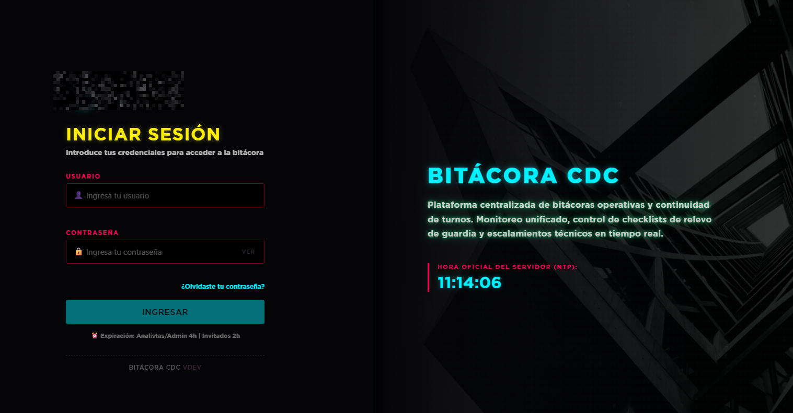
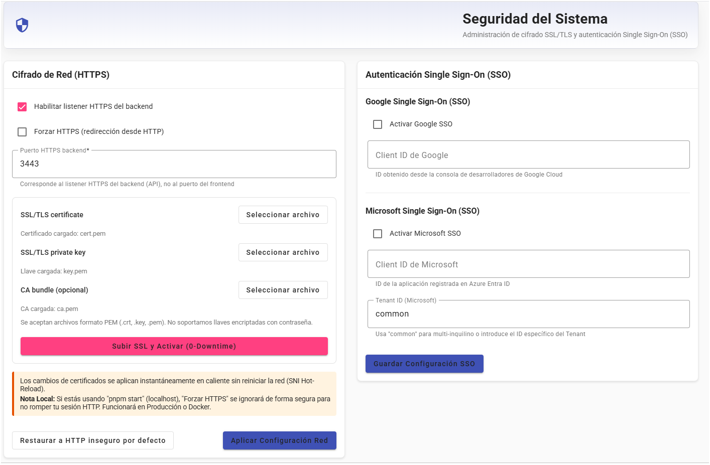

# Bitacora SOC

<!-- Marca de autor en comentarios: Athan Espinoza -->

Plataforma web para operacion SOC con bitacora operativa, checklists de turno, escalacion, auditoria, backup, integraciones y modulo de complementos embebidos.

> Estado del proyecto: estable. Validar siempre los flujos en un entorno de pruebas antes de pasar a operación formal.
>
> Version referencial actual (segun `CHANGELOG.md`): **v1.6.21**

Stack principal:

- frontend: Angular 20
- backend: Express 5 + Node 22 LTS
- base de datos: MongoDB 8
- despliegue: Docker Compose v2

---

## Capacidades principales

- **Bitácora Operativa Integral**: Registro continuo de eventos en tiempo real, incidentes críticos, mantenciones y ofensas de seguridad, estructurados mediante narrativa y hashtags.
- **Disciplina Operativa y Checklists**: Gestión del relevo de guardia mediante checklists obligatorios de inicio y cierre de turno, con alertas reactivas e impedimentos de cierre si quedan hallazgos no conformes (NOK) abiertos.
- **Ruta de Escalación Visual e Interactiva**: Mapa de contactos y diagramas jerárquicos interactivos por cliente y servicio que permiten identificar visualmente a quién llamar primero en caso de incidencias.
- **Visualización de Flujos de Escalación**: Monitoreo y consulta del flujo de llamadas, flujo de correos y la matriz de responsabilidades RACI editable desde el panel de control.
- **Directorio Centralizado**: Agenda de correos y teléfonos unificada para la búsqueda veloz de contactos de clientes, analistas de guardia y enlaces a servicios web críticos.
- **Automatización de Turnos y Correos de Guardia**: Programación automatizada del reporte periódico de turnos para analistas y clientes. Los correos (HTML premium responsivo) se envían con badges y colores corporativos de acuerdo a la condición de turno (Guardia, Teletrabajo, Vacaciones, Licencias o Trámites Médicos).
- **Pruebas de Correo Interactivas**: Panel para realizar envíos de prueba inmediatos en base a la configuración en caliente de la interfaz, sin alterar el histórico ni las fechas de envío de producción.
- **Gestión SMTP y Personalización de Marca (Branding)**: Ajuste de servidores de correo, configuración del remitente y opción de subir logotipos y modificar títulos de la aplicación para adaptar la plataforma a la identidad institucional.
- **Celebración de Cumpleaños**: Mapeo diario automático de cumpleaños de analistas del SOC con felicitaciones estructuradas y envío de imágenes kawaii embebidas en línea (CID).
- **Seguridad y Acceso Robusto**:
  - Soporte de Doble Factor de Autenticación (TOTP - Google Authenticator, Authy, etc.).
  - Integración Single Sign-On (SSO) referencial mediante Google y Microsoft Azure AD _(módulo base implementado; requiere validación, credenciales de API del proveedor y pruebas de configuración en producción)_.
  - Consola de gestión HTTPS con inyección y rotación de certificados TLS sin detención del servicio (0-Downtime).
- **Estadísticas y Reportes Automatizados**: Generación de informes ejecutivos e indicadores de uso basados en las entradas de la bitácora para evaluar la actividad y el cumplimiento operacional del equipo.
- **Resiliencia con Backups Cifrados**: Creación y restauración de copias de seguridad de la base de datos MongoDB y evidencias de disco con empaquetado cifrado por contraseña descargable desde la UI.
- **Extensibilidad mediante Complementos (Plugins)**: Carga y ejecución de utilidades estáticas (ZIP) y URLs externas integradas por iframes seguros con aislamiento Sandbox, control selectivo de accesos a la API compartida y protección Circuit Breaker contra caídas del complemento.
- **Integraciones y API Keys (SOAR / Automática)**: CRUD administrativo de credenciales seguras (SHA-256) con permisos granulares (scopes), logs de auditoría en tiempo real y soporte para renderizado MJML de reportes y envío SMTP automático de alertas de incidentes para integración con herramientas externas.

---

## Comparativa con herramientas similares

| Característica / Enfoque          | Bitácora SOC                                                                                                                                                                                  | TheHive / Cortex                                                                                    | ITSM / Ticketing Genérico (JSM, ServiceNow, GLPI, etc.)                                                                    |
| :-------------------------------- | :-------------------------------------------------------------------------------------------------------------------------------------------------------------------------------------------- | :-------------------------------------------------------------------------------------------------- | :------------------------------------------------------------------------------------------------------------------------- |
| **Objetivo Principal**            | Continuidad operacional por turno: qué pasó, quién lo tomó, qué quedó pendiente y a quién llamar.                                                                                             | Gestión de incidentes de ciberseguridad e investigación técnica profunda (IOC, forense, respuesta). | Gestión de solicitudes/incidentes de servicio con trazabilidad administrativa y SLA.                                       |
| **Centro de Gravedad**            | **Operación en tiempo real y relevo de guardia** (SOC, NOC, TI on-call y equipos de emergencia).                                                                                              | **Investigación de amenazas** y respuesta técnica especializada orientada a la ciberseguridad.      | **Proceso de atención** (tickets, colas, aprobaciones, catálogo de servicios).                                             |
| **Naturaleza de la Escalada**     | **Humana y directa**: la bitácora documenta a quién llamar, qué equipo contactar y qué ruta seguir; no depende de un ticket para disparar la ayuda inmediata.                                 | **Técnica y orientada a caso**: prioriza el análisis y la orquestación sobre la llamada operativa.  | **Automática por flujo de atención**: el ticket se enruta al área o cola definida y puede escalarse por reglas de proceso. |
| **Gobernanza del Turno**          | **Sí** (checklist de inicio/cierre, segregación por `shiftId`, métricas de cumplimiento y disciplina operativa diaria).                                                                       | No nativo (el foco está en casos; no en rituales de apertura/cierre de guardia).                    | Parcial (se puede modelar con customización, pero no suele venir listo como flujo operativo de relevo).                    |
| **Gestión Operativa y de Equipo** | **Sí** (minutas/informes de turno, visibilidad de teletrabajo/vacaciones, asignaciones internas y recordatorios automatizados).                                                               | No orientado a dotación y coordinación de guardias.                                                 | Parcial (fuerte en asignación de tickets; más débil en vista táctica de dotación en turno).                                |
| **Analíticas y KPI Operativos**   | **Sí** (métricas de uso por usuario, volumen de entradas, acciones registradas, alertas atendidas y trazabilidad de actividad para medir disciplina operativa).                               | Enfoque más orientado a casos e investigación que a KPI de relevo diario.                           | Sí, pero centradas en SLAs, colas y tiempos de atención, no en bitácora de turno.                                          |
| **Alertas y Confirmaciones**      | **Sí** (avisos para checklist, alertas NOK, recordatorios y alertas por cliente; el usuario puede confirmar lectura/cierre cuando corresponda y volver a cerrarlas según el flujo operativo). | Sí, pero orientadas a incidentes/casos de seguridad.                                                | Sí, normalmente mediante notificaciones y estados del ticket.                                                              |
| **Flexibilidad de Entrada**       | **Alta** (bitácora narrativa con hashtags para incidentes, mantenimiento, guardias físicas y operación multiárea).                                                                            | Media-baja (estructura centrada en caso de ciber).                                                  | Media (campos estructurados y formularios; menos natural para narrativa cronológica de guardia).                           |
| **Modelo de Datos Operativo**     | **Evento + narrativa + checklist + auditoría** (prioriza contexto de turno, continuidad entre personas y seguimiento de acciones).                                                            | **Caso + observable + tarea** (prioriza investigación y evidencia técnica).                         | **Ticket + estado + SLA** (prioriza ciclo de vida de atención).                                                            |
| **Búsqueda y Trazabilidad**       | Búsqueda textual/narrativa por contenido y hashtags, útil para reconstrucción operativa y respaldo histórico.                                                                                 | Búsqueda técnica por observables/IOCs para correlación de amenazas.                                 | Búsqueda por ticket, campos, estados y reportes de servicio.                                                               |
| **Reportes y Comunicación**       | Boletines/reportes ejecutivos con envío por correo, agrupación por dominio y historial de envíos para saber cuándo se avisó a clientes o equipos.                                             | Requiere capas adicionales para reporteo ejecutivo orientado a cliente.                             | Muy fuerte en reportes de servicio/SLA; menos enfocado en narrativa de relevo de guardia.                                  |
| **Auditoría y Cumplimiento**      | Auditoría persistente transversal (acciones operativas y administrativas) + control de acceso por roles (admin/user/auditor/guest).                                                           | Auditoría orientada a investigación y acciones sobre casos.                                         | Auditoría administrativa madura, generalmente centrada en proceso ITSM.                                                    |
| **Resiliencia y Backups**         | Backups/restores desde UI con cifrado y alcance integral (BD + evidencias + secretos).                                                                                                        | Normalmente delegado a estrategia de infraestructura/plataforma.                                    | Depende del producto y plan; suele manejarse a nivel plataforma/instancia.                                                 |
| **Extensibilidad del Operador**   | Complementos embebidos con sandbox, bridge de contexto y circuit breaker para utilidades de terreno.                                                                                          | Extensible a través de integraciones orientadas a seguridad.                                        | Marketplace e integraciones robustas, usualmente orientadas a flujos ITSM corporativos.                                    |
| **Cobertura de Dominio**          | **SOC-first pero no SOC-only**: también aplica a NOC, mesas TI, guardias físicas y equipos con múltiples escalamientos/monitoreo.                                                             | **Ciberseguridad-first y especializada**.                                                           | **Empresa-first y transversal**, con foco en gobierno de servicios más que en bitácora de turno.                           |
| **Curva de Aprendizaje**          | Baja a media (entrada rápida para N1/operador de guardia, con crecimiento progresivo).                                                                                                        | Media-alta (perfil analista de seguridad N2/N3).                                                    | Media (requiere adopción de procesos y configuración de catálogo/flujo).                                                   |

---

## Novedades recientes (resumen rapido)

### v1.6.21 (Filtros de búsqueda de entradas, exportación a CSV, corrección de cifrado en directorio y reparación de correos SMTP)

- **Mejoras en Búsqueda de Entradas**: Adición de selector de preajustes de fecha (3, 7, 15, 30, 60, 90 días, rango personalizado) con controles interactivos condicionales de calendario, filtro por analista y botón para descargar reportes en CSV en tiempo real.
- **Exportación en Backend**: Endpoint `/api/entries/export` para descargar la bitácora completa y checklists unificados. Configurado con UTF-8 BOM para apertura directa en Microsoft Excel sin fallas de codificación.
- **Bugfix de Cifrado en Directorio**: Corrección del error de visualización de datos cifrados con hashes / dos puntos en el directorio global para usuarios internos. Implementada interceptación en `encrypt` para evitar el doble cifrado y ejecutada migración correctora sobre 13 registros afectados.
- **Bugfix de Notificaciones SMTP**: Resolución de ReferenceError y TypeError de scoping/logging en el bloque catch, junto con forzado de resolución IPv4 e inicio TLS correcto (STARTTLS) sobre puerto 587 para solucionar fallos `ENETUNREACH` de envío de correos automáticos.

### v1.6.20 (API Keys robustas, logs de auditoría en tiempo real, renderizador de MJML y envío SMTP de incidentes)

- **Módulo de Gestión de API Keys**: Panel administrativo completo con encriptación hash SHA-256 de credenciales y asignación selectiva de permisos (scopes) para integraciones externas (SOAR, Syslog parsers, etc.).
- **Auditoría de Consumo de API**: Registro no bloqueante de logs de acceso en tiempo real (IP, método, endpoint, estado HTTP, fecha, clave consumida) con paginación interactiva en el panel del SOC.
- **API Externa de Incidentes y SMTP**: Exposición de `/api/v1/templates/render` para procesamiento de plantillas MJML con soporte opcional para envío automático de alertas por correo mediante el SMTP del SOC pasándole `"sendEmail": true`. Se inyecta automáticamente el logo de Netics (Sharp-processed) y se autocompletan los campos de incidentes (ofensa, ticket, criticidad) provistos en el JSON.
- **Manuales de Integración y Postman**: Creación del manual detallado de la API externa e incrustación de un panel interactivo paso a paso de uso con Postman y ejemplos de JSON Payload en el frontend del SOC.

### v1.6.18 (acordeón de meses en turnos, visualización completa en admin, correcciones de escalación y huso horario)

- **Acordeón de Meses y Selección Masiva**: Introducción de acordeones de meses colapsados por defecto en las pestañas "Próximo" y "Pasado" del administrador de turnos para optimizar espacio, junto con botones para expandir/colapsar todo y checkboxes mensuales de selección masiva para borrado rápido. Diseño de celdas ultra compactas y alineación del botón mediante `inline-flex`.
- **Transparencia en Consola de Administración**: Eliminación de los filtros por prioridad en el listado del administrador. Esto garantiza que el administrador pueda visualizar y gestionar la totalidad de las asignaciones de turnos (trámites médicos, capacitaciones, etc.) sin que se oculten por superposiciones.
- **Visualización Completa en Escalación Simple**: Ajuste al listado semanal de analistas para listar automáticamente a todo el personal activo que no tiene programada ninguna ausencia especial como "En Oficina" por defecto. Adicionalmente, se priorizó el renderizado de estados de Teletrabajo y Capacitación para evitar que queden solapados por roles de guardia de oficina.
- **Corrección de Huso Horario de Envío**: Forzado estricto de la zona horaria chilena (`America/Santiago`) en los cálculos del programador automatizado (`escalationScheduleScheduler.js`), previniendo desfases horarios al enviar alertas desde servidores alojados con hora UTC.

### v1.6.17 (personalización de login por usuario, tema Windows 3.11 y Unix Terminal 1989)

- **Selección de Temas de Login por Usuario**: Los usuarios ahora pueden elegir su propio estilo de pantalla de inicio de sesión desde su panel de Perfil, guardando su preferencia local (`localStorage`) y en la base de datos (se cargará al iniciar sesión). Lógica refactorizada en el frontend para alternar temas en caliente y limpiar animaciones de forma segura.
- **Tema Windows 3.11**: Nuevo diseño retro inspirado en Windows for Workgroups v3.11. Cuenta con un escritorio clásico verde azulado (Teal), Program Manager de fondo, diálogos grises biselados en 3D clásico, botones clásicos e inputs hundidos para Login, MFA y Recuperación.
- **Tema Unix Terminal (1989)**: Nuevo diseño retro plano CLI de Unix/Linux a finales de los 80s. Presenta un fondo negro, fuente de fósforo ámbar naranja de alta visibilidad, reloj de consola en tiempo real fijado en 1989 y la técnica de **Input Espejo** que dibuja el texto escrito y desplaza el cursor parpadeante retro hacia la derecha dinámicamente con cada carácter ingresado.
- **Gestión SMTP y Branding**: Soporte para que el administrador configure `win311` y `unix89` como temas globales predeterminados desde los paneles de Branding y de Apariencia del Administrador.

### Estado IA local

- alcance definido en `docs/ISSUES.md` (epic `AI-SUMMARY-001` y subitems).
- IA planteada como asistencia operativa efimera y controlada (sin chat de usuario final).
- estado actual: planificado/documentado, no activado en produccion.

---

## Quick Start con Docker

```bash
# 1. Preparar variables
cp .env.example .env

# 2. Editar credenciales obligatorias
#    - MONGO_ROOT_PASSWORD
#    - ADMIN_PASSWORD
#    - JWT_SECRET
#    - ENCRYPTION_KEY
#    - COMPLEMENT_TOKEN_SECRET
#    - (Opcional) GOOGLE_CLIENT_ID / AZURE_CLIENT_ID / AZURE_TENANT_ID (para SSO)
#    - (Opcional) RATE_LIMIT_RESET_SECRET — reinicio de rate limit; ver docs/06_SEGURIDAD.md

# 3. Levantar stack
docker compose up -d --build

# 4. Inicializar datos base
docker compose exec backend node src/scripts/seed-admin.js
# o, si necesitas ambiente de prueba:
docker compose exec backend node src/scripts/seed.js
```

## Inicio rapido

si ya esta descargado y solo resta levantar

```bash
docker compose build --no-cache && docker compose up -d
```

Para actualizar

```bash
git pull origin main && docker compose build --no-cache && docker compose up -d
```

Acceso por defecto:

- frontend Docker: `http://localhost`
- backend health: `http://localhost:3000/health`
- Swagger: `http://localhost:3000/api-docs`

Notas rapidas:

- el proyecto usa `docker compose`, no `docker-compose`
- el overlay `docker-compose.complements.yml` es opcional y hoy sirve principalmente para el `complement-stub` de laboratorio
- los scripts `scripts/compose-up.*` y `scripts/compose-rebuild.*` ya incluyen ese overlay

Diagnostico rapido si backend no levanta:

```bash
# Estado general
docker compose ps

# Logs del backend y Mongo
docker compose logs backend --tail=200
docker compose logs mongodb --tail=120

# Rebuild completo cuando cambian dependencias
docker compose up -d --build
```

Si ves errores de modulo faltante en backend durante arranque, ejecuta rebuild para forzar reinstalacion de dependencias de la imagen.

---

## Vista rapida de la interfaz

Galeria visual resumida del producto. Para ver el set completo, revisa `docs/SCREENSHOTS.md`.

### Pantallas principales







> 💡 **Nota sobre la Consola de Seguridad (HTTPS & SSO):** El panel unificado de HTTPS y Single Sign-On (SSO) está completamente integrado. El soporte para la inyección y rotación de certificados **HTTPS** (0-Downtime) es altamente funcional y estable, mientras que el inicio de sesión vía SSO (Google/Microsoft) está disponible como esquema base (sujeto a configuración y pruebas finales con el proveedor de identidad corporativo).

---

## Desarrollo local

### Backend

```bash
cd backend
cp .env.example .env
pnpm install
pnpm run dev
```

### Frontend

```bash
cd frontend
pnpm install
pnpm start
```

Politica de gestor de paquetes:

- Este repositorio usa exclusivamente `pnpm@11`.
- No usar `npm` para instalar o ejecutar scripts.
- Ver detalles en `docs/PNPM_POLICY.md`.

Acceso local:

- frontend dev: `http://localhost:4200`
- backend dev: `http://localhost:3000`

El frontend actual usa cookie `auth_token` HttpOnly y bootstrap de sesion via `/api/users/me`, por lo que el backend debe tener `ALLOWED_ORIGINS=http://localhost:4200` en desarrollo.

---

## Complementos

El modulo de complementos soporta hoy dos caminos productivos:

1. registro manual de un servicio o frontend ya desplegado
2. publicacion administrada de un ZIP estatico `HTML/JS simple`

El flujo `validar -> preview -> publicar` ya existe en la consola admin, pero la publicacion automatica hoy solo soporta `static-html`. Los stacks `Vite`, `React + Vite` y `Node.js` se analizan, pero deben desplegarse por fuera y luego registrarse manualmente.

El detalle completo esta en `docs/COMPLEMENTS.md`.

### Complementos en `Extras/`

La carpeta `Extras/` incluye complementos y muestras listos para laboratorio, QA o publicacion como `zip-static`:

- `Extras/doom-browser/`: complemento estatico para ejecutar DOOM en navegador embebido.
- `Extras/diccionario-logs-ciber/`: complemento estatico tipo log helper/diccionario tecnico para analisis SOC.
- `Extras/complement-stub/`: stub minimo de complemento para pruebas de integracion con Docker.
- `Extras/complement-samples/`: ejemplos de referencia (`no-db-static`, `internal-db-local`, `external-db-api`) para acelerar nuevos desarrollos.
- `Extras/Imagenes/`: capturas de apoyo de herramientas/complementos para documentacion operativa.

El catalogo de los complementos de prueba (con imagen y descripcion breve) esta en `docs/COMPLEMENTS_CATALOG.md`.

---

## Estructura del repositorio

```text
BitacoraSOC/
|- backend/                  API Express, modelos, rutas, utilidades
|- frontend/                 SPA Angular
|- docs/                     Documentacion tecnica y operativa
|- scripts/                  Scripts de apoyo para compose y versionado
|- docker-compose.yml        Stack principal
|- docker-compose.complements.yml
`- .env.example             Plantilla de variables globales
```

---

## Documentacion

Documentos principales (Gobernanza Armonizada):

- `docs/01_ARQUITECTURA.md`: Arquitectura del sistema, flujos Mermaid y diseño de TLS/SSL.
- `docs/02_DESPLIEGUE_Y_CONFIG.md`: Guía de instalación, variables de entorno (.env) y despliegue con Docker Compose.
- `docs/03_OPERACIONES.md`: Guía operativa general, bitácoras, checklists de turno, roles de usuario, backup/restore y runbook del SOC.
- `docs/04_DESARROLLO_Y_API.md`: Documentación de la API REST, Swagger y endpoints integrados.
- `docs/05_MODULOS_EXTRAS.md`: Gestión e integración del módulo de complementos e iframe sandbox.
- `docs/06_SEGURIDAD.md`: Hardening, Helmet, rate limiting, mitigación de Zip Slip y directivas de seguridad.
- `docs/07_MONGO_REPLICA_SET.md`: Guía opcional para la configuración de réplicas de base de datos (Replica Set) en alta disponibilidad.
- `docs/SCREENSHOTS.md`: Galería visual de la interfaz y módulos principales.
- `docs/api-v1-manual.md`: Manual técnico de la API externa v1 y ejemplos de integración con Postman y SOAR.
- `CHANGELOG.md`: Historial de cambios relevantes y control de versiones del proyecto.
- `docs/history/ISSUES.md`: Plan de trabajo y control de issues del SOC.

Documentos funcionales complementarios:

- `docs/UI-GOVERNANCE.md`: Estándares de desarrollo de interfaz y componentes.

---

## Licencia

El proyecto se distribuye bajo Business Source License 1.1. Revisar `LICENSE.md` para el detalle formal.
El archivo incluye el texto base en ingles y una seccion informativa en espanol para facilitar su lectura.
