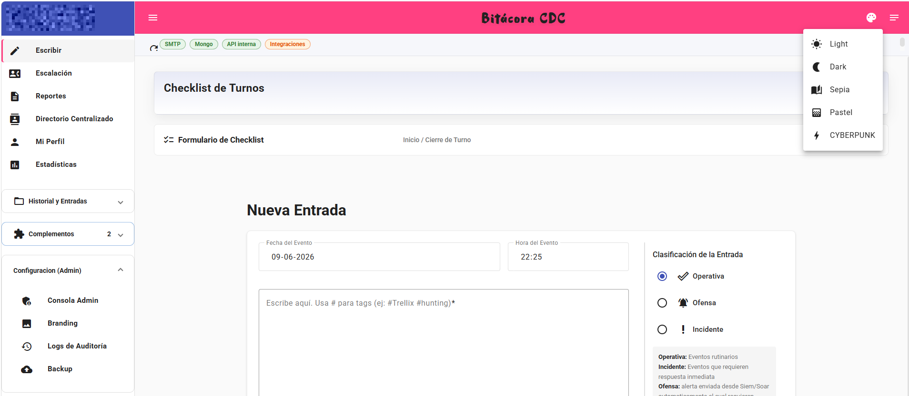
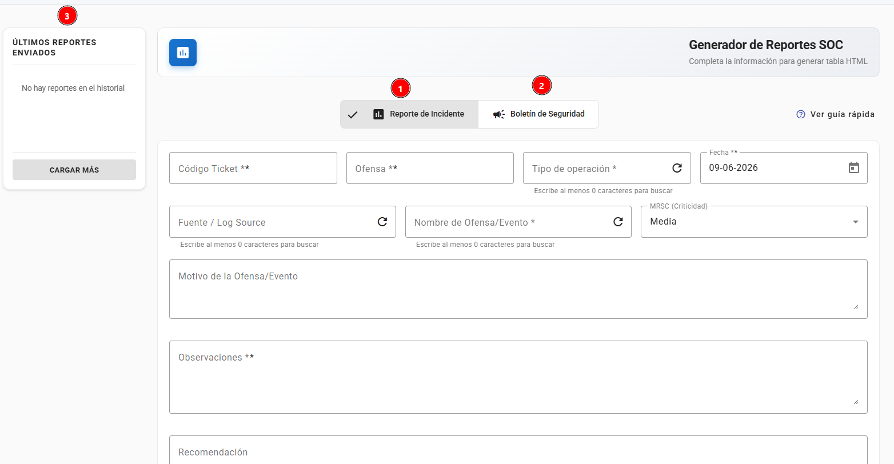
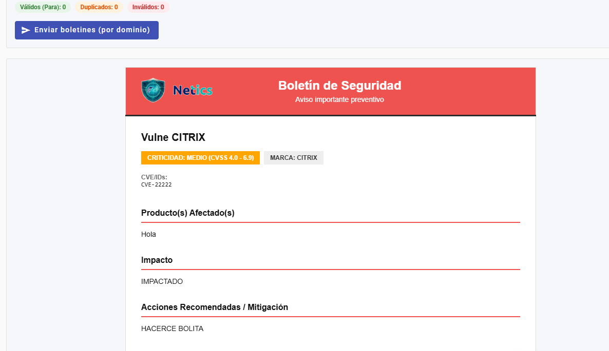
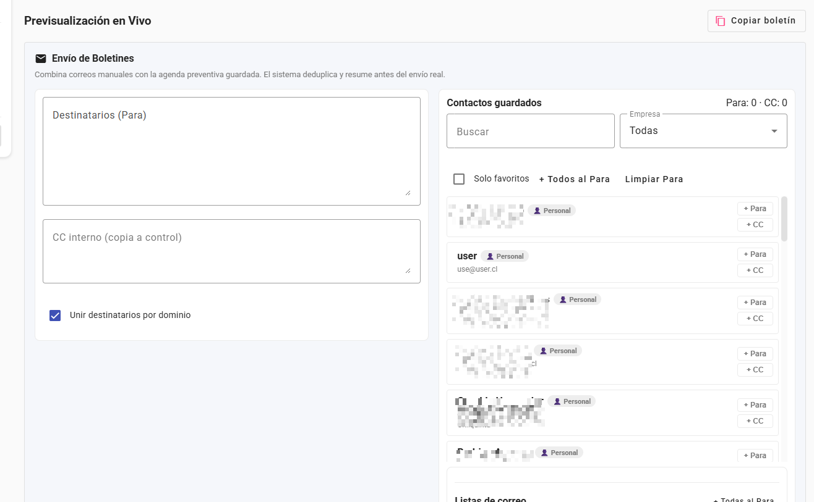
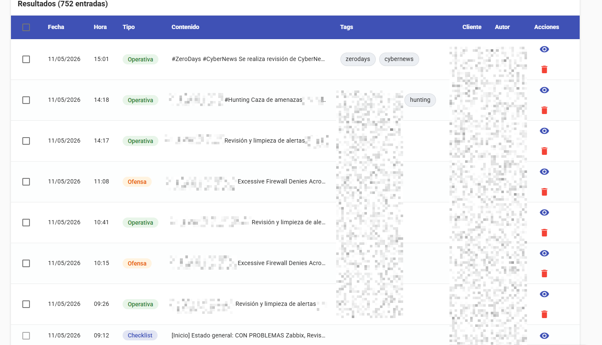
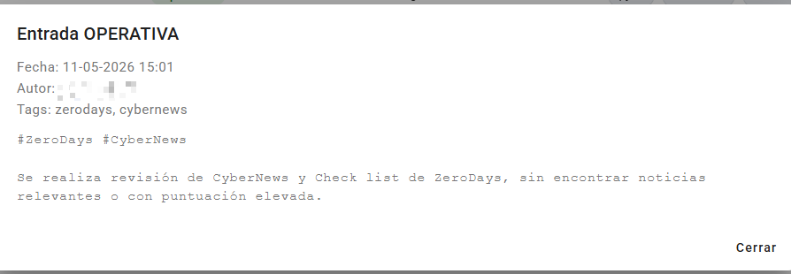
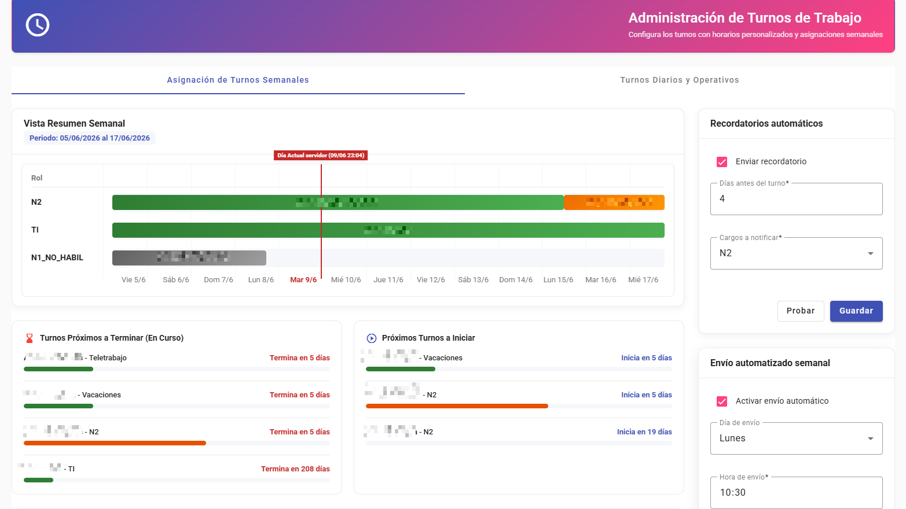
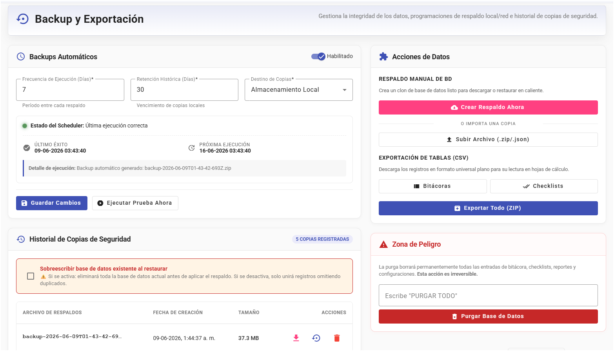

# Bitacora SOC

<!-- Marca de autor en comentarios: Athan Espinoza -->

Plataforma web para operacion SOC con bitacora operativa, checklists de turno, escalacion, auditoria, backup, integraciones y modulo de complementos embebidos.

> Estado del proyecto: beta. Validar siempre los flujos criticos en un entorno controlado antes de pasar a operacion formal.
>
> Version referencial actual (segun `docs/history/CHANGELOG.md`): **v1.5.93-beta**

Stack principal:

- frontend: Angular 20
- backend: Express 5 + Node 22 LTS
- base de datos: MongoDB 8
- despliegue: Docker Compose v2

---

## Capacidades principales

- bitacora de entradas operativas, incidentes y ofensas
- checklists de inicio y cierre de turno
- consola admin unificada
- auditoria persistente y forwarding a SIEM
- backups y restore desde la plataforma
- branding, SMTP, catalogos y escalacion
- complementos con iframe seguro, API interna y circuit breaker

---

## Vista rapida de la interfaz

Galeria visual resumida del producto. Para ver el set completo, revisa `docs/SCREENSHOTS.md`.

### Pantallas principales














---

## Novedades recientes (resumen rapido)

### v1.5.93-beta (permisos de asignaciones y tabla de teletrabajo)

- nueva ruta publica `GET /api/escalation/assignments` para que analistas autenticados consulten asignaciones sin requerir rol admin.
- separados los metodos `getAssignments()` (vista operativa) y `getAssignmentsAdmin()` (administracion de turnos) en el servicio frontend para evitar errores `403`.
- estilos CSS completos para la tabla `excel-table` en la vista operativa: fila completa en rojo para vacaciones activas, azul para pronto-vacaciones.

### v1.5.92-beta (teletrabajo y vacaciones en administracion de turnos)

- roles `TELEWORK` y `VACATION` disponibles en el formulario de asignacion de `/main/admin/work-shifts`.
- validacion de conflictos adaptativa: teletrabajo coexiste con turnos regulares; vacaciones dispara autoliberacion de turnos previos en backend.
- notificacion al guardar vacaciones si se liberaron turnos automaticamente.
- etiquetas en espanol en tabla, Gantt y tarjetas de proximidad.
- importacion CSV acepta `Teletrabajo` y `Vacaciones` como roles validos.

### v1.5.91-beta (UX y tabla de teletrabajo escalable)

- autocomplete de clientes sin necesidad de borrar texto ni presionar X; el panel despliega todos los clientes si el valor actual ya coincide exactamente con la seleccion.
- tabla escalable para el listado de personal en teletrabajo y apoyo con columnas Nombre, Correo (copiable), Telefono (copiable), Cargo y Situacion con badges de color.
- soporte de estados: En Teletrabajo, En Oficina, VACACIONES (rojo), Pronto Vacaciones (azul, dentro de 2 semanas).

### v1.5.89-beta (auditoria QA y UX/UI)

- ajuste de contraste en flujo de recuperacion de contrasena en tema Matrix.
- aviso de privacidad con branding dinamico desde la base de datos; consentimiento persistente en `localStorage`.
- rediseno asimetrico de la vista de backups con layout de dos columnas.
- easter egg `#bat` con HUD cyberpunk y mecanica de caceria interactiva.
- correccion de texto borroso en el panel central (remocion de `will-change: transform`).
- limites de recursos CPU/RAM en `docker-compose.yml` para todos los contenedores.
- refactorizacion de helpers duplicados: `cookie-helper.js`, `boolean-helper.js`, `time-helper.js`, `date-utils.js`.
- cierre de hallazgos de auditoria de seguridad: JWT denylist, rate-limit en MongoDB, CORS estricto, guards robustecidos.

### v1.5.88-beta (ortografia y v1.5.87 / historial compartido)

- correccion masiva de tildes y acentos en la UI (labels, placeholders, snackbars).
- historial de reportes/boletines migrado a backend compartido para que todos los usuarios autenticados vean los envios del equipo.
- borrado de historial restringido a rol admin.

### v1.5.86-beta (hora oficial del servidor en turnos)

- la vista de turnos semanales ahora usa hora oficial del backend como fuente de verdad.
- el endpoint `GET /api/work-shifts/current` entrega `currentDateTime` y `currentTimestamp` para sincronizacion temporal robusta.
- el Gantt calcula linea de dia actual y estados (`Pasado`, `En Curso`, `Proximo`) con tiempo de servidor.

### Estado IA local

- alcance definido en `docs/ISSUES.md` (epic `AI-SUMMARY-001` y subitems).
- IA planteada como asistencia operativa efimera y controlada (sin chat de usuario final).
- estado actual: planificado/documentado, no activado en produccion.

---

## Quick Start con Docker

```bash
# 1. Preparar variables
cp .env.example .env

# 2. Editar credenciales obligatorias
#    - MONGO_ROOT_PASSWORD
#    - ADMIN_PASSWORD
#    - JWT_SECRET
#    - ENCRYPTION_KEY
#    - COMPLEMENT_TOKEN_SECRET
#    - (Opcional) RATE_LIMIT_RESET_SECRET — cadena >= 24 caracteres para reinicio
#      de contadores 429 sin reiniciar el backend; formato y uso en docs/SECURITY.md

# 3. Levantar stack
docker compose up -d --build

# 4. Inicializar datos base
docker compose exec backend node src/scripts/seed-admin.js
# o, si necesitas ambiente de prueba:
docker compose exec backend node src/scripts/seed.js
```

## Inicio rapido

si ya esta descargado y solo resta levantar

```bash
docker compose build --no-cache && docker compose up -d
```

Para actualizar

```bash
git pull origin main && docker compose build --no-cache && docker compose up -d
```

Acceso por defecto:

- frontend Docker: `http://localhost`
- backend health: `http://localhost:3000/health`
- Swagger: `http://localhost:3000/api-docs`

Notas rapidas:

- el proyecto usa `docker compose`, no `docker-compose`
- el overlay `docker-compose.complements.yml` es opcional y hoy sirve principalmente para el `complement-stub` de laboratorio
- los scripts `scripts/compose-up.*` y `scripts/compose-rebuild.*` ya incluyen ese overlay

Diagnostico rapido si backend no levanta:

```bash
# Estado general
docker compose ps

# Logs del backend y Mongo
docker compose logs backend --tail=200
docker compose logs mongodb --tail=120

# Rebuild completo cuando cambian dependencias
docker compose up -d --build
```

Si ves errores de modulo faltante en backend durante arranque, ejecuta rebuild para forzar reinstalacion de dependencias de la imagen.

---

## Desarrollo local

### Backend

```bash
cd backend
cp .env.example .env
pnpm install
pnpm run dev
```

### Frontend

```bash
cd frontend
pnpm install
pnpm start
```

Politica de gestor de paquetes:

- Este repositorio usa exclusivamente `pnpm@11`.
- No usar `npm` para instalar o ejecutar scripts.
- Ver detalles en `docs/PNPM_POLICY.md`.

Acceso local:

- frontend dev: `http://localhost:4200`
- backend dev: `http://localhost:3000`

El frontend actual usa cookie `auth_token` HttpOnly y bootstrap de sesion via `/api/users/me`, por lo que el backend debe tener `ALLOWED_ORIGINS=http://localhost:4200` en desarrollo.

---

## Complementos

El modulo de complementos soporta hoy dos caminos productivos:

1. registro manual de un servicio o frontend ya desplegado
2. publicacion administrada de un ZIP estatico `HTML/JS simple`

El flujo `validar -> preview -> publicar` ya existe en la consola admin, pero la publicacion automatica hoy solo soporta `static-html`. Los stacks `Vite`, `React + Vite` y `Node.js` se analizan, pero deben desplegarse por fuera y luego registrarse manualmente.

El detalle completo esta en `docs/COMPLEMENTS.md`.

### Complementos en `Extras/`

La carpeta `Extras/` incluye complementos y muestras listos para laboratorio, QA o publicacion como `zip-static`:

- `Extras/doom-browser/`: complemento estatico para ejecutar DOOM en navegador embebido.
- `Extras/diccionario-logs-ciber/`: complemento estatico tipo log helper/diccionario tecnico para analisis SOC.
- `Extras/complement-stub/`: stub minimo de complemento para pruebas de integracion con Docker.
- `Extras/complement-samples/`: ejemplos de referencia (`no-db-static`, `internal-db-local`, `external-db-api`) para acelerar nuevos desarrollos.
- `Extras/Imagenes/`: capturas de apoyo de herramientas/complementos para documentacion operativa.

El catalogo de los complementos de prueba (con imagen y descripcion breve) esta en `docs/COMPLEMENTS_CATALOG.md`.

---

## Estructura del repositorio

```text
BitacoraSOC/
|- backend/                  API Express, modelos, rutas, utilidades
|- frontend/                 SPA Angular
|- docs/                     Documentacion tecnica y operativa
|- scripts/                  Scripts de apoyo para compose y versionado
|- docker-compose.yml        Stack principal
|- docker-compose.complements.yml
`- .env.example             Plantilla de variables globales
```

---

## Documentacion

Documentos principales:

- `docs/OPERATIONS.md`: como levantar desde cero, semillas y validaciones operativas
- `docs/DISASTER-RECOVERY.md`: plan de recuperacion total ante desastre
- `docs/COMPLEMENTS.md`: guia integral del modulo de complementos
- `docs/COMPLEMENTS_CATALOG.md`: catalogo de complementos de prueba (doom-browser, diccionario-logs-ciber)
- `docs/API.md`: referencia de endpoints
- `docs/ARCHITECTURE.md`: arquitectura y flujos
- `docs/DEPLOY.md`: despliegue, actualizacion y operacion
- `docs/SETUP.md`: instalacion y configuracion detallada
- `docs/SECURITY.md`: hardening, auth, rate limiting y secreto `RATE_LIMIT_RESET_SECRET` (reinicio operativo de 429)
- `docs/RUNBOOK.md`: operacion diaria del SOC
- `docs/BACKUP.md`: backup, restore e implicancias para complementos
- `docs/TROUBLESHOOTING.md`: diagnostico de fallas comunes
- `docs/SCREENSHOTS.md`: galeria visual de la interfaz y modulos principales
- `docs/CHANGELOG.md`: cambios relevantes por version

Documentos funcionales complementarios:

- `docs/ESCALATION.md`: escalacion, directorio global, agenda preventiva y turnos
- `docs/CATALOGS.md`
- `docs/LOGGING.md`
- `docs/TLS_SSL_ARCHITECTURE.md`
- `docs/UI-GOVERNANCE.md`
- `backend/scripts/README.md`

---

## Licencia

El proyecto se distribuye bajo Business Source License 1.1. Revisar `LICENSE.md` para el detalle formal.
El archivo incluye el texto base en ingles y una seccion informativa en espanol para facilitar su lectura.
