# Arquitectura General

# 🧭 Arquitectura y Flujos - Bitacora SOC

Documentacion visual del funcionamiento general del sistema.

> Estado: Arquitectura en evolución (beta). Los módulos clave ya están operativos y separados por dominio funcional.
>
> Referencia visual de pantallas: ver `docs/SCREENSHOTS.md` para capturas reales de la interfaz.

---

## 🗺️ Mapa Conceptual (alto nivel)

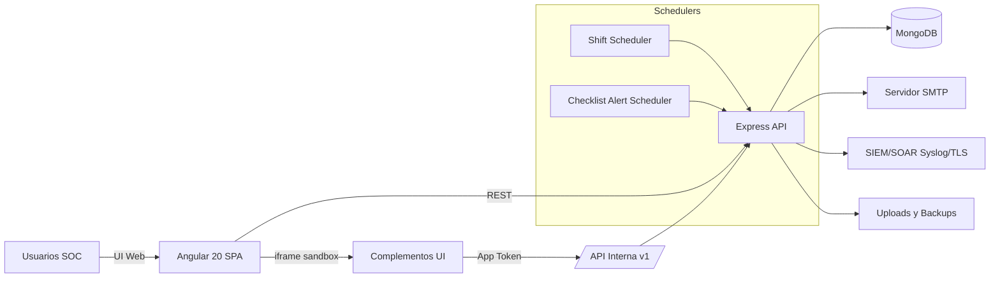

---

## 🧩 Módulos Administrativos (Frontend)

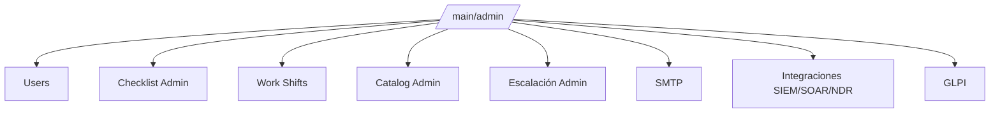

- Integraciones SIEM/SOAR/NDR y GLPI quedaron separados por diseño.
- GLPI opera como módulo independiente (API REST o correo collector).

---

## 🔐 Flujo de Autenticacion y Auditoria

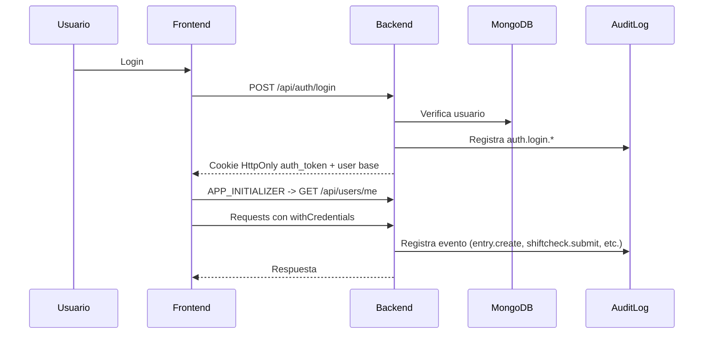

- La sesión web usa cookie `auth_token` HttpOnly.
- El frontend rehidrata sesión al arrancar usando `/api/users/me`.

### 🔑 Flujo de Autenticación de Terceros (SSO)

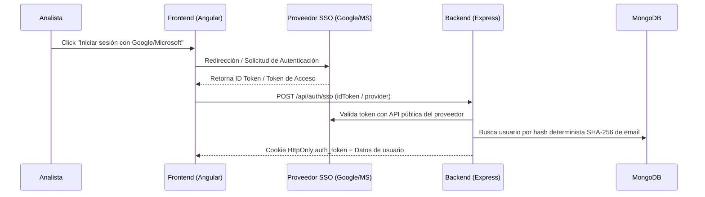

### 🔐 Flujo de Autenticación Multifactor (MFA - TOTP)

El sistema soporta MFA por software (TOTP - RFC 6238). Por defecto está desactivado. El administrador lo habilita individualmente por usuario.

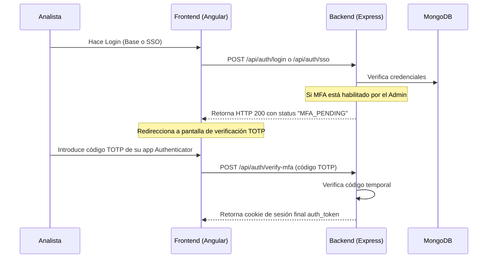

### 🔒 Arquitectura de Privacidad y Cifrado PII

Para asegurar el cumplimiento de privacidad de la información personal identificable (PII), los campos `email` y `phone` se protegen mediante criptografía fuerte en MongoDB:
1. **Cifrado Probabilístico:** Se utiliza **AES-256-GCM** con un Vector de Inicialización (IV) aleatorio por cada registro. Esto garantiza que el mismo correo cifrado dos veces tenga salidas cifradas distintas en base de datos.
2. **Búsqueda Indexada Determinista:** Se genera un hash **SHA-256** determinista de los campos PII (`emailHash` y `phoneHash`) indexados en MongoDB. De este modo, las búsquedas por correo se resuelven de forma extremadamente rápida sin descifrar toda la colección.

### ⚡ Paginación Nativa en Base de Datos (`$unionWith`)

Para optimizar el rendimiento y evitar el consumo excesivo de memoria Heap en el backend al mezclar registros de `Entry` y `ShiftCheck`, la paginación y ordenamiento se delegan por completo a MongoDB utilizando la etapa `$unionWith`. El pipeline unifica las colecciones, aplica `$sort` por fecha, y segmenta con `$skip` y `$limit` de forma nativa antes de poblar las referencias de usuarios.

---

## 📧 Flujo de Reporte de Turno

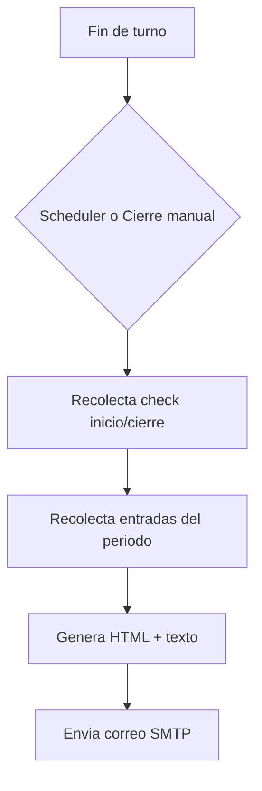

### Flujo de Boletín de Seguridad (actual)

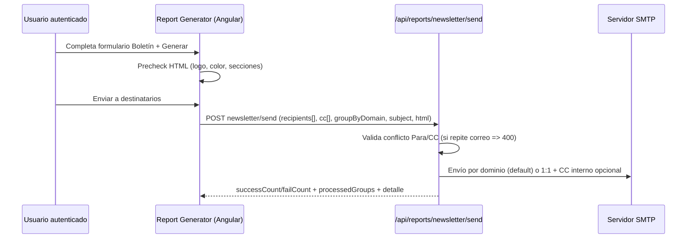

### Flujo objetivo IA local (planificado)

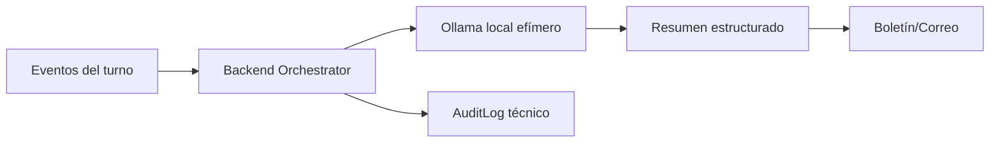

- Este flujo IA está en preparación documental (`AI-SUMMARY-001`) y aún no está habilitado en producción.

---

## 🔌 Flujo de Integraciones (SIEM + GLPI)

```mermaid
flowchart LR
  AUD[AuditLog] --> FW[logForwarder]
  FW --> SIEM1[Conector SIEM #1]
  FW --> SIEM2[Conector SOAR/NDR #2]
  FW --> SIEMN[Conector N]

  ADMIN[Admin > GLPI] --> GLPIAPI[/api/glpi/config,/test]
  GLPIAPI --> GLPIREST[GLPI REST apirest.php]
  GLPIAPI --> GLPIMAIL[Correo collector GLPI]
```

- Forwarding SIEM soporta múltiples destinos activos en paralelo.
- GLPI tiene configuración propia y prueba de conectividad independiente.

---

## 🧩 Complementos

```mermaid
flowchart LR
  ADMIN[Admin UI] --> CRUD[/api/complements]
  ADMIN --> ZIP[/source validate preview publish/]
  CRUD --> ORCH[Complement Manager]
  ZIP --> ORCH
  ORCH --> GDB[(MongoDB General)]
  ORCH -. wipe-out seguro .-> PDB[(bitacora_ext_*)]
  ORCH --> PRE[/uploads/complements/preview/]
  ORCH --> PUB[/uploads/complements/published/]
  ORCH --> AUD[AuditLog complement.*]
  ORCH --> CIR[Circuit Breaker]
  CIR --> SLOT[Complement Container iframe]
  FE[Angular SPA] --> SLOT
  SLOT --> BRIDGE[Complement Bridge]
  BRIDGE --> INT[/API Interna v1/]
  INT --> ORCH
```

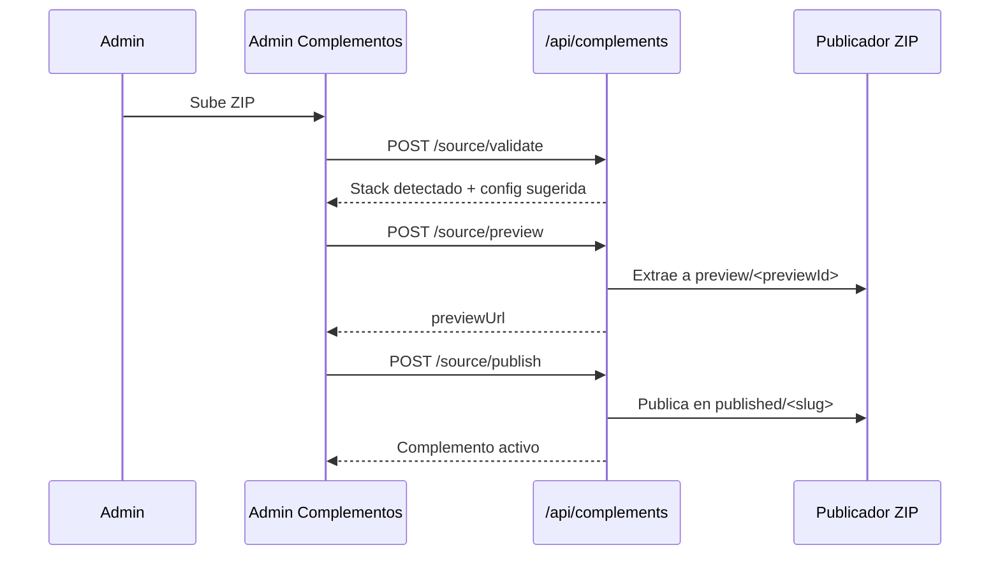

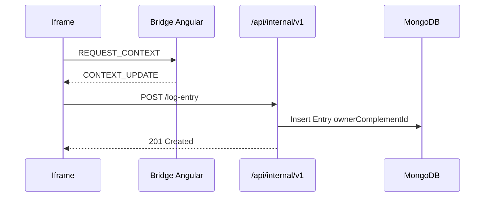

- La publicación automática hoy solo soporta ZIP `static-html`.
- `browser-state` y `shared_storage` viven en `ComplementSharedRecord` dentro de la base general.
- `v2` existe en discovery/modelo, pero no es aún una API interna funcional.


# Arquitectura TLS/SSL

# Arquitectura TLS/SSL en Bitácora SOC (Implementación Detallada)

Este documento explica en profundidad técnica el diseño, la implementación y el funcionamiento de la capa de seguridad TLS/SSL en el proyecto **Bitácora SOC**. Este sistema fue diseñado para ofrecer máxima seguridad (E2E encryption), alta disponibilidad (cero caídas al rotar certificados) y tolerancia a fallos en el arranque inicial.

---

## 1. Diagrama de Arquitectura Global

El siguiente diagrama ilustra cómo se estructuran y se comunican los componentes en la red de Docker para proveer una conexión cifrada, así como el flujo de recarga de certificados "En Caliente" (Hot Reload):

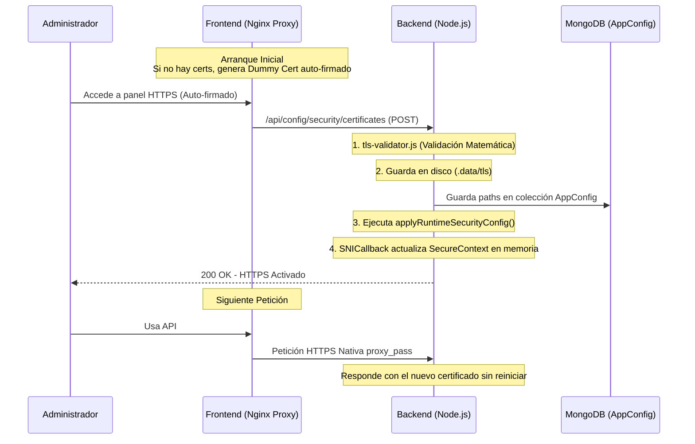

---

## 2. Capa Frontend: Proxy Nginx y Contenedor Tolerante a Fallos

Nginx sirve como el servidor perimetral que presenta la interfaz SPA de Angular y hace de proxy reverso hacia el backend.

### 2.1. Problema del Huevo y la Gallina en Docker
Si configuras Nginx para escuchar en el puerto `443` activando `ssl_certificate`, Nginx fallará catastróficamente **si esos archivos no existen en disco** al momento del arranque. En un despliegue virgen, el usuario aún no ha tenido oportunidad de subir certificados.

### 2.2. Solución: Generación de Certificados Dummy en el Arranque
Para asegurar que el contenedor inicie siempre, el `Dockerfile` del frontend incluye el binario `openssl`, y el `docker-compose.yml` inyecta un script de comprobación antes de arrancar Nginx:

**En `docker-compose.yml`:**
```yml
    command: >
      sh -c ' if [ ! -f /etc/nginx/certs/cert.pem ]; then
        echo "Generando certificados autofirmados dummy para arranque inicial...";
        openssl req -x509 -nodes -days 365 -newkey rsa:2048 -keyout /etc/nginx/certs/key.pem -out /etc/nginx/certs/cert.pem -subj "/CN=localhost";
      fi; nginx -g "daemon off;" '
```
**Resultado**: Si el directorio `/etc/nginx/certs` está vacío, se crea un certificado autofirmado que permite que Nginx arranque. Luego, el administrador accederá (aceptando la advertencia del navegador) y usará la app para subir los certificados reales.

---

## 3. Capa Backend: Hot Reloading y SNICallback en Express.js

La "magia" para poder recargar certificados y habilitar/deshabilitar HTTPS **sin reiniciar ni detener el backend** reside en el uso del contexto de servidor dual y el `SNICallback`.

### 3.1 Servidor Dual Plegable
El backend de Bitácora levanta en HTTP (por defecto puerto 3000) de manera obligatoria. El servidor HTTPS (por defecto 3443) solo se instancia si la propiedad `httpsEnabled` en base de datos es `true`.

### 3.2. Recarga en Caliente (Hot Reloading) con SNICallback
El protocolo TLS permite que el servidor decida qué certificado proveer dependiendo del dominio que solicitó el cliente (SNI). Nosotros abusamos de este mecanismo para actualizar el certificado completo del servidor.

**Snippet en `server.js`:**
```javascript
let currentSecureContext = null;

httpsServer = https.createServer({
  SNICallback: (domain, cb) => {
    // Si hay un contexto seguro cargado en memoria, se despacha.
    // Si no lo hay, falla la negociación TLS.
    if (currentSecureContext) {
      cb(null, currentSecureContext);
    } else {
      cb(new Error('Contexto TLS no disponible'));
    }
  }
}, app);
```

Cuando un usuario sube un nuevo certificado desde el Admin Panel:
1. Se guarda en base de datos la ubicación (`secrets/...`).
2. Se llama a la función global `app.locals.applyRuntimeSecurityConfig()`.
3. Esta función lee los nuevos archivos de disco y recrea la variable `currentSecureContext` usando `tls.createSecureContext({ cert, key })`.
4. Listo. **La siguiente petición milisegundos después** recibirá el nuevo certificado, sin interrupciones.

---

## 4. Validación Matemática Estricta de Certificados (Pre-guardado)

Node.js es extremadamente frágil si le entregas un certificado y una llave que no coinciden matemáticamente; un error fatal arrojará una excepción "Uncaught Exception" que botará el proceso `node`.

Para evitar que un error humano de un admin tire la plataforma, se diseñó `backend/src/utils/tls-validator.js`:

```javascript
const validateCryptoPair = ({ certPem, keyPem, caPem }) => {
    // 1. Evitar llaves privadas cifradas con contraseña
    const keyString = String(keyPem);
    if (keyString.includes('ENCRYPTED')) {
        throw new Error('Llave privada cifrada no soportada. Sube una llave PEM sin passphrase.');
    }

    try {
        // 2. Simulamos la creación del SecureContext en un bloque try/catch
        const contextOptions = { cert: certPem, key: keyPem };
        tls.createSecureContext(contextOptions);
        return true;
    } catch (err) {
        throw new Error(`Los certificados TLS son inválidos o no corresponden: ${err.message}`);
    }
};
```
La ruta POST `/api/config/security/certificates` invoca `validateCryptoPair()` en un bloque seguro. Si los certificados no encajan, se borran inmediatamente de `/tmp/` y la API devuelve HTTP 400.

Además, con el método asíncrono `isPortFree()`, el backend intenta enlazar un socket silencioso al nuevo puerto HTTPS antes de guardarlo; si el puerto ya está en uso, se bloquea la configuración para prevenir caídas de colisión de red (EADDRINUSE).

---

## 5. Middleware de Redirección Inteligente: CORS y Status 426

Cuando el administrador marca el switch `Forzar HTTPS en Backend` (`forceHttps = true`), el backend no debe procesar nada que venga por HTTP.

**El problema con `307 Redirect`**:
Generalmente, para forzar HTTPS se devuelve un status `301` o `307` redirigiendo hacia la url con `https://`. Sin embargo, esto es veneno para SPAs (Angular) realizando peticiones AJAX/Fetch. Cuando un navegador sigue un HTTP Redirect ciego por CORS, elimina las cabeceras de `Authorization` o descarta las cookies (`withCredentials`). El usuario terminará con errores `401 Unauthorized` inexplicables y la UI colapsará.

**La Solución Amigable API - Status 426**:
El backend distingue si la petición HTTP proviene del navegador directo o de la API:

```javascript
// Si es una petición API o un Fetch XHR
if (req.path.startsWith('/api') || req.xhr || (req.headers.accept && req.headers.accept.includes('application/json'))) {
  // En lugar de redirigir, abortamos con un error semánticamente correcto: "Upgrade Required"
  return res.status(426).json({
    message: 'HTTPS requerido para esta operación',
    targetUrl: `https://${targetHost}${req.originalUrl}`
  });
}

// Si es una petición de navegador normal (GET /) redirigimos tradicionalmente
if (req.method === 'GET' || req.method === 'HEAD') {
  return res.redirect(307, targetUrl);
}
```

El **HttpInterceptor de Angular** captura los errores `426 Upgrade Required`, e informa limpiamente al usuario internamente, o en un futuro podría re-intentar la petición ajustando la URL con las credenciales intactas, haciendo la UX mucho más resistente.

---

## 6. Experiencia de Usuario (Frontend): Validación y Cuenta Atrás

Dado que cambiar la configuración HTTPS del sistema (especialmente pasar de HTTP a HTTPS o cambiar el puerto) invoca un cambio drástico en la URL donde se aloja el frontend, el panel de administración (`admin-security.component.ts`) implementa un flujo a prueba de fallos de red.

**El Flujo UI:**
Cuando el administrador hace clic en "Guardar", se emite el request al backend. Inmediatamente el backend aplica el `SNICallback`, pero el navegador del usuario sigue atado a la URL HTTP/HTTPS antigua.

Para solucionar esto, Angular inicia un proceso de rescate automatizado:
1. Se despliega un SnackBar informando `Reiniciando frontend... (espere 15s)`.
2. El método interno `startCountdownAndRedirect()` bloquea el botón de guardar e inicia un `setInterval` rebajando cada segundo la cuenta atrás.
3. Al llegar a `0`, Angular manda un **Hard Redirect** a través de `window.location.href = targetUrl;`. En esa `targetUrl` Angular computa el protocolo esperado (`http://` o `https://`) basándose en los switches recién guardados.

```typescript
// admin-security.component.ts
private startCountdownAndRedirect(targetUrl: string, seconds: number = 15): void {
  this.isSaving = true;
  let remaining = seconds;
  this.countdownMessage = `(espere ${remaining}s)`;

  const interval = setInterval(() => {
    remaining--;
    if (remaining > 0) {
      this.countdownMessage = `(espere ${remaining}s)`;
    } else {
      this.countdownMessage = `(Recargando...)`;
      clearInterval(interval);
      window.location.href = targetUrl; // Hard reload a la nueva configuración HTTPS
    }
  }, 1000);
}
```

Esta técnica visual brinda confianza al administrador, dándole tiempo al backend a procesar la recarga TLS antes de arrastrar al navegador hacia la nueva URL segura.

---

## Resumen de Buenas Prácticas Aplicadas
- **Resiliencia al Inicio**: El contenedor se "auto-sana" generando dummy certs (Nginx/Openssl).
- **Zero-Downtime TLS Rotation**: SNICallback evita que las recargas rompan el uptime.
- **Fail-Fast Validation**: Validación matemática criptográfica previene corrupciones y caídas del core de Node.js.
- **API First Redirect**: Abandono de 3xx redirects para endpoints AJAX en favor del estado explícito 426, mejorando la fiabilidad de CORS y la retención de Sesión.
- **UX Segura (Countdown)**: Transición amigable en el Frontend para no perder al administrador durante el cambio de contexto HTTP a HTTPS.


