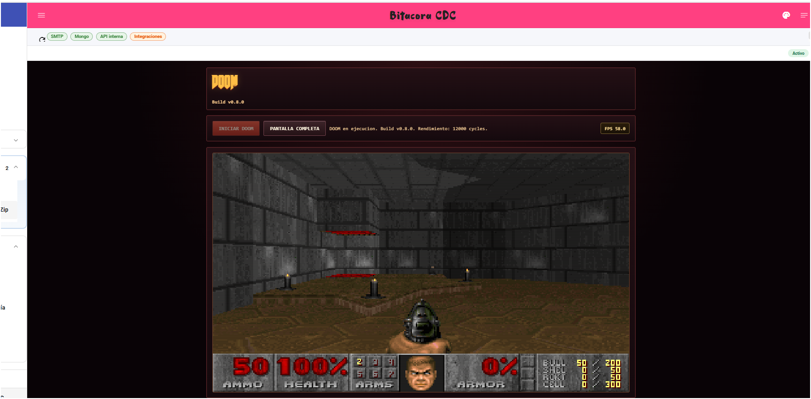
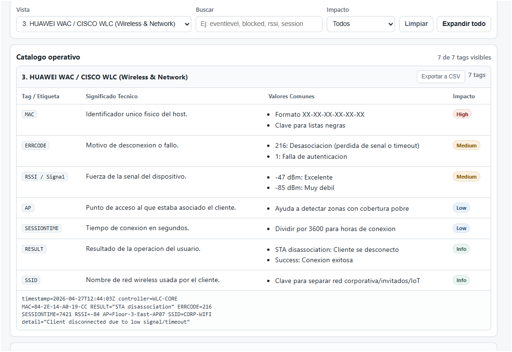
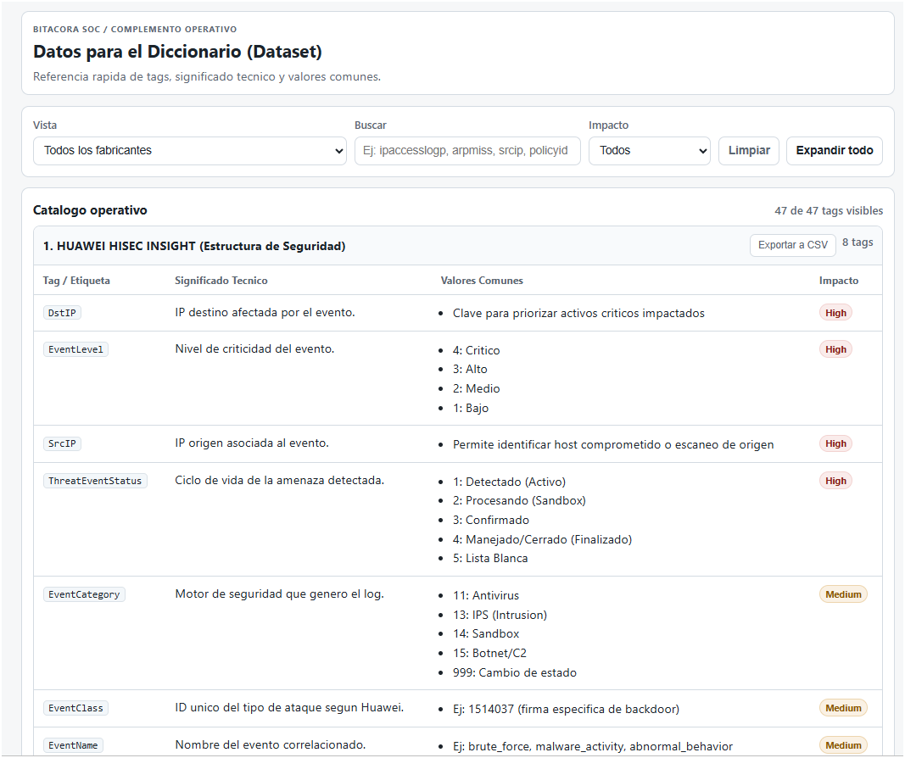

# Catálogos de Sistema

# 📚 Sistema de Catálogos con Autocomplete

<!-- Marca de autor en comentarios: Athan Espinoza -->

Sistema de autocomplete reutilizable con Angular Material para datasets grandes (1900+ items).

## 🎯 Componentes Implementados

### Backend (Express + MongoDB)

#### Modelos:
- **CatalogEvent** - Eventos SOC (phishing, malware, vulnerabilidades, etc)
- **CatalogLogSource** - Fuentes de logs / Clientes
- **CatalogOperationType** - Tipos de operación SOC

#### Endpoints:
```
GET /api/catalog/events?search={q}&enabled=true&limit=20
GET /api/catalog/log-sources?search={q}&enabled=true&limit=20
GET /api/catalog/operation-types?search={q}&enabled=true&limit=20
```

**Características**:
- ✅ Búsqueda server-side con índice de texto MongoDB
- ✅ Máximo 20 resultados por request (performance)
- ✅ Cursor-based pagination (opcional)
- ✅ Solo registros `enabled=true`
- ✅ Ordenamiento por relevancia (textScore)

### Frontend (Angular 20 + Material)

#### Componente Reutilizable:
**EntityAutocompleteComponent** - `<app-entity-autocomplete>`

**Features UX**:
- ✅ Typeahead con debounce 250ms
- ✅ Spinner "Buscando..."
- ✅ Mensaje "Sin resultados"
- ✅ Keyboard friendly (↑↓, Enter, Esc)
- ✅ Mouse friendly (click)
- ✅ Botón "X" para limpiar
- ✅ Paste support (Ctrl+V)
- ✅ Muestra name, parent, description truncada

**Performance**:
- ✅ ChangeDetectionStrategy.OnPush
- ✅ trackBy en *ngFor
- ✅ RxJS switchMap (cancela requests anteriores)
- ✅ Sin filtrado en frontend

## 🚀 Instalación

### 1. Seed de Datos

Poblar catálogos con datos de ejemplo:

```bash
cd backend
node src/scripts/seed-catalogs.js
```

Esto insertará:
- 8 eventos SOC de ejemplo
- 8 log sources / clientes
- 6 tipos de operación

### 2. Verificar Índices MongoDB

Los índices de texto se crean automáticamente al insertar el primer documento. Verificar:

```javascript
db.catalog_events.getIndexes()
db.catalog_log_sources.getIndexes()
db.catalog_operation_types.getIndexes()
```

Deberías ver índices:
- `catalog_event_search_index` (text search)
- `enabled_1_name_1` (queries rápidas)

## 📖 Uso

### Ejemplo Básico

```typescript
// Component
import { CatalogService } from '@app/services/catalog.service';
import { CatalogEvent } from '@app/models/catalog.model';

export class MyComponent {
  searchEventsFn = (query: string) => this.catalogService.searchEvents(query);
  
  displayEventFn = (item: CatalogEvent): string => {
    return item.parent ? `${item.name} (${item.parent})` : item.name;
  };

  onEventSelected(event: CatalogEvent): void {
    console.log('Evento seleccionado:', event);
    // Autocompletar otros campos
    this.form.patchValue({
      eventId: event._id,
      motivo: event.motivoDefault
    });
  }
}
```

```html
<!-- Template -->
<app-entity-autocomplete
  label="Evento"
  placeholder="Buscar evento..."
  [apiFn]="searchEventsFn"
  [displayFn]="displayEventFn"
  [minChars]="2"
  (selected)="onEventSelected($event)"
  (cleared)="onEventCleared()"
></app-entity-autocomplete>
```

### Ejemplo Completo

Ver: `frontend/src/app/pages/main/report-generator/`

Componente demo con 3 autocompletes integrados:
- Evento → autocompleta "Motivo"
- Log Source → selección simple
- Operation Type → autocompleta "Info Adicional"

**Ruta**: `/main/report-generator`

## 🔧 API Reference

### EntityAutocompleteComponent

**Inputs**:
- `label: string` - Label del campo
- `placeholder: string` - Placeholder del input
- `apiFn: (query: string) => Observable<{items, nextCursor}>` - Función de búsqueda
- `displayFn: (item) => string` - Función para mostrar texto en input
- `minChars: number = 2` - Mínimo caracteres para buscar
- `disabled: boolean = false` - Deshabilitar input

**Outputs**:
- `selected: EventEmitter<AutocompleteItem>` - Emite cuando se selecciona un item
- `cleared: EventEmitter<void>` - Emite cuando se limpia la selección

**Interfaces**:
```typescript
interface AutocompleteItem {
  _id: string;
  name: string;
  parent?: string | null;
  description?: string;
  [key: string]: any; // Campos adicionales
}

interface AutocompleteResponse {
  items: AutocompleteItem[];
  nextCursor?: string | null;
}
```

### CatalogService

```typescript
// Buscar eventos
searchEvents(query: string, cursor?: string, limit = 20): Observable<CatalogSearchResponse<CatalogEvent>>

// Buscar log sources
searchLogSources(query: string, cursor?: string, limit = 20): Observable<CatalogSearchResponse<CatalogLogSource>>

// Buscar tipos de operación
searchOperationTypes(query: string, cursor?: string, limit = 20): Observable<CatalogSearchResponse<CatalogOperationType>>
```

## 🎨 Customización

### Cambiar Estilos

Editar: `frontend/src/app/components/entity-autocomplete/entity-autocomplete.component.scss`

Variables CSS disponibles:
- `--mat-primary-color` - Color principal del tema

### Cambiar Límite de Resultados

En el componente:
```typescript
searchEventsFn = (query: string) => this.catalogService.searchEvents(query, undefined, 30); // 30 items
```

En backend: editar límite máximo en `routes/catalog.js`:
```javascript
const limitNum = Math.min(parseInt(limit) || 20, 50); // Max 50
```

## 📊 Performance

### Métricas Esperadas:
- Query MongoDB con text search: **< 50ms**
- Request completa: **< 200ms**
- Renderizado de 20 items: **< 100ms**

### Optimizaciones Implementadas:
1. **Índices MongoDB**: text search + compuesto (enabled + name)
2. **Debounce 250ms**: reduce requests innecesarias
3. **switchMap**: cancela requests anteriores
4. **Cursor pagination**: carga incremental (si se necesita)
5. **OnPush**: reduce ciclos de detección de cambios
6. **trackBy**: evita re-render de items ya renderizados

## 🔒 RBAC / Permisos

### Lectura (GET):
✅ Todos los usuarios autenticados pueden buscar catálogos

### Escritura (POST/PUT/DELETE):
❌ Solo rol `admin` (endpoints en `/api/admin/catalog/*` - no implementados en esta versión)

### Regla:
No se borran registros, solo se marcan como `enabled: false`

## 🧪 Testing

### Test Manual:
1. Iniciar backend: `cd backend && pnpm start`
2. Iniciar frontend: `cd frontend && pnpm start`
3. Login en `/login`
4. Navegar a `/main/report-generator`
5. Probar los 3 autocompletes

### Test de Performance:
```bash
# Insertar 2000 eventos para probar performance
node backend/src/scripts/seed-large-catalog.js
```

## 📝 Notas de Implementación

### MongoDB Text Search:
- Busca en: `name` (peso 10), `parent` (peso 5), `description` (peso 1)
- Case-insensitive
- Acepta múltiples palabras
- Ordenamiento automático por relevancia

### RxJS Pipeline:
```typescript
valueChanges.pipe(
  map(v => typeof v === 'string' ? v.trim() : ''),
  distinctUntilChanged(),
  filter(q => q.length >= minChars),
  debounceTime(250),
  switchMap(q => apiFn(q).pipe(
    catchError(() => of({ items: [], nextCursor: null }))
  ))
)
```

### Angular Material:
- `mat-autocomplete` con `displayWith`
- `mat-form-field` con appearance="outline"
- `mat-progress-spinner` para loading
- `mat-icon` para botón de limpiar

## 🐛 Troubleshooting

### "Sin resultados" siempre:
- Verificar que existen registros con `enabled: true`
- Verificar índice de texto en MongoDB
- Verificar que el backend está corriendo
- Verificar CORS en backend

### Performance lenta:
- Verificar índices: `db.catalog_events.getIndexes()`
- Reducir límite de resultados
- Verificar red/latencia

### Errores en consola:
- Verificar que `SharedComponentsModule` está importado
- Verificar que `CatalogService` está en `providedIn: 'root'`
- Verificar ruta de API en `environment.ts`

## 📦 Archivos Creados

### Backend:
```
backend/src/models/
  ├── CatalogEvent.js
  ├── CatalogLogSource.js
  └── CatalogOperationType.js

backend/src/routes/
  └── catalog.js

backend/src/scripts/
  └── seed-catalogs.js

backend/src/server.js (modificado)
```

### Frontend:
```
frontend/src/app/models/
  └── catalog.model.ts

frontend/src/app/services/
  └── catalog.service.ts

frontend/src/app/components/
  ├── entity-autocomplete/
  │   ├── entity-autocomplete.component.ts
  │   ├── entity-autocomplete.component.html
  │   └── entity-autocomplete.component.scss
  └── shared-components.module.ts

frontend/src/app/pages/main/
  ├── report-generator/ (ejemplo completo)
  │   ├── report-generator.component.ts
  │   ├── report-generator.component.html
  │   └── report-generator.component.scss
  └── main.module.ts (modificado)
```

## 🚀 Próximos Pasos

1. **Admin Panel**: Implementar CRUD de catálogos para rol admin
2. **Import CSV**: Importación masiva de eventos desde CSV/Excel
3. **Analytics**: Dashboard de eventos más usados
4. **Cache**: Implementar cache en Redis para queries frecuentes
5. **Infinite Scroll**: Usar `nextCursor` para load-more
6. **Multi-Select**: Variante para selección múltiple

## 📞 Soporte

Para issues o dudas:
1. Revisar esta documentación
2. Verificar logs de backend (consola)
3. Verificar logs de frontend (DevTools)
4. Revisar código de ejemplo en `report-generator.component.ts`


# Complementos

# Complementos - Guia Completa

Documentacion operativa y tecnica del modulo de complementos de Bitacora SOC.

Esta guia describe el estado real del sistema hoy: flujos soportados, endpoints, seguridad, almacenamiento, despliegue y limitaciones actuales.

---

## 1. Que es un complemento

Un complemento es una capacidad adicional integrada a la Bitacora mediante un `iframe` seguro y un contrato de API interna. La plataforma administra:

- registro y visibilidad del complemento
- aislamiento visual mediante circuit breaker
- token de aplicacion independiente del usuario
- acceso controlado a API interna y almacenamiento compartido
- publicacion administrada para paquetes ZIP estaticos

El modelo principal es `Complement` y vive en la base general, mientras que el contenido operativo del complemento puede vivir en:

- artefactos publicados por la plataforma (`zip-static`)
- un servicio/manual URL externo o interno
- almacenamiento compartido (`ComplementSharedRecord`)
- entradas generales marcadas con `ownerComplementId`

---

## 2. Flujos soportados hoy

### 2.1 Registro manual

Caso recomendado para:

- microservicios Node/Express
- frontends Vite/React ya desplegados por fuera
- servicios internos publicados en red privada o dominio propio

El admin registra manualmente:

- `slug`
- `name`
- `baseUrl`
- `internalBaseUrl` opcional
- `dbName`
- `apiVersion`
- `healthPath`
- `iframePath`
- scopes y colecciones permitidas
- visibilidad por roles o cargos

Resultado:

- se crea el registro del complemento
- se emite un `Application Token`
- el token debe guardarse solo en el servicio del complemento

### 2.2 ZIP estatico administrado por plataforma

Caso recomendado para:

- HTML + JavaScript simple
- paquetes con `index.html` y recursos estaticos

Flujo:

1. `Validar`: analiza el ZIP, detecta stack y propone configuracion.
2. `Preview`: extrae el ZIP a `uploads/complements/preview/<previewId>/` para revisarlo en navegador.
3. `Publicar`: copia el contenido a `uploads/complements/published/<slug>/` y crea o actualiza el complemento como `sourceType=zip-static`.

Resultado:

- el `iframe` deja de apuntar a una URL externa y pasa a servirse desde `/uploads/complements/...`
- el artefacto publicado queda protegido por autenticacion y visibilidad

### 2.3 ZIP analizado pero no auto-publicable

Hoy se pueden detectar estos stacks dentro del ZIP:

- `static-html`
- `vite-frontend`
- `react-vite`
- `node-service`

Pero la publicacion automatica hoy solo soporta `static-html`.

Para `vite-frontend`, `react-vite` y `node-service` el flujo correcto es:

1. validar el ZIP para obtener diagnostico y configuracion sugerida
2. desplegar el servicio o build fuera del publicador automatico
3. registrar el complemento por flujo manual

---

## 3. Limites y validacion de paquetes

Limites actuales del analizador de ZIP:

- tamano maximo comprimido: 25 MB
- maximo de archivos: 200
- tamano maximo descomprimido: 20 MB
- `package.json` leido solo si pesa hasta 256 KB

Lenguajes bloqueados de forma explicita en esta etapa:

- Python
- Java
- C#/.NET
- Go
- PHP
- Ruby
- Rust
- Kotlin
- Swift

Notas importantes:

- la lista de lenguajes bloqueados no es exhaustiva; cualquier stack fuera de los soportados se rechaza
- el analizador propone scopes y colecciones segun el stack detectado
- la UI admin ya distingue entre paquete valido, preview y publicacion

---

## 4. Modelo del complemento

Campos relevantes del modelo `Complement`:

| Campo | Uso |
|------|-----|
| `slug` | Identificador unico del complemento |
| `name` | Nombre visible en UI |
| `baseUrl` | URL base publica o de runtime |
| `internalBaseUrl` | URL alternativa para llamadas internas del backend |
| `dbName` | Nombre reservado para base privada, debe iniciar con `bitacora_ext_` |
| `apiVersion` | `v1` o `v2` |
| `status` | `active`, `disabled`, `maintenance` |
| `permissions.scopes` | Capacidades permitidas sobre API interna |
| `permissions.allowedCollections` | Colecciones generales autorizadas |
| `visibility.roles` | Roles que pueden verlo |
| `visibility.cargoLabels` | Cargos que pueden verlo |
| `sourceArtifact` | Metadatos de origen manual o `zip-static` |
| `tokenHash` | Hash del ultimo token emitido |

### 4.1 Scopes disponibles

- `READ_CONTEXT`
- `READ_LOGS`
- `WRITE_ENTRIES`
- `READ_STORAGE`
- `WRITE_STORAGE`
- `WRITE_LOGS`

### 4.2 Colecciones autorizables

- `entries`
- `auditlogs`
- `shared_storage`

---

## 5. Endpoints de administracion

Todos los endpoints de gestion usan autenticacion de usuario y requieren rol `admin`, salvo los endpoints de lectura para uso del analista indicados debajo.

### 5.1 Admin

| Metodo | Endpoint | Uso |
|--------|----------|-----|
| `GET` | `/api/complements` | Lista completa para consola admin |
| `POST` | `/api/complements` | Alta manual |
| `GET` | `/api/complements/:slug` | Detalle del complemento |
| `PUT` | `/api/complements/:slug` | Actualizacion |
| `POST` | `/api/complements/:slug/test` | Prueba de health-check |
| `POST` | `/api/complements/:slug/token` | Regenera application token |
| `DELETE` | `/api/complements/:slug` | Wipe-out completo |
| `GET` | `/api/complements/source/limits` | Devuelve limites del analizador |
| `POST` | `/api/complements/source/validate` | Analiza ZIP |
| `POST` | `/api/complements/source/preview` | Genera preview |
| `POST` | `/api/complements/source/publish` | Publica ZIP estatico |

### 5.2 Endpoints visibles para usuarios autenticados

| Metodo | Endpoint | Uso |
|--------|----------|-----|
| `GET` | `/api/complements/active` | Lista complementos visibles para sidebar |
| `GET` | `/api/complements/:slug` | Detalle visible si el usuario tiene acceso |
| `GET` | `/api/complements/:slug/browser-state` | Lee estado compartido de navegador del complemento |
| `PUT` | `/api/complements/:slug/browser-state` | Guarda estado compartido de navegador |

### 5.3 Rate limiting de gestion

- gestion admin general: 50 requests por 15 minutos
- borrado: 3 requests por 60 minutos

---

## 6. API interna para complementos

Autenticacion:

- `Authorization: Bearer <application_token>`
- el token es distinto del JWT/cookie de usuario
- el backend valida firma, expiracion, `slug`, hash del ultimo token emitido y scopes

### 6.1 Versiones disponibles

| Endpoint | Estado |
|----------|--------|
| `/api/internal/v1/*` | Activo |
| `/api/internal/v2/*` | Placeholder; hoy devuelve `501` en `/context` |

### 6.2 Endpoints v1

| Metodo | Endpoint | Scope | Uso |
|--------|----------|-------|-----|
| `GET` | `/api/internal/versions` | - | Descubrir versiones disponibles |
| `GET` | `/api/internal/v1/context` | `READ_CONTEXT` | Contexto operativo actual |
| `POST` | `/api/internal/v1/log-entry` | `WRITE_ENTRIES` | Crear entrada marcada con `ownerComplementId` |
| `GET` | `/api/internal/v1/query-general` | `READ_LOGS` | Consultar coleccion autorizada |
| `POST` | `/api/internal/v1/storage` | `WRITE_STORAGE` | Guardar clave/valor propio |
| `GET` | `/api/internal/v1/storage` | `READ_STORAGE` | Leer almacenamiento propio |
| `POST` | `/api/internal/v1/log` | `WRITE_LOGS` | Centralizar logs en auditoria |

### 6.3 Headers de version

```text
X-API-Version: v1
X-API-Latest: v1
```

---

## 7. Bridge Core <-> iframe

El frontend registra cada `iframe` en `ComplementBridgeService` y sincroniza contexto por `postMessage` validando `origin`.

### 7.1 Eventos salientes del core

- `CONTEXT_UPDATE`
- `SHIFT_CHANGE`
- `USER_CHANGE`
- `THEME_CHANGE`
- `CHECKLIST_SUBMITTED`

### 7.2 Eventos entrantes hoy soportados

- `REQUEST_CONTEXT`: el core responde con `CONTEXT_UPDATE`
- `CREATE_ENTRY`: el core crea una entrada usando el formulario minimo enviado

### 7.3 Protecciones del bridge

- validacion estricta de `event.origin`
- registro por `slug`
- desconexion del frame si supera 100 mensajes en 10 segundos

---

## 8. Persistencia y almacenamiento

### 8.1 Browser state

`GET/PUT /api/complements/:slug/browser-state` guarda un registro compartido por complemento con clave fija `browser-state`.

Uso recomendado:

- tablas simples del complemento publicado
- caches UI compartidos
- formularios pequeños que deban sobrevivir logout/login

Consideraciones:

- no es almacenamiento por usuario
- el ultimo guardado sobrescribe el valor completo
- queda trazado por `updatedByUserId`, `updatedByUsername` y `updatedVia`

### 8.2 Shared storage via API interna

`/api/internal/v1/storage` permite al propio microservicio guardar multiples claves en `ComplementSharedRecord` filtradas por `ownerComplementId`.

Uso recomendado:

- configuracion funcional del complemento
- estados operativos propios del microservicio
- caches o snapshots administrados por backend del complemento

### 8.3 Entradas en la bitacora general

Cuando el complemento crea entradas por API interna, cada registro queda marcado con:

- `ownerComplementId=<slug>`

Esto permite:

- trazabilidad
- filtros operativos
- purge seguro durante wipe-out

### 8.4 Base privada `bitacora_ext_*`

El campo `dbName` sigue siendo parte del contrato y del wipe-out seguro.

Importante:

- hoy la plataforma valida y reserva ese nombre
- el borrado seguro contempla `dropDatabase()` para esa DB
- el aprovisionamiento automatico de una DB privada por API no forma parte del flujo admin actual; si el microservicio la usa, debe administrarla de su lado

---

## 9. Circuit breaker y resiliencia

Cada complemento tiene un estado de circuito en memoria:

- `CLOSED`: normal
- `OPEN`: aislado por fallos
- `HALF_OPEN`: en verificacion de recuperacion

Parametros por defecto:

- timeout: `COMPLEMENT_CIRCUIT_TIMEOUT_MS=3000`
- umbral de fallo: `COMPLEMENT_CIRCUIT_FAIL_THRESHOLD=3`
- reintento: `COMPLEMENT_CIRCUIT_RESET_MS=30000`

Comportamiento:

- para complementos manuales se prueba `healthPath`
- para `zip-static` no se hace sonda HTTP a un microservicio; se valida que el artefacto publicado exista en disco
- si el circuito esta `OPEN`, la UI no carga el `iframe` y muestra estado de mantenimiento

---

## 10. Seguridad

### 10.1 Aislamiento de credenciales

- la web usa cookie `auth_token` HttpOnly para usuarios
- los complementos usan `Application Token` aparte
- no se comparte la cookie de usuario con la API interna del complemento

### 10.2 Proteccion de artefactos publicados

Los archivos servidos bajo `/uploads/complements/...` no son publicos anonimos.

Reglas:

- preview: solo admin autenticado
- published: usuario autenticado con visibilidad al complemento
- se remueve `X-Frame-Options: DENY` solo para esta ruta para permitir el `iframe`

### 10.3 Politica de URL privadas

La validacion de URLs del complemento usa guard SSRF.

- en entornos autorizados puede permitir hosts privados
- la configuracion se controla con `COMPLEMENT_ALLOW_PRIVATE_URLS`
- `internalBaseUrl` puede usar HTTP y red privada si el caso lo requiere

### 10.4 Sandbox del iframe

El `iframe` corre con:

```html
sandbox="allow-scripts allow-same-origin allow-forms"
```

---

## 11. Despliegue y runtime

### 11.1 Docker base

El stack principal ya deja al backend unido a dos redes:

- `bitacora-network`
- `bitacora-complements`

Esto significa que el modulo de complementos del core queda operativo aun sin overlays adicionales.

### 11.2 Overlay `docker-compose.complements.yml`

El overlay actual es opcional y esta orientado a laboratorio/QA. Su funcion hoy es levantar `complement-stub` para pruebas.

No reemplaza el despliegue de un complemento real en produccion.

### 11.3 Scripts del repositorio

Los scripts:

- `scripts/compose-up.ps1`
- `scripts/compose-up.sh`
- `scripts/compose-rebuild.ps1`
- `scripts/compose-rebuild.sh`

ya incluyen `-f docker-compose.complements.yml` para levantar tambien el stub de pruebas.

### 11.4 Artefactos de plataforma

- previews: `uploads/complements/preview/<previewId>/`
- publicados: `uploads/complements/published/<slug>/`

Hoy no existe un job automatico de limpieza de previews antiguos. Deben revisarse manualmente si se usa mucho el flujo de prueba.

---

## 12. Desarrollo de un complemento

### 12.1 Recomendacion por nivel de complejidad

- simple UI embebida: ZIP `static-html`
- frontend moderno ya compilado: desplegar build y registrar manual
- microservicio con logica propia: servicio Node y registro manual

### 12.2 Ejemplo minimo: pedir contexto desde el iframe

```html
<script>
  window.addEventListener('message', (event) => {
    if (!event.data || event.data.version !== 1) return;
    if (event.data.type === 'CONTEXT_UPDATE') {
      console.log('Contexto recibido', event.data.payload);
    }
  });

  window.parent.postMessage({
    type: 'REQUEST_CONTEXT',
    version: 1,
    payload: {}
  }, '*');
</script>
```

### 12.3 Ejemplo minimo: crear una entrada via API interna

```bash
curl -X POST http://backend:3000/api/internal/v1/log-entry \
  -H "Authorization: Bearer $COMPLEMENT_TOKEN" \
  -H "Content-Type: application/json" \
  -d '{
    "content": "Complemento registro hallazgo operativo",
    "entryType": "operativa",
    "entryDate": "2026-04-03",
    "entryTime": "09:30"
  }'
```

### 12.4 Ejemplo minimo: usar browser-state desde un complemento publicado

```javascript
async function loadBrowserState(slug) {
  const response = await fetch(`/api/complements/${slug}/browser-state`, {
    credentials: 'include'
  });
  return response.ok ? response.json() : { value: null };
}

async function saveBrowserState(slug, value) {
  const response = await fetch(`/api/complements/${slug}/browser-state`, {
    method: 'PUT',
    credentials: 'include',
    headers: { 'Content-Type': 'application/json' },
    body: JSON.stringify({ value })
  });
  return response.json();
}
```

---

## 13. Operacion diaria

### Alta recomendada de complemento

1. Definir si sera `manual` o `zip-static`.
2. Validar scopes minimos necesarios.
3. Restringir visibilidad por rol/cargo si no es de uso global.
4. Guardar el token solo en el servicio del complemento.
5. Probar health-check antes de exponerlo al equipo.
6. Verificar que aparezca en `GET /api/complements/active` para el usuario destino.

### Baja recomendada de complemento

1. Pasarlo a `maintenance` o `disabled` si necesitas aislarlo antes.
2. Ejecutar borrado solo si corresponde wipe-out definitivo.
3. Revisar auditoria `complement.delete.*`, `complement.wipe.*`.
4. Confirmar purga de `ownerComplementId` y artefactos publicados.

---

## 14. Limitaciones actuales

- la publicacion automatica solo soporta ZIP `static-html`
- `apiVersion=v2` existe en modelo y discovery, pero el runtime v2 todavia no esta implementado
- no hay limpieza automatica de previews viejos
- `browser-state` es compartido por complemento, no por usuario
- la DB privada `bitacora_ext_*` forma parte del contrato y del wipe-out, pero su explotacion operativa depende del microservicio

---

## 15. Documentos relacionados

- `docs/API.md`
- `docs/ARCHITECTURE.md`
- `docs/DEPLOY.md`
- `docs/SECURITY.md`
- `docs/LOGGING.md`
- `docs/RUNBOOK.md`
- `docs/BACKUP.md`
- `docs/COMPLEMENTS_CATALOG.md`: catalogo de complementos de prueba disponibles en `Extras/` (lista, imagen y descripcion breve)


# Catálogo de Complementos

# Catalogo de Complementos de Prueba

Complementos listos para cargar en la plataforma desde `Extras/`.
Cada uno se publica desde Admin > Complementos usando el flujo `Analizar ZIP → Preview → Publicar`.

---

## doom-browser

Complemento `zip-static` que ejecuta DOOM en el navegador embebido.
Sirve para validar el soporte de runtime avanzado (WebAssembly, workers, canvas) en la plataforma sin levantar servicios adicionales.

- **Tipo**: `zip-static`
- **Archivo**: `Extras/doom-browser.zip`
- **Fuente**: `Extras/doom-browser/`



---

## diccionario-logs-ciber

Complemento `zip-static` de apoyo SOC para consultar tags y campos de logs por fabricante.
Permite busqueda rapida, filtro por nivel de impacto y comparacion de ejemplos reales de log entre marcas (Huawei HiSec, Fortinet FortiOS, Huawei WAC/Cisco WLC).

- **Tipo**: `zip-static`
- **Archivo**: `Extras/diccionario-logs-ciber.zip`
- **Fuente**: `Extras/diccionario-logs-ciber/`





---

## Documentos relacionados

- `docs/COMPLEMENTS.md`: guia tecnica del modulo de complementos (flujos, API, seguridad, despliegue)
- `Extras/README.md`: catalogo completo incluyendo muestras de referencia y stub de integracion


