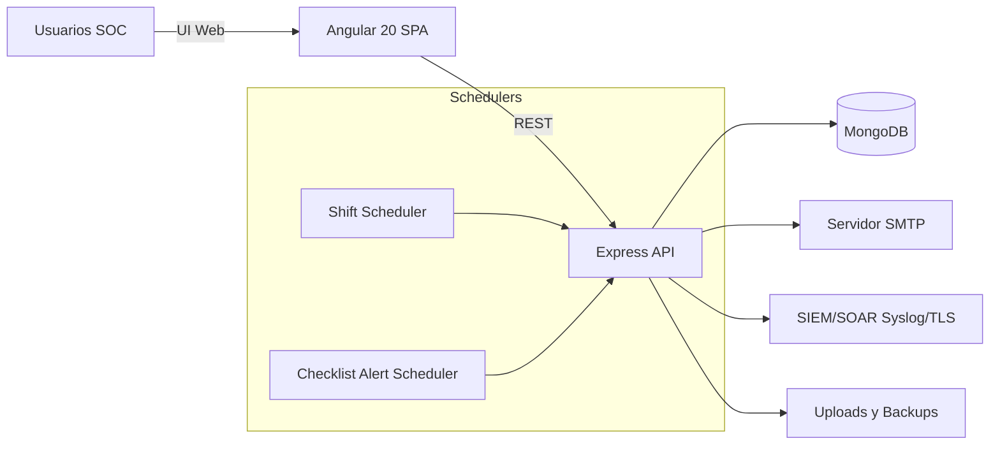
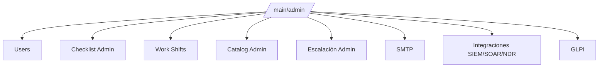
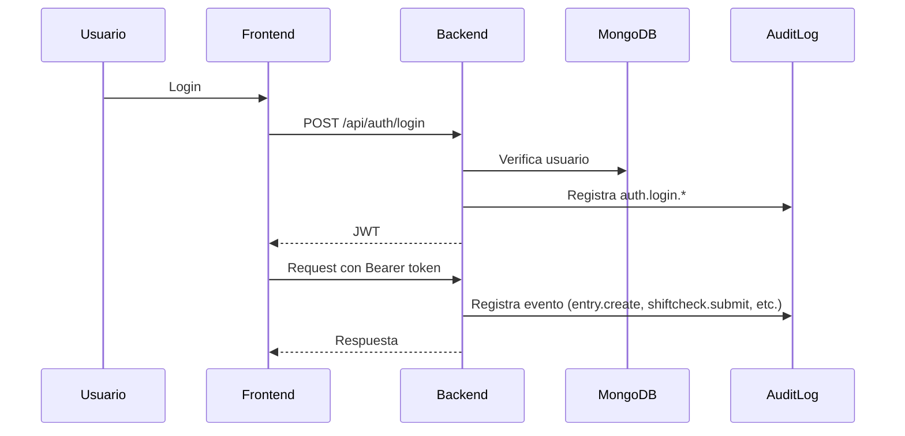
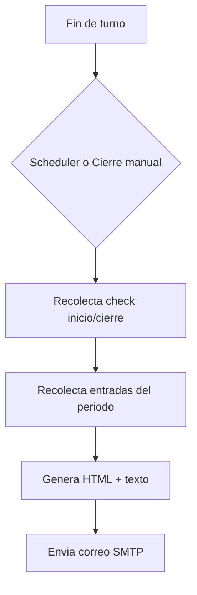

# 🧭 Arquitectura y Flujos - Bitacora SOC

Documentacion visual del funcionamiento general del sistema.

> Estado: Arquitectura en evolución (beta). Los módulos clave ya están operativos y separados por dominio funcional.

---

## 🗺️ Mapa Conceptual (alto nivel)



---

## 🧩 Módulos Administrativos (Frontend)



- Integraciones SIEM/SOAR/NDR y GLPI quedaron separados por diseño.
- GLPI opera como módulo independiente (API REST o correo collector).

---

## 🔐 Flujo de Autenticacion y Auditoria



---

## 📧 Flujo de Reporte de Turno



---

## 🔌 Flujo de Integraciones (SIEM + GLPI)

```mermaid
flowchart LR
  AUD[AuditLog] --> FW[logForwarder]
  FW --> SIEM1[Conector SIEM #1]
  FW --> SIEM2[Conector SOAR/NDR #2]
  FW --> SIEMN[Conector N]

  ADMIN[Admin > GLPI] --> GLPIAPI[/api/glpi/config,/test]
  GLPIAPI --> GLPIREST[GLPI REST apirest.php]
  GLPIAPI --> GLPIMAIL[Correo collector GLPI]
```

- Forwarding SIEM soporta múltiples destinos activos en paralelo.
- GLPI tiene configuración propia y prueba de conectividad independiente.
