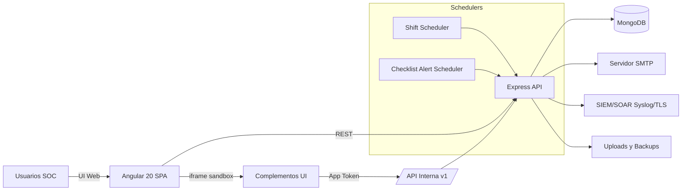
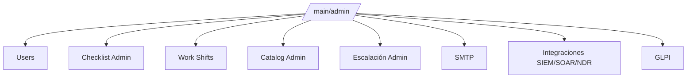
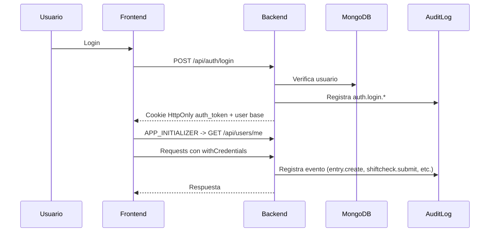
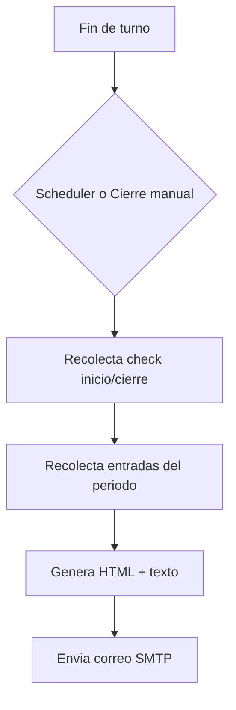
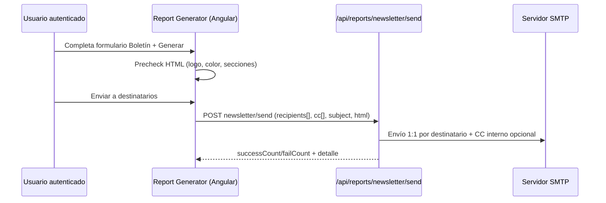
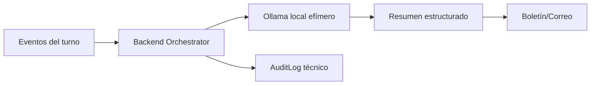
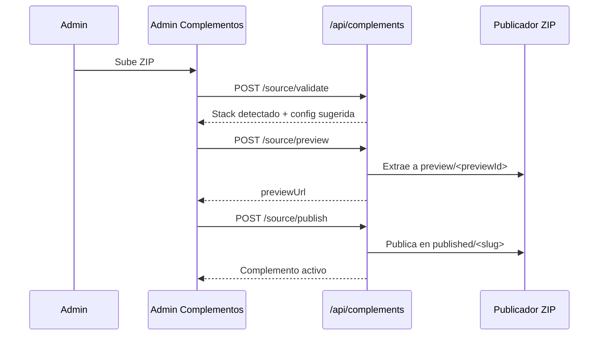
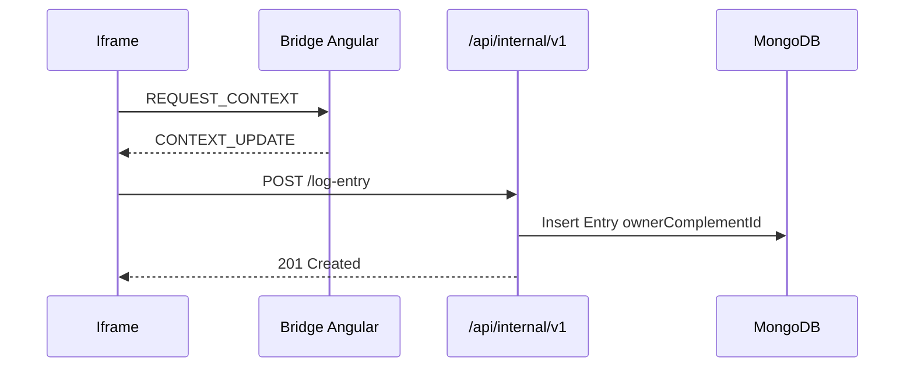

# 🧭 Arquitectura y Flujos - Bitacora SOC

Documentacion visual del funcionamiento general del sistema.

> Estado: Arquitectura en evolución (beta). Los módulos clave ya están operativos y separados por dominio funcional.
>
> Referencia visual de pantallas: ver `docs/SCREENSHOTS.md` para capturas reales de la interfaz.

---

## 🗺️ Mapa Conceptual (alto nivel)



---

## 🧩 Módulos Administrativos (Frontend)



- Integraciones SIEM/SOAR/NDR y GLPI quedaron separados por diseño.
- GLPI opera como módulo independiente (API REST o correo collector).

---

## 🔐 Flujo de Autenticacion y Auditoria



- La sesión web usa cookie `auth_token` HttpOnly.
- El frontend rehidrata sesión al arrancar usando `/api/users/me`.

---

## 📧 Flujo de Reporte de Turno



### Flujo de Boletín de Seguridad (actual)



### Flujo objetivo IA local (planificado)



- Este flujo IA está en preparación documental (`AI-SUMMARY-001`) y aún no está habilitado en producción.

---

## 🔌 Flujo de Integraciones (SIEM + GLPI)

```mermaid
flowchart LR
  AUD[AuditLog] --> FW[logForwarder]
  FW --> SIEM1[Conector SIEM #1]
  FW --> SIEM2[Conector SOAR/NDR #2]
  FW --> SIEMN[Conector N]

  ADMIN[Admin > GLPI] --> GLPIAPI[/api/glpi/config,/test]
  GLPIAPI --> GLPIREST[GLPI REST apirest.php]
  GLPIAPI --> GLPIMAIL[Correo collector GLPI]
```

- Forwarding SIEM soporta múltiples destinos activos en paralelo.
- GLPI tiene configuración propia y prueba de conectividad independiente.

---

## 🧩 Complementos

```mermaid
flowchart LR
  ADMIN[Admin UI] --> CRUD[/api/complements]
  ADMIN --> ZIP[/source validate preview publish/]
  CRUD --> ORCH[Complement Manager]
  ZIP --> ORCH
  ORCH --> GDB[(MongoDB General)]
  ORCH -. wipe-out seguro .-> PDB[(bitacora_ext_*)]
  ORCH --> PRE[/uploads/complements/preview/]
  ORCH --> PUB[/uploads/complements/published/]
  ORCH --> AUD[AuditLog complement.*]
  ORCH --> CIR[Circuit Breaker]
  CIR --> SLOT[Complement Container iframe]
  FE[Angular SPA] --> SLOT
  SLOT --> BRIDGE[Complement Bridge]
  BRIDGE --> INT[/API Interna v1/]
  INT --> ORCH
```





- La publicación automática hoy solo soporta ZIP `static-html`.
- `browser-state` y `shared_storage` viven en `ComplementSharedRecord` dentro de la base general.
- `v2` existe en discovery/modelo, pero no es aún una API interna funcional.
