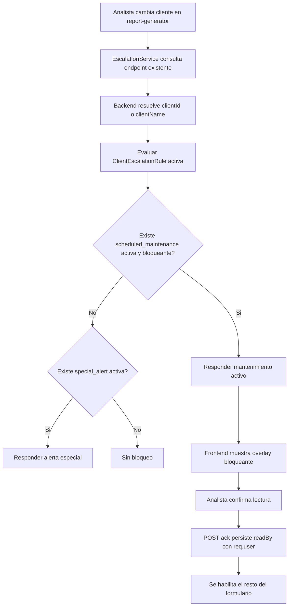
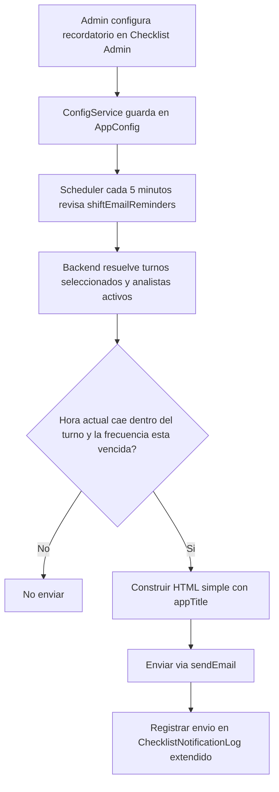

<!-- markdownlint-disable MD013 MD007 MD030 MD031 MD034 MD036 MD050 MD032 -->
# Plan de Trabajo: Bitácora SOC

## Tablas de Control

**Alcance de seguimiento:** Las filas `AI-SUMMARY-001` … `AI-SUMMARY-001G` se mantienen como **referencia** (especificación/archivo), pero **no forman parte** del backlog operativo que el equipo prioriza para iteraciones UI/QA ni de las **métricas por oleada** históricas (`UI-MIG-060` cerrado como proceso). Para trabajo vivo: obligaciones **Recurrente**, métricas §9 en `docs/UI-GOVERNANCE.md`, y nuevos `UI-*` si se abren.

### Leyenda de estados (tablas de control)

| Estado | Uso |
| --- | --- |
| **En progreso** | Issues `UI-*` con trabajo abierto. Si la tabla solo muestra el marcador de posición, no hay `UI-*` activos; usar **Listas** para cerrados y **Recurrente** para QA. |
| **Recurrente** | Política viva (cada PR); no se marca **Listo** como ticket único. |
| **Archivo** | Epic IA documentado; sin seguimiento operativo UI (ver nota de alcance). |

**Mejora continua (no son filas En progreso):** bajar `!important` global (`styles.scss`), ejecutar WCAG con herramienta por PR que toque UI (ver `docs/wcag-audit-handoff.md`), y reconteos `rg` §9 cuando cambien tokens o temas.

### En progreso

| ID | Estado | Seccion | Tarea | Notas |
| --- | --- | --- | --- | --- |
| BACKUP-ENC-081 | En progreso | Backup / Seguridad ALTA | Cifrado opcional de backups con passphrase en crear y restaurar | Al crear un backup, el usuario podrá elegir si desea cifrarlo mediante un popup para ingresar frase secreta; no será obligatorio. Al restaurar, si el respaldo está cifrado, el sistema debe pedir la llave, validarla antes de tocar datos y continuar solo si es correcta. |

**Plan de ataque visual ejecutado:** `docs/ui-visual-remediation-plan.md` (oleadas, criterios de aceptación, rutas objetivo y Definition of Done visual).

### Recurrente (QA — cada cambio UI)

| ID | Estado | Seccion | Tarea | Notas |
| --- | --- | --- | --- | --- |
| QA-UI-061 | Recurrente | QA + Frontend CRÍTICA | Rol QA en cada cambio UI | Obligación **en cada PR** que toque estilos. Referencia: `docs/UI-GOVERNANCE.md` §8. |
| QA-UI-062 | Recurrente | QA Visual CRÍTICA | Probar en los 5 temas lo tocado | Recurrente por cambio. `docs/UI-GOVERNANCE.md` §8. |
| QA-UI-063 | Recurrente | QA Funcional + UI ALTA | Regresión formularios tras cambios de estilo | Recurrente por cambio. `docs/UI-GOVERNANCE.md` §8. |
| QA-UI-064 | Recurrente | QA Contraste / Theming ALTA | Casos explícitos contraste/inputs | Recurrente por cambio. `docs/UI-GOVERNANCE.md` §§7–8. |
| QA-UI-065 | Recurrente | Gobernanza CRÍTICA | No omitir estándares al codificar | Política viva; `docs/UI-GOVERNANCE.md` §8. |

### Archivo IA (referencia — sin seguimiento operativo)

| ID | Estado | Seccion | Tarea | Notas |
| --- | --- | --- | --- | --- |
| AI-SUMMARY-001 | Archivo | IA/Operación ALTA | Módulo de Resumen Ejecutivo Efímero (IA On-Demand) | Integrar Ollama+llama3.2:3b en modo efímero `docker start -> healthcheck -> generate -> docker stop` con `try/finally`. Alcance: IA sin interacción conversacional con usuarios; solo consume eventos del turno y genera resumen sugerido. |
| AI-SUMMARY-001A | Archivo | IA/Backend CRÍTICA | Endpoint seguro de generación IA on-demand (solo admin) | Crear `POST /api/reports/newsletter/ai-summary` con `authenticate + authorize('admin')`, validación fuerte de payload, timeout y respuesta estructurada. |
| AI-SUMMARY-001B | Archivo | IA/Infra CRÍTICA | Orquestador efímero de Ollama con kill garantizado | Implementar flujo `start -> healthcheck -> generate -> stop` en `try/finally`, con lock de concurrencia para evitar múltiples arranques simultáneos. |
| AI-SUMMARY-001C | Archivo | IA/Seguridad ALTA | Hardening anti prompt-injection y sanitización de contexto | Sanitizar entradas, truncar tamaño, remover instrucciones maliciosas y usar prompt de sistema inmutable con formato JSON estricto. |
| AI-SUMMARY-001D | Archivo | IA/Observabilidad ALTA | Auditoría técnica sin fuga de datos sensibles | Auditar duración, modelo, tokens estimados, resultado y errores; nunca persistir prompt completo ni respuesta íntegra sensible. |
| AI-SUMMARY-001E | Archivo | IA/Frontend ALTA | UX integrada en Boletín: `Resumen Sugerido por IA` + botón `Generar con IA` | Campo editable no bloqueante, estados loading/error/reintento, cancelación y preservación de edición manual al regenerar. |
| AI-SUMMARY-001F | Archivo | IA/Operación ALTA | Límite de recursos y políticas de degradación | Timeout duro, memoria/CPU límites, rate-limit por usuario, fallback manual si IA falla, sin bloquear generación de boletín. |
| AI-SUMMARY-001G | Archivo | QA/Testing ALTA | Suite de pruebas de seguridad, carga y regresión | Tests de éxito, timeout, lock concurrente, sanitización, RBAC, fallback UX y no-regresión en `report-generator`/newsletter. |


### ✅ Listas

| ID | Estado | Seccion | Tarea | Notas |
| --- | --- | --- | --- | --- |
| UI-NEWS-072 | Listo | UI/UX + Boletines ALTA | Selector rápido de destinatarios guardados en envío de boletín | En `/main/report-generator` se agregó bloque contiguo con contactos guardados por checkbox mostrando **nombre + correo + empresa**; convive con el textarea manual y ambas fuentes se combinan sin duplicados. |
| UI-ESC-073 | Listo | UX/Admin + Escalación MEDIA | Renombrar "Contactos de Clientes" a "Contactos de Escalación" | `/main/admin/escalation` ahora explicita que el módulo corresponde a escalación/turnos y separa la libreta preventiva del flujo operacional. |
| UI-DIR-074 | Listo | Admin + Backend + Email ALTA | Agenda simple de contactos generales para avisos preventivos | Se implementó agenda preventiva separada usando `contactType='preventive'` con CRUD liviano, **nombre/correo/empresa obligatorios** y **teléfono opcional**, reutilizable para boletines. |
| UI-NEWS-075 | Listo | UX/Boletines MEDIA | Filtros, favoritos y selección masiva de destinatarios | El panel del boletín ahora incluye búsqueda por nombre/correo/empresa, filtro por empresa, acciones `Seleccionar todo`, `Limpiar` y `Solo favoritos`, más contador visible de seleccionados. |
| UI-DIR-076 | Listo | Admin + Datos MEDIA | Importación y exportación CSV de agenda preventiva | La agenda preventiva permite descargar plantilla CSV, importar en lote con validación parcial segura y exportar el respaldo actual desde el admin. |
| UI-DIR-077 | Listo | Admin + Cumplimiento ALTA | Estado del contacto y exclusión de envíos | Se agregaron flags `activo`, `favorito` y `no enviar`, además de nota interna; los contactos excluidos o sin correo válido quedan claramente identificados y no participan por defecto. |
| MAIL-NEWS-078 | Listo | Email + QA MEDIA | Validación previa y resumen de destinatarios antes del envío | Antes del envío se resume cuántos destinatarios serán válidos, duplicados, inválidos o excluidos; el despacho queda operativo como **envío real 1:1** con auditoría clara. |
| UI-CHK-080 | Listo | Checklist Admin + Theming ALTA | Corregir legibilidad de plantillas/editor en dark y cyberpunk | Se reparó el layout visual de `/main/admin/checklist` en la sección **Plantillas y editor**: nombres ya no se enciman, badges usan contraste theme-aware y el acordeón/items vuelve a leerse correctamente en temas oscuros. |
| UI-TOKEN-046 | Listo | Design System ALTA | Tokens semánticos superficie/bordes (5 temas) | `frontend/src/styles/semantic-tokens.scss`: `--surface-card`, `--surface-variant`, `--outline-*`, `--text-muted`. |
| UI-TOKEN-047 | Listo | Design System ALTA | Escala spacing/radius/typography base | `:root`: `--space-*`, `--radius-*`, `--font-size-*`, `--line-height-*`, `--font-weight-*`. Migración progresiva de componentes: ver `UI-MIG-060` / `UI-DENS-054`. |
| UI-AUDIT-056 | Listo | UI/Auditoría ALTA | Colores por categoría en `audit-logs` | Tokens `--audit-cat-*` por tema; componente con `var(--audit-cat-*)`. |
| UI-HEALTH-057 | Listo | UI/Operación MEDIA | Chips de salud con tokens globales | Barra y chips usan `--state-*` y bordes semánticos (alineado al layout principal). |
| UI-GOV-058 | Listo | Gobernanza UI ALTA | Publicar guía operativa UI/QA | Entregable: `docs/UI-GOVERNANCE.md`. **No** sustituye las obligaciones **Recurrente** (QA por PR) ni la mejora continua §9. |
| UI-CHK-044 | Listo | UI/UX + Admin Checklist ALTA | Rediseño UX de `/main/admin/checklist` | Secciones 1–3, paneles `.admin-panel`, sticky, tabla recordatorios responsive + móvil apilado; **asistente** por pasos (nav + `scrollIntoView`); **una** acción primaria **Guardar plantilla** en editor (sin duplicar submit abajo). |
| UI-ARCH-045 | Listo | UI/UX Architecture CRÍTICA | Reducir nesting `card > card > card` en vistas core | Regla §3; sin `mat-card` contenedor en rutas core y oleadas 1–11 (`reports`, `all-entries`, `catalog-admin`, checklist operador, GLPI, escalamiento, complementos, turno actual, legado view/admin, etc.). |
| UI-COMP-048 | Listo | UI Componentes ALTA | Librería shared de estados (badge/chip/alert) | Entregable operativo: clases globales en `styles.scss` / §10 `UI-GOVERNANCE.md`; chips/badges Material donde aplica. Paquete Angular dedicido queda como evolución opcional. |
| UI-COLOR-049 | Listo | UI/Temas ALTA | Remover hardcode `#hex` en vistas funcionales | En `frontend/src/app/**/*.scss` solo literales en bloques de variables **CRT** / **infoflow** (`login`); el resto del color de producto vive en `styles.scss` / `semantic-tokens.scss` y `var(--*)`. |
| UI-A11Y-050 | Listo | Accesibilidad CRÍTICA | Auditoría WCAG AA en los 5 temas | Criterios y pasos en `docs/UI-GOVERNANCE.md` §7; handoff de ejecución por release/PR en `docs/wcag-audit-handoff.md`. Hallazgos y fixes en ciclo QA (**Recurrente** / §8). |
| UI-REF-051 | Listo | Frontend ALTA | Quitar estilos inline → SCSS theme-aware | Sin `style="` estático en `frontend/src/app/**/*.html`; excepciones dinámicas §11 (heatmap, selectores de color). |
| UI-MAT-052 | Listo | Frontend + Angular Material ALTA | Reducir `!important` y `::ng-deep` | `::ng-deep` **0** usos activos en SCSS de app; overrides globales Material con `!important` acotados a `styles.scss` (métrica viva §9; reducción gradual sin ticket único). |
| UI-LAYOUT-053 | Listo | UI/UX ALTA | Patrón layout estándar en páginas admin | Patrón §4 aplicado en pantallas admin migradas (incl. oleada 11). |
| UI-DENS-054 | Listo | UI/UX MEDIA | Política de densidad por breakpoint | Política §5 + escala `--space-*` en módulos objeto de la migración UI; refinar tablas densas como mejora continua. |
| UI-LOGIN-055 | Listo | UX/Branding MEDIA | Login CRT vs multi-tema del producto | CRT vía variables SCSS (`$crt-*`); infoflow con tokens; `prefers-reduced-motion` en scanlines. Opción futura: unificar CRT con `var(--*)` del documento. |
| UI-QA-059 | Listo | QA Visual ALTA | Baseline de regresión visual por tema | Rutas/temas §6; convención `docs/ui-baselines/README.md`; evidencia en PR cuando el equipo lo exija (CI opcional fuera de alcance). |
| UI-MIG-060 | Listo | Gestión de deuda ALTA | Migración por lotes con métricas de cierre | Oleadas **1–11** documentadas; comandos `rg` §9; `MatCardModule` retirado de `main.module` donde aplica; nuevas deudas bajo §9 + nuevos issues si hace falta. |
| UI-VIS-066 | Listo | UI/UX Visual CRÍTICA | Resolver errores visuales evidentes en login y layout base | Login CRT/Cyber y shell principal ajustados: jerarquía, spacing, contraste, foco y estados; build y smoke QA OK (`/health` 200, `/api/config/logo` 200, `/api/users/me` 401 esperado sin sesión). |
| UI-VIS-067 | Listo | UI/UX Consistencia ALTA | Unificar jerarquía visual entre pantallas core (`report-generator`, `checklist`, `catalogs`, `audit-logs`, `settings`) | Baseline global en `styles.scss`: `page-header`, `admin-section`, `admin-panel`, `section-card`, toolbars de acciones y densidad homogénea para pantallas operativas. |
| UI-VIS-068 | Listo | UI/Theming + Contraste ALTA | Corregir combinaciones ilegibles o "lavadas" por tema | Reajuste de contraste en login (CRT/Cyber), barra superior/salud y superficies panel; se mantiene QA recurrente por tema en cada PR posterior (`QA-UI-062`/`064`). |
| UI-VIS-069 | Listo | UX Formularios ALTA | Mejorar legibilidad y feedback en formularios largos | Inputs, etiquetas, errores y acciones primarias/secundarias mejor alineadas en baseline de paneles + refinamiento específico de login. |
| UI-VIS-070 | Listo | UX Navegación MEDIA | Reducir fricción de uso en navegación y onboarding contextual | Shell principal con título y densidad ajustada en desktop/móvil; separación visual consistente entre toolbar, health-strip y contenido operativo. |
| UI-VIS-071 | Listo | QA Visual CRÍTICA | Evidencia y baseline de la mejora visual por iteración | Se formalizó y ejecutó plan en `docs/ui-visual-remediation-plan.md` + validación técnica (build prod, lint limpio, smoke Docker). Recurrente activo para iteraciones siguientes. |
| REP-GEN-039 | Listo | UI/UX + Reportería MEDIA | Sistema de ayuda contextual dinámica con globos animados en `/main/report-generator` | Rediseñar guía rápida: eliminar panel fijo, implementar sistema dinámico "Top-Aligned" que evita recortes laterales, contenido condicional por modo y animaciones premium via anime.js. |
| UI-NEWS-042 | Listo | UI/UX + Newsletter MEDIA | Formato de campos de texto en Boletín (saltos de línea, viñetas y sangría) | Se implementó `formatNewsletterText()` en `report-generator`: convierte saltos de línea, viñetas (`-`, `*`, `•`) e indentación en divs con estilos inline email-safe, eliminando dependencia de `white-space: pre-wrap` que los clientes de correo no respetan. |
| MAIL-REM-043 | Listo | Backend / Email / Turnos / Checklist ALTA | Recordatorios por email respetando turnos laborales | Implementado: campos `shiftReminderEnabled`, `shiftReminderMinutesBefore` (5-120 min), `shiftReminderTimezone`, `shiftReminderLastSentMap` en `AppConfig`; `shiftReminderScheduler.js` con polling de 5 min, lógica de ventana con `moment-timezone`, resolución de destinatarios desde `WorkShift.assignedUserIds`, dedup por `shiftReminderLastSentMap`, email HTML con `sendEmail()`; registrado en `server.js`; UI en `/main/admin/checklist` con 3 controles condicionados al toggle. |
| MAIL-REM-079 | Listo | Email / UX + QA ALTA | Texto largo en recordatorios de turno queda limitado a 500 y puede perder formato | Corregido: límite ampliado a **5000** caracteres en frontend + backend y el correo HTML ahora preserva saltos de línea y listas, evitando que el mensaje llegue "achoclonado". |
| ESC-MAINT-042 | Listo | Backend / Frontend / Catálogos ALTA | Bloqueo por Mantenimientos Programados reutilizando Alertas Especiales | Implementado: `ruleType` (`special_alert`/`scheduled_maintenance`), `blocking`, `maintenanceTitle`, `readBy` (con dedup por `occurrenceKey`+usuario) en modelo y controlador; precedencia en evaluación; diálogo bloqueante sin "Más tarde"; banner con variante mantenimiento; tab renombrado "Alertas y Mantenimientos" con selector de tipo y badge en tabla. |
| UI-NEWS-041 | Listo | UI/UX + Newsletter MEDIA | Formato de CVEs en Boletín (saltos de línea) | Se implementó `formatCveList()` en `report-generator`: divide CVE/IDs por comas, puntos y coma o saltos de línea y renderiza uno por línea con fuente monoespaciada, reemplazando el texto continuo anterior. |
| AUDIT-EXPORT-028 | Listo | Auditoría / Operación ALTA | Descarga flexible de logs de auditoría | Verificado completo: selector de 5 modos (filtros, cantidad, días, meses, todos); `mat-hint` visible con ejemplos exactos (`2, 7, 15` días; `1, 3, 6` meses); hint contextual por modo describe la `N` al usuario. |
| UI-HEALTH-033 | Listo | UI/UX + Operación ALTA | Barra de salud visible de servicios críticos | Verificado completo: `*ngIf="isAdmin"` restringe visibilidad solo a admins; barra con `background: var(--surface-muted)` y `border-bottom` separada visualmente del toolbar; chips con colores de alto contraste (`#1f7a35`/blanco verde, `#b71c1c`/blanco rojo) y `font-weight: 600`. |
| DOCKER-OPT-040 | Listo | DevOps / Infra ALTA | Optimización de tiempos de Build y Startup de Docker | Optimización completada: Implementado aislamiento de caché npm en BuildKit (`type=cache,id=...`) para evitar colisiones `ENOTEMPTY` en builds paralelos. Restaurada compatibilidad con `node:24-alpine` en backend. |
| UI-NEWS-037 | Listo | UI/UX + Boletines MEDIA | Pegado enriquecido en campos de boletín se aplana en un bloque | En `report-generator` (modo Boletín) se agregó manejo de pegado enriquecido en textareas clave. Ahora convierte `text/html` a texto legible preservando estructura (saltos, viñetas y filas), evitando el texto "achochlonado". |
| UI-ONBOARD-036 | Listo | UI/UX + Accesibilidad ALTA | Botón "Ver guía rápida" parece enlace muerto en módulos clave | Se corrigió comportamiento en `Report Generator`, `Checklist`, `Auditoría` y `Settings SMTP`: al hacer click en "Ver guía rápida" se abre la guía y se hace scroll automático al bloque visible, eliminando percepción de enlace muerto. |
| SMTP-030 | Listo | Configuración / SMTP ALTA | Probar conexión falla si contraseña queda vacía con estado "Conectado" | Se ajustó frontend y backend para reutilizar la contraseña cifrada guardada cuando el campo password está vacío, manteniendo validación explícita cuando no existe configuración previa. |
| AUDIT-RET-029 | Listo | Auditoría / Retención ALTA | Retención máxima de logs de auditoría: 13 meses | Se estableció retención de 13 meses (TTL por defecto) y scheduler automático de limpieza con métricas (`deletedCount`, `cutoff`) y eventos auditables de éxito/fallo. |
| CATALOG-COLOR-031 | Listo | Admin / Catálogos ALTA | Mejoras en "Color del reporte copiable a correo" | Se renombró a **Colores de Reportería**, se agregó leyenda de alcance (reportes y boletines), entrada manual HEX + selector dinámico y etiqueta "(actual)" ahora refleja el color realmente activo. |
| UI-ERR-032 | Listo | UI/UX + Observabilidad ALTA | Errores accionables en interfaz (causa + siguiente paso) | Se mejoraron mensajes de error con causa probable y acción sugerida en módulos clave (SMTP, GLPI, login y exportación de auditoría), incluyendo fallback para errores no categorizados. |
| INT-RETRY-034 | Listo | Integraciones + Operación ALTA | Reintentos guiados con diagnóstico en un clic | Se implementó reintento guiado en SMTP y GLPI con panel de diagnóstico (código, causa probable, siguiente paso y detalle técnico) y acción directa de reintento en UI. |
| UI-ONBOARD-035 | Listo | UI/UX + Adopción MEDIA | Micro-onboarding contextual por módulo | Se agregaron guías rápidas contextuales en `Checklist`, `Reportes/Boletines`, `Auditoría` y `Admin SMTP`, con opción "No volver a mostrar" por usuario y acceso manual a "Ver guía rápida". |
| REP-GEN-019A | Listo | Email / Comunicación Cliente MEDIA | Sub-issue de `REP-GEN-019`: envío individual por correo desde Boletín de Seguridad | Después de generar el boletín, agregar un cajón de texto para múltiples correos y acción `Enviar` que despache un correo por destinatario (1:1), nunca un único correo con todos en copia. Debe depender del SMTP existente, registrar auditoría por destinatario y mantener fallback de copia manual. |
| REP-GEN-019 | Listo | Frontend / Comunicación Cliente ALTA | Reutilizar `/main/report-generator` para modo dual Reporte / Boletín de Seguridad | Mantener la ruta y mecánica actual del generador, agregando un selector vistoso de modo con default en `Reporte`. El modo `Boletín` debe simplificar el formulario a título/amenaza, criticidad, resumen ejecutivo, impacto, mitigación y referencias, generar salida HTML para cliente y quedar desacoplado de `Log Source` para permitir alertas transversales reutilizables con múltiples clientes por separado. |
| B48 | Listo | Admin / Catálogos | No se pueden borrar elementos en "Tipos de operacion" | En `/main/admin/catalogs` no es posible eliminar los "Tipos de operacion". Es correcto que se puedan deshabilitar, pero el sistema debe proveer también la opción para poder borrarlos definitivamente. |
| B49 | Listo | Configuración / Logo | Aumentar límite de tamaño de imagen para Logo a 5MB | En `/main/logo`, al utilizar la opción para subir la imagen del logo se debe incrementar el límite de tamaño máximo permitido del archivo de 2MB a 5MB. |
| SEC-RL-018 | Listo | Seguridad / Autenticación ALTA | Falso positivo de rate limit en login: mensaje "DEMASIADAS PETICIONES DESDE ESTA IP" sin conducta de DoS | Se actualizó `apiLimiter` para detectar identificadores de sesión por cookie (auth_token). Ahora se aplica un rate limit separado e individual usando los últimos 24 caracteres del token para autenticados, y se agregaron exclusiones para rutas estáticas como /config/logo. |
| AQL-LIB-001 | Listo | Complemento / Operación SOC ALTA | Biblioteca de Sentencias AQL (Complemento) | Nuevo complemento que centraliza sentencias AQL pre-validadas para QRadar, con catálogo por tipo, botón de copia rápida, campo de explicación, sección de Tips/Cheatsheet y CRUD admin para agregar/editar/eliminar sentencias y tips. |
| INFRA-MONGO-001 | Listo | Infraestructura / Datos CRÍTICA | Upgrade MongoDB (7 → 8) | Se actualizó `docker-compose.yml` a `mongo:8` y se documentó el procedimiento de migración mayor (dump, volumen limpio y restore) en `docs/DEPLOY.md`. |
| B19 | Listo | Integraciones | Creación de tickets en GLPI (Correo / API) | Se implementó despacho GLPI para resumen diario e inmediato (incidente/ofensa), con reintentos, estado persistente y auditoría de éxito/fallo. |
| DEP-NPM-012 | Listo | Deuda Técnica / Backend MEDIA | Dependencias npm deprecadas en build Docker (`glob`/`inflight`) | Se actualizó árbol raíz (`jest` 30, reemplazo `yamljs` por `yaml`) y se validó que en instalación de producción (`--omit=dev`) no aparece `inflight` ni `glob@7`; remanente deprecado queda solo en subárbol dev/transitivo. |
| FE-SASS-013 | Listo | Deuda Técnica / Frontend MEDIA | Migrar `@import` Sass a `@use/@forward` en login | Migración aplicada en login (`@import` → `@use`) para compatibilidad con Dart Sass 3. |
| AUDIT-014 | Listo | Auditoría / Backend+Frontend ALTA | Login exitoso no muestra actor real en Auditoría | Se corrigió la atribución de actor en `auth.login.success` (backend) y el fallback de renderizado en auditoría (frontend). |
| BACKUP-AUTO-016 | Listo | Backup / Operación ALTA | Backup automático no se ejecuta según intervalo configurado | Scheduler rediseñado con estado persistente (`last/next run`), verificación por vencimiento al inicio/intervalo, trazabilidad de eventos automáticos y visualización de estado en UI. |
| BACKUP-RET-017 | Listo | Backup / Operación ALTA | Retención de backups no elimina archivos al superar 7 días | Se corrigió cleanup de retención para respaldos locales `backup-*.json` y `backup-*.zip`, usando criterio robusto de antigüedad y trazabilidad explícita de inicio/eliminado/omitido por archivo. |
| SEC-HIGH-009 | Listo | Seguridad ALTA | Riesgo de Regex Injection / ReDoS en búsquedas de catálogo y tags (NoSQL) | Se saneó construcción de regex con escape en búsquedas de catálogo/tags/RACI y se agregaron límites de tamaño de input (`search/q/topic`) y clamp de paginación para evitar patrones costosos. |
| SEC-HIGH-010 | Listo | Seguridad ALTA | OWASP A10 SSRF: URLs salientes configurables sin allowlist en integraciones | Se implementó guard central de URLs salientes (solo HTTPS, bloqueo loopback/red privada, validación DNS y `OUTBOUND_ALLOWLIST` opcional) aplicado a GLPI y Log Forwarding en configuración y runtime. |
| SEC-MED-011 | Listo | Seguridad MEDIA | OWASP A09/A02: Logging sensible en autenticación (username + estado de password) | Se eliminó exposición de datos sensibles en logs de autenticación y se reemplazó logging de enlace de reseteo por mensaje sanitizado sin secretos. |
| MAIL-AUDIT-015 | Listo | Email / Observabilidad ALTA | Error `❌ [CORREO] Para: sin destinatarios` sin contexto diagnóstico | Se enriqueció la auditoría de `mail.send.success/fail` con `sourceModule`, `triggerType`, `triggerContext`, `shiftId/checklistId/entryType`, `smtpConfigId`, `resolvedRecipientsCount` y preview sanitizado; además se normalizó causa de fallo y se aplicó control de ruido (deduplicación/re-log periódico) para errores repetidos. La UI ahora muestra contexto operativo y causa explícita. |
| COMP-001 | Listo | Arquitectura / Complementos ALTA | Persistencia Aislada, Wipe Out y Auditoría Forense | Se implementó `Complement`, DB privada `bitacora_ext_*`, wipe-out de 4 fases, purge por `ownerComplementId` y eventos `complement.wipe.*`. |
| COMP-002 | Listo | API / Complementos ALTA | Contrato de API Interna (Microservicio-Bitácora) | Se creó `/api/internal/v1/*` con Application Token, scopes, colecciones autorizadas y propagación de `X-Request-Id`. |
| COMP-003 | Listo | UI / Complementos ALTA | Slot Dinámico en UI (N1 y Admin) | Se agregó shell iframe con `sandbox`, menú dinámico y consola admin de complementos. |
| COMP-004 | Listo | Resiliencia / Complementos ALTA | Circuit Breaker para Microservicios | Se añadió health-check periódico y estados `CLOSED/OPEN/HALF_OPEN` con aislamiento visual y rechazo `503` en API interna. |
| COMP-005 | Listo | Seguridad / Complementos ALTA | Application Token y Scopes Granulares | Se implementó `COMPLEMENT_TOKEN_SECRET`, hash SHA-256 del token activo, regeneración y revocación por borrado. |
| COMP-006 | Listo | Arquitectura / Contratos ALTA | Shared Types & Contracts (Esquema JSON Compartido) | Se creó `shared/schemas/` y validación backend con `ajv`, más modelo TypeScript para frontend. |
| COMP-007 | Listo | Frontend / Estado ALTA | Bus de Eventos para State Sync (Core ↔ Iframe) | Se implementó `ComplementBridgeService` con validación de `origin`, `REQUEST_CONTEXT` y sincronización de turno/tema/checklist. |
| COMP-008 | Listo | DevOps / Infraestructura ALTA | Orquestación Docker y Redes Aisladas | Se agregó overlay `docker-compose.complements.yml` y red `bitacora-complements`; el antiguo `docker-compose.test.yml` quedó deprecado y fue eliminado. |
| COMP-009 | Listo | Observabilidad / Complementos ALTA | Logging Centralizado de Microservicios | Los complementos ya publican a `/api/internal/v1/log`, centralizado en `AuditLog` con `source='complement'` y filtro por slug. |
| COMP-010 | Listo | API / Versionamiento MEDIA | Versionamiento de API Interna (Compatibilidad) | Se estructuró la API interna en `v1` y `v2`, con discovery en `/api/internal/versions` y headers de versión. |
| COMP-011 | Listo | Testing / Complementos MEDIA | Mocks de Complementos para Pruebas de Integración | Se creó `tools/complement-stub/` y el overlay de testing para simular health, iframe y cleanup. |
| B34 | Listo | Operación/Alertas | Alerta por ítems NOK (Rojo) en Checklist | Se agregó configuración global para alertas NOK (`alertNokEnabled`, `alertNokRoleTarget`) y envío automático de correo por checklist con rojos a usuarios activos del cargo seleccionado, incluyendo detalle de observación por ítem NOK. |
| B46 | Listo | UI/UX + Seguridad Preventiva / Frontend MEDIA | Textarea de entradas permite escribir más de 50000 caracteres | Se aplicó `maxlength=50000` en creación y edición, truncado defensivo por `input` y aviso explícito al alcanzar el máximo. |
| B47 | Listo | UI/UX + Accesibilidad / Frontend MEDIA | Heatmap en temas light/sepia/pastel no muestra bien el número de entradas | **Causa raíz**: `ngx-charts-heat-map` v23 NO renderiza texto dentro de las celdas (solo tooltip). Se reemplazó por heatmap HTML/CSS propio con grid de `div`, color por celda según escala 5-niveles desde CSS vars, y contraste de texto dinámico por luminancia (oscuro para celdas claras, blanco para oscuras). Se corrigieron también los tokens `--heatmap-label-color` de sepia/pastel que eran blancos sobre fondo claro. |

Los items marcados como `Listo` deben quedar reflejados en `docs/CHANGELOG.md` como fuente de historial.
---

## [UI/UX] Deuda visual global: "cuadrados dentro de cuadrados" y consistencia multi-tema

**Prioridad:** Alta  
**Estado:** Cerrado a nivel tabla de control — los `UI-*` de esta ola pasaron a **Listas** (CHK-044 … MIG-060); mejora continua vía **Recurrente** (`QA-UI-061`–`065`), §9 métricas y `docs/wcag-audit-handoff.md`. **Sin incluir** el epic IA `AI-SUMMARY-*` (**Archivo IA**). Ver `docs/UI-GOVERNANCE.md`.  
**Tipo:** UX/UI Architecture  
**Scope:** Frontend completo (Angular + temas)

### Problema observado

La interfaz presenta un patron repetido de contencion visual excesiva:

- card principal
- cards internas
- bloques internos con borde + fondo + sombra

Esto genera una experiencia tosca y recargada. Aunque el branding y los temas funcionan, la jerarquia visual depende demasiado de cajas y poco de tipografia, espaciado y ritmo visual.

En resumen: hay buena base de tema, pero falta un **sistema de layout y jerarquia** para evitar "box-in-box-in-box".

### Impacto

1. Fatiga visual en pantallas operativas de uso diario.
2. Menor legibilidad y escaneo de informacion critica.
3. Inconsistencia entre modulos (cada vista resuelve distinto).
4. Mayor costo de mantenimiento para cada tema.
5. Mayor riesgo de errores de contraste en overrides locales.

### Rol QA y pruebas obligatorias (regresión visual y funcional)

Todo lo descrito en esta sección y en los issues `UI-*` / `QA-UI-*` **debe probarse** al implementarse. Los cambios de CSS, tokens o estructura de layout suelen introducir:

- aspectos visuales raros o incoherentes entre módulos;
- errores aparentes en campos (errores ilegibles, mismos colores que el fondo);
- **fondo oscuro con letras oscuras** (o claro con texto claro) por tokens incompletos o hardcode;
- **cajas de texto** (`input`, `textarea`, Material outline) cuyo fondo o borde **no acompaña al tema** mientras el resto de la página sí cambia;
- regresiones solo visibles en **un** tema (p. ej. sepia o cyberpunk).

**Regla:** no se marca trabajo como terminado sin pasar la matriz de temas y el checklist de formularios/contraste (`docs/UI-GOVERNANCE.md` **§8**, equivalente a `QA-UI-061`–`065`; contraste detallado **§7**). Las buenas prácticas de verificación multi-tema y accesibilidad **no se omiten** al escribir código de interfaz; ahí es donde más se concentran los fallos.

### Evidencia (muestras representativas)

- Uso extensivo de contenedores visuales y overrides globales: `frontend/src/styles.scss`
- Estructura con multiples bloques visuales y estilos inline:  
  `frontend/src/app/pages/main/report-generator/report-generator.component.html`  
  `frontend/src/app/pages/main/report-generator/report-generator.component.scss`
- Patrones de badge/estado duplicados por modulo:  
  `frontend/src/app/pages/main/checklist-admin/checklist-admin.component.scss`  
  `frontend/src/app/pages/main/catalog-admin/catalog-admin.component.scss`
- Chips/estados hardcodeados no semanticos:  
  `frontend/src/app/pages/main/main-layout.component.scss`
- Paletas locales por categoria y tokens no definidos:  
  `frontend/src/app/pages/main/audit-logs/audit-logs.component.scss`
- Tema/pantalla visualmente aislada del sistema global:  
  `frontend/src/app/pages/login/login.component.scss`

### Causas raiz

1. Jerarquia visual basada en bordes/fondos, no en contenido.
2. Falta de reglas de contencion por nivel (cuantos niveles de caja permitir).
3. Tokens semanticos incompletos (surface variants, outline variants, etc).
4. Uso de hardcode (`#hex`) en vistas funcionales.
5. Dependencia alta de `!important` y `::ng-deep`.

### Mejores practicas a aplicar (multi-tema)

1. **Maximo 2 niveles visuales por pantalla**
   - Nivel A: superficie de pagina.
   - Nivel B: bloque funcional.
   - Evitar Nivel C como otra card salvo excepciones justificadas (dialogs, estados criticos).

2. **Jerarquia por tipografia + espacio, no por mas cajas**
   - Encabezados claros (`title`, `section-title`, `label`).
   - Espaciado consistente (escala 8px).
   - Separar secciones con ritmo vertical antes que con bordes repetidos.

3. **Una sola pista visual por bloque**
   - Usar solo una de estas por nivel: borde, fondo o sombra.
   - Evitar combinar las 3 simultaneamente.

4. **Tokens semanticos obligatorios para todos los temas**
   - `--surface-base`, `--surface-raised`, `--surface-subtle`, `--surface-card`, `--surface-variant`
   - `--outline-subtle`, `--outline-strong`, `--outline-variant`
   - `--text-primary`, `--text-secondary`, `--text-muted`
   - `--state-success|warning|error|info` + fondos asociados

5. **Estados reutilizables, no por pantalla**
   - Componente base para `badge/chip/alert/status-pill`.
   - Misma semantica visual en checklist, catalogos, reportes, auditoria.

6. **Accesibilidad de contraste por tema (WCAG AA)**
   - Texto normal >= 4.5:1
   - Texto grande >= 3:1
   - Validar especialmente textos secundarios y badges.

7. **Densidad y forma global**
   - Radius fijo por escala (`sm/md/lg`).
   - Elevacion limitada (`0/1/2`) para evitar ruido.
   - Padding/gaps sistematizados (`space-1..space-6`).

### Plan de implementacion propuesto

#### Fase 1 - Estabilizacion visual (Quick wins)
- Definir tokens faltantes usados por componentes actuales.
- Mover estilos inline a SCSS en vistas criticas.
- Reemplazar hardcoded de color en estados y superficies principales.

#### Fase 2 - Arquitectura visual comun
- Crear capa de design tokens de spacing/radius/typography.
- Definir reglas de contencion (max 2 niveles visuales).
- Estandarizar estructura de pagina: header, bloque principal, secciones internas limpias.

#### Fase 3 - Componentizacion de estados
- Crear componentes o clases utilitarias shared para badge/chip/alert/status.
- Migrar modulos de mayor deuda: report-generator, checklist-admin, catalog-admin, audit-logs.

#### Fase 4 - Calidad continua multi-tema
- Checklist de contraste por tema en PR.
- Lint de estilos para bloquear hex hardcode fuera de tokens.
- Baseline visual por tema para detectar regresiones.
- **QA manual obligatorio** según `QA-UI-061`–`QA-UI-065` para cada PR que toque estilos o tokens.

### Checklist de criterios de aceptacion

1. Ninguna pantalla critica supera 2 niveles de contencion visual.
2. Se elimina al menos 80% de estilos inline en modulos prioritarios.
3. Estados visuales (success/warning/error/info) son consistentes en todas las vistas auditadas.
4. No se introducen colores hardcode en componentes funcionales nuevos.
5. Contraste AA validado en tema light/dark/sepia/pastel/cyberpunk para texto y estados.
6. Se reduce significativamente el uso de `!important`/`::ng-deep` en vistas priorizadas.
7. **Prueba en los cinco temas** en las rutas afectadas; sin excepciones por “cambio pequeño”.
8. **Formularios y mensajes de validacion** legibles en todos los temas; sin inputs “fantasma” (fondo/texto que no refleja el tema activo).
9. Evidencia en PR (checklist marcado o nota breve) de que se cumplieron `QA-UI-062`–`QA-UI-064`.

### Sub-issues recomendados

- `UI-BOX-01` Reducir nesting de contenedores en `report-generator`.
- `UI-BOX-02` Reducir nesting de contenedores en `checklist-admin`.
- `UI-BOX-03` Reducir nesting de contenedores en `catalog-admin`.
- `UI-TOKEN-01` Completar tokens semanticos de superficies y bordes para todos los temas.
- `UI-TOKEN-02` Introducir escala de spacing/radius/typography global.
- `UI-STATE-01` Libreria shared de badges/chips/alerts theme-aware.
- `UI-A11Y-01` Auditoria de contraste multi-tema con correcciones.
- `UI-CSS-01` Politica anti-hardcode y reduccion progresiva de `::ng-deep`.
- `QA-UI-061`–`QA-UI-065` Rol QA, matriz 5 temas, regresión de formularios, checklist contraste/inputs, gobernanza al codificar.

---

## Información de como solucionar los Pendientes

### UI-NEWS-072 - Selector rápido de destinatarios guardados en envío de boletín

**Objetivo funcional:** Mantener el textarea manual de destinatarios separados por coma en el modo **Boletín** de `/main/report-generator`, pero sumar un panel lateral o bloque contiguo con contactos guardados seleccionables por checkbox. Cada registro debe mostrar nombre, correo y empresa para acelerar el envío sin obligar a memorizar direcciones.

**Criterios mínimos de aceptación:**

- permitir mezclar correos escritos manualmente con contactos seleccionados desde la libreta;
- deduplicar destinatarios repetidos antes del envío `1:1`;
- permitir búsqueda rápida por nombre, correo o empresa;
- mostrar cantidad de destinatarios válidos seleccionados;
- si un contacto no tiene correo válido, omitirlo con aviso claro sin bloquear el resto.

**Hallazgo técnico validado antes de implementar:**

- la UI actual solo expone el campo `newsletterRecipients` como texto manual libre y luego ejecuta el envío desde la vista previa;
- el comportamiento manual actual **debe mantenerse** como fallback obligatorio;
- el valor agregado de este issue está en la selección rápida y la reutilización de contactos guardados.

### UI-ESC-073 - Renombrar "Contactos de Clientes" a "Contactos de Escalación"

**Objetivo funcional:** Corregir la nomenclatura del módulo en `/main/admin/escalation` para que no induzca a error. El tab y los textos actuales sugieren una agenda general de clientes, pero en realidad corresponden a contactos usados en escenarios de escalación operacional.

**Criterios mínimos de aceptación:**

- actualizar título de pestaña, subtítulo, ayudas y textos vacíos;
- dejar explícito que esos contactos pertenecen al flujo de escalación/turnos;
- evitar que usuarios registren ahí contactos comerciales o preventivos que no tengan servicio activo;
- mantener compatibilidad con los registros existentes y sin migraciones destructivas.

### UI-DIR-074 - Agenda simple de contactos generales para avisos preventivos

**Objetivo funcional:** Crear una libreta simple y separada de escalación para almacenar contactos de clientes o terceros que deban recibir avisos preventivos, aunque no tengan servicio activo o contrato de escalación asociado.

**Campos mínimos:**

- nombre completo (**obligatorio**)
- correo electrónico (**obligatorio**)
- empresa (**obligatorio**)
- teléfono (**opcional**)

**Criterios mínimos de aceptación:**

- CRUD simple tipo "gestión de usuarios", pero más liviano;
- búsqueda y filtrado por empresa / nombre / correo;
- fuente reutilizable para selección rápida en boletines y futuras campañas preventivas;
- no mezclar esta libreta con los contactos de escalación ya existentes;
- registrar auditoría básica de alta, edición y eliminación.

### UI-NEWS-075 - Filtros, favoritos y selección masiva de destinatarios

**Objetivo funcional:** Hacer que el panel de destinatarios guardados sea realmente rápido de usar en operación diaria, especialmente cuando existan muchos contactos cargados de distintas empresas.

**Criterios mínimos de aceptación:**

- buscador instantáneo por nombre, correo o empresa;
- filtro rápido por empresa;
- acciones `Seleccionar todo`, `Limpiar` y `Solo favoritos`;
- contador visible de seleccionados;
- mantener compatibilidad con el ingreso manual existente.

### UI-DIR-076 - Importación y exportación CSV de agenda preventiva

**Objetivo funcional:** Evitar carga manual repetitiva permitiendo importar y exportar contactos generales desde planillas CSV.

**Criterios mínimos de aceptación:**

- plantilla CSV simple y documentada;
- validación por fila con reporte de errores;
- importación parcial segura (las filas válidas se guardan y las inválidas se informan);
- exportación filtrable para respaldo o edición externa.

### UI-DIR-077 - Estado del contacto y exclusión de envíos

**Objetivo funcional:** Dar control operativo sobre qué contactos sí deben recibir avisos y cuáles deben quedar excluidos temporal o permanentemente.

**Campos/flags sugeridos:**

- activo (sí/no)
- favorito (sí/no)
- no enviar (sí/no)
- nota breve interna (opcional)

**Criterios mínimos de aceptación:**

- un contacto marcado `no enviar` no aparece seleccionado por defecto;
- un contacto inactivo no participa en campañas nuevas;
- favoritos se priorizan visualmente en el selector rápido del boletín.

### MAIL-NEWS-078 - Validación previa y resumen de destinatarios antes del envío

**Objetivo funcional:** Reducir errores antes de disparar el correo mostrando un pequeño resumen operativo de destinatarios válidos, inválidos y deduplicados.

**Criterios mínimos de aceptación:**

- previsualizar cantidad total a enviar;
- separar correos válidos, duplicados e inválidos;
- permitir validación previa clara sin bloquear el flujo manual antes del envío real;
- no bloquear el flujo manual si el usuario decide seguir corrigiendo a mano.

### ESC-MAINT-042 - Bloqueo por Mantenimientos Programados reutilizando Alertas Especiales

**Objetivo funcional:** Implementar un sistema de bloqueo por mantenimientos programados sin duplicar la lógica existente de Alertas Especiales por cliente/log source. La solución debe evaluar el mantenimiento al cambiar el cliente en `report-generator`, bloquear la interacción mediante overlay, registrar confirmación de lectura por usuario autenticado y reutilizar la administración actual en `/main/admin/catalogs`.

---

**Auditoría técnica validada antes de implementar:**

| Área | Hallazgo validado |
| --- | --- |
| Carpeta `/skills` | Contiene guías y lineamientos, no contratos runtime ni tipado de dominio reutilizable para este caso. |
| Backend modelos | No existe modelo `Maintenance`, `Calendar` o `Task`. La entidad más cercana y reutilizable es `ClientEscalationRule`. |
| Backend lógica | Ya existen evaluación temporal por cliente y confirmación de lectura en `clientAlertController`. |
| Frontend servicios | `EscalationService` ya expone `evaluateClientAlert`, `acknowledgeClientAlert` y CRUD admin de reglas especiales. |
| Frontend trigger | `report-generator` ya tiene el punto correcto de integración en `onLogSourceSelected()`. |
| Catálogos | La gestión actual de cliente/log source ya está centralizada en `CatalogLogSource` y `/main/admin/catalogs`. |

---

**Hallazgos de código que condicionan el diseño:**

1. `ClientEscalationRule` ya tiene casi todo lo necesario:
   - `clientId`
   - `contexts`
   - `timezone`
   - `priority`
   - `validFrom`
   - `validTo`
   - `holidayDates`
   - `timeWindows`
   - `alertMessage`
   - `acknowledgementRequired`
   - `lastUpdatedBy`
2. `GET /api/escalation/client-alert` ya evalúa si una regla aplica para el tiempo actual.
3. `POST /api/escalation/client-alert/ack` ya existe, pero hoy solo audita el evento; no persiste un `readBy` asociado al usuario.
4. En `report-generator`, el cliente/log source ya dispara evaluación cuando cambia el combo.
5. La UX actual no es bloqueante:
   - se muestra un banner;
   - el diálogo actual permite cierre;
   - la confirmación local depende de `acknowledgedRuleIds` en memoria del componente.
6. La pestaña "Alertas Especiales" en `/main/admin/catalogs` ya tiene formulario, tabla y estilos reutilizables (`catalog-table`).

---

**Decisión técnica recomendada:**

No crear un modelo `Maintenance` nuevo.

Se debe extender `ClientEscalationRule` para soportar un nuevo tipo de regla bloqueante de mantenimiento programado.

**Motivo:** crear un modelo nuevo duplicaría relación con cliente, evaluación temporal, endpoints, servicio Angular, tipado y administración en catálogos.

---

**Diseño recomendado - Backend**

**1. Extender `ClientEscalationRule`**

Agregar campos compatibles hacia atrás:

- `ruleType`: `'special_alert' | 'scheduled_maintenance'`
- `blocking`: `boolean`
- `maintenanceTitle`: `string`
- `readBy`: arreglo de confirmaciones por usuario y ocurrencia

Estructura sugerida:

```js
readBy: [{
  userId: ObjectId,
  username: String,
  context: String,
  readAt: Date,
  occurrenceKey: String
}]
```

**2. Reutilizar el evaluador actual**

No crear un motor paralelo.

Recomendación:

- mantener `evaluateClientAlert()` como evaluador central;
- agregar soporte para `ruleType`;
- aplicar precedencia fuerte para `scheduled_maintenance`.

**Regla de precedencia:**

1. Si existe mantenimiento programado activo y bloqueante, esa regla gana.
2. Solo si no existe mantenimiento activo, evaluar la alerta especial normal.

**3. Endpoint compatible con `clientName`**

El requerimiento pide recibir `clientName`.

Recomendación:

- extender el endpoint actual para aceptar `clientId` o `clientName`;
- resolver `clientName` contra `CatalogLogSource`;
- usar internamente el mismo motor ya existente.

**Regla de robustez:**

- internamente debe seguir privilegiándose `clientId`;
- `clientName` debe tratarse como compatibilidad;
- si hay nombres duplicados, responder error explícito por ambigüedad.

**4. Fuente de verdad temporal**

La validación del mantenimiento debe usar `new Date()` del servidor.

Regla:

- la hora del navegador no decide el bloqueo;
- si se conserva `now`, debe quedar solo para pruebas automatizadas.

**5. Confirmación de lectura persistente**

El ack debe:

- persistir `readBy`;
- vincular `req.user`;
- guardar `context`;
- guardar `readAt`;
- evitar duplicados para la misma ocurrencia activa.

**6. Ocurrencia de lectura**

La lectura no debe quedar marcada para siempre solo por `ruleId`.

Debe existir una clave de ocurrencia:

- si la ventana es absoluta, usar `validFrom + validTo`;
- si hay recurrencia, incluir la fecha local efectiva evaluada por backend.

---

**Diseño recomendado - Frontend (Angular)**

**1. Reutilizar `EscalationService`**

No crear `MaintenanceService`.

Se deben extender:

- `ClientAlertRule`
- `ClientAlertEvaluation`
- `ClientAlertAckPayload`

**2. Trigger correcto**

Seguir usando el evento actual:

- `onLogSourceSelected()`

Ese ya es el punto exacto donde cambia el cliente en `report-generator`.

**3. Overlay bloqueante**

Cuando la regla activa sea mantenimiento y `blocking = true`, reemplazar el flujo actual por un overlay/modal bloqueante.

Requisitos:

- `disableClose: true`;
- sin botón "Más tarde";
- impedir interacción con el formulario;
- impedir generar reporte;
- impedir copiar reporte o markdown mientras la lectura esté pendiente.

**4. Precedencia sobre Alertas Especiales**

Si el mantenimiento bloqueante está activo:

- no renderizar el banner normal de alerta especial;
- no abrir el diálogo normal de alerta especial;
- el mantenimiento debe ser la única capa visible.

**5. Fuente de verdad de la lectura**

`acknowledgedRuleIds` no puede seguir siendo la verdad principal.

Debe quedar como cache visual temporal, si se necesita, pero el estado real debe venir del backend vía `readBy`.

---

**Gestión administrativa recomendada**

No crear una nueva pantalla.

Se debe reutilizar `/main/admin/catalogs`.

**Opción recomendada:**

Convertir la pestaña actual en una administración unificada:

- nuevo nombre: `Alertas y Mantenimientos`
- agregar selector `ruleType`
- si `ruleType = scheduled_maintenance`, mostrar campos específicos de mantenimiento y bloqueo
- si `ruleType = special_alert`, mantener el comportamiento actual

**Opción alternativa menos recomendable:**

- mantener la pestaña actual y agregar una segunda sección separada para mantenimientos

Esto es menos deseable porque reparte la precedencia y duplica lectura operativa en UI.

---

**Flujo propuesto:**



---

**Criterios de aceptación:**

1. No se crea un modelo `Maintenance`, `Calendar` o `Task` nuevo si `ClientEscalationRule` puede extenderse.
2. El backend puede evaluar mantenimiento activo usando `new Date()` del servidor.
3. El endpoint acepta `clientName` sin duplicar el motor de evaluación existente.
4. La lectura se persiste en `readBy` vinculada al usuario autenticado.
5. Al cambiar el cliente en `report-generator`, la validación se ejecuta automáticamente.
6. Si hay mantenimiento bloqueante activo, se muestra overlay bloqueante y no `alert()`.
7. Mientras el mantenimiento siga pendiente de lectura, el formulario no puede operar normalmente.
8. Si el mantenimiento está activo, no se debe renderizar la capa normal de Alertas Especiales.
9. La administración reutiliza la UI y los estilos de tabla actuales en Catálogos.
10. No se instalan librerías nuevas salvo justificación estricta.

---

**Archivos impactados probables cuando se implemente:**

**Backend**
- `backend/src/models/ClientEscalationRule.js`
- `backend/src/controllers/clientAlertController.js`
- `backend/src/routes/escalation.js`

**Frontend**
- `frontend/src/app/models/escalation.model.ts`
- `frontend/src/app/services/escalation.service.ts`
- `frontend/src/app/pages/main/report-generator/report-generator.component.ts`
- `frontend/src/app/pages/main/report-generator/report-generator.component.html`
- `frontend/src/app/pages/main/report-generator/client-alert-dialog.component.ts`
- `frontend/src/app/pages/main/catalog-admin/catalog-admin.component.ts`
- `frontend/src/app/pages/main/catalog-admin/catalog-admin.component.html`

---

**Riesgos y controles antes de implementar:**

- Riesgo de ambigüedad si `clientName` no es único.
- Riesgo funcional si la lectura se guarda solo por `ruleId` y no por ocurrencia.
- Riesgo UX si conviven dos overlays distintos para mantenimiento y alerta especial.
- Riesgo de regresión si la precedencia no se centraliza en backend.

**Control recomendado:** la prioridad y precedencia deben resolverse del lado backend; el frontend solo debe obedecer la respuesta del evaluador.

---

### MAIL-REM-043 - Recordatorios por email respetando turnos laborales

**Objetivo funcional:** Implementar un sistema de recordatorios por email configurable desde `/main/admin/checklist`, reutilizando la infraestructura actual de configuración, SMTP, scheduler y turnos. El envío solo debe ocurrir si la hora actual del servidor cae dentro del turno activo del analista asignado, respetando timezone y sin duplicar lógica ya validada en el proyecto.

---

**Auditoría técnica validada antes de implementar:**

| Área | Hallazgo validado |
| --- | --- |
| Branding | El nombre de la Bitácora ya existe como `appTitle` en `AppConfig` y se expone por `GET /api/config/logo`. |
| SMTP | El servicio reutilizable correcto es `backend/src/utils/email.js`, que ya resuelve SMTP desde `SmtpConfig`, `AppConfig` o variables de entorno. |
| Worker actual | Ya existe un scheduler backend en `checklistAlertScheduler` que corre cada 5 minutos y procesa avisos automáticos. |
| Log de envíos | Ya existe `ChecklistNotificationLog`, que hoy registra notificaciones de checklist y es la base reutilizable más cercana a `AvisoLogs`. |
| Turnos | La resolución de turno activo y timezone ya existe en `work-shifts.js`, incluyendo asignaciones activas por usuario, rango horario y zona horaria. |
| Admin Angular | `/main/admin/checklist` ya administra configuración global de checklist mediante `ConfigService` y es la pantalla correcta para extender. |
| Vista operacional | `/main/admin/work-shifts` ya expone la relación analista ↔ correo ↔ turno y sirve como referencia para selección/validación de destinatarios. |

---

**Hallazgos de código que condicionan el diseño:**

1. `AppConfig` ya centraliza configuraciones operativas de checklist y recordatorios, incluyendo:
   - `checklistAlertEnabled`
   - `checklistAlertTime`
   - `checklistWeeklyTimezone`
   - `escalationReminderEnabled`
   - `escalationReminderCargoLabels`
2. `checklistAlertScheduler` ya es el punto natural para agregar otro proceso programado, porque:
   - ya se inicializa desde `server.js`;
   - ya corre con un intervalo fijo;
   - ya maneja deduplicación básica por fecha.
3. El envío SMTP ya está abstraído en `sendEmail()` y además registra auditoría técnica de éxito/fallo.
4. En `routes/smtp.js` existen helpers de correo que crean transportes propios; para este issue no se debe seguir ese patrón si `utils/email.js` ya cubre el caso.
5. `ChecklistNotificationLog` hoy no calza perfecto con este nuevo uso porque obliga `weekId` y `userId`, pero sigue siendo la base más cercana para extender en vez de crear una tabla `AvisoLogs` paralela.
6. La lógica de turnos que realmente respeta timezone vive hoy en backend:
   - `isAssignmentActiveForMoment()`
   - `attachResolvedAssignments()`
   - uso de `moment-timezone`
7. En frontend ya existe el patrón de configuración simple en `checklist-admin`, y el tipado global de config ya pasa por `config.model.ts`.

---

**Decisión técnica recomendada:**

No crear un modelo `ReminderConfig`, `MailReminder` o `AvisoLogs` aislado como primera opción.

La vía más segura es:

1. extender `AppConfig` para guardar las configuraciones de recordatorio;
2. extender el scheduler actual para procesarlas;
3. extraer/reutilizar la lógica de turnos backend ya validada;
4. extender `ChecklistNotificationLog` para registrar estos envíos.

**Motivo:** así se evita duplicar configuración singleton, transporte SMTP, scheduler, lógica horaria y tabla de auditoría.

---

**Diseño recomendado - Backend**

**1. Configuración en `AppConfig`**

Agregar una colección embebida de recordatorios dentro del singleton actual.

Estructura recomendada:

```js
shiftEmailReminders: [{
  enabled: Boolean,
  message: String,
  scheduleType: 'interval_hours' | 'fixed_time',
  intervalHours: Number,
  fixedTime: String,
  targetShiftIds: [ObjectId],
  lastUpdatedBy: ObjectId
}]
```

**Razón:** el usuario configurará estos avisos desde una sola pantalla admin y no hay evidencia de que se necesite una colección independiente con ciclo de vida propio.

**2. Worker**

No crear un proceso aparte si no es estrictamente necesario.

Se debe extender `backend/src/utils/checklistAlertScheduler.js` con un tercer runner, por ejemplo:

- `runShiftEmailReminders()`

Ese runner debe ejecutarse dentro del mismo ciclo de 5 minutos ya existente.

**3. Reutilización de lógica de turnos**

La lógica actual útil está en `routes/work-shifts.js`, pero hoy no es importable porque vive dentro de la ruta.

Recomendación de diseño para la futura implementación:

- extraer `isAssignmentActiveForMoment()` y la resolución efectiva de asignaciones a un util compartido;
- reutilizar `moment-timezone`;
- no basarse en la hora del navegador ni en `shift-time.util.ts` del frontend para decidir envíos reales.

**4. Regla de envío**

El correo solo se envía si se cumplen todas:

1. el recordatorio está `enabled`;
2. el turno seleccionado tiene un analista asignado activo;
3. ese analista tiene email válido;
4. la hora actual del servidor cae dentro de la ventana efectiva de ese turno;
5. la frecuencia configurada está vencida para esa combinación de recordatorio + turno + ventana.

**5. Frecuencia**

Se deben soportar dos modos:

- `interval_hours`
- `fixed_time`

**Regla recomendada para `interval_hours`:**

- calcular la ventana efectiva del turno activo;
- disparar por slots relativos al inicio del turno;
- evitar reenvío duplicado del mismo slot.

**Regla recomendada para `fixed_time`:**

- evaluar la hora configurada en la timezone del turno;
- enviar una sola vez por ocurrencia efectiva del turno;
- si la hora configurada cae fuera del turno, no enviar.

**6. Idempotencia y deduplicación**

No usar solo `lastSentAt` global.

Debe existir una clave de ocurrencia por envío, por ejemplo:

`reminderConfigId + shiftId + analystId + scheduleWindowKey`

Eso evita duplicados cuando el scheduler corre cada 5 minutos.

**7. Servicio de correo**

Usar `sendEmail()` de `backend/src/utils/email.js`.

No crear un `nodemailer.createTransport()` adicional para este caso.

**8. Template HTML**

Mantenerlo deliberadamente simple:

- header con `appTitle`;
- bloque principal con `RECORDATORIO` en `h1` o `h2`;
- texto libre del recordatorio;
- sin botones;
- sin estilos complejos;
- con versión texto plano mínima para fallback.

**9. Bitácora de envíos**

No crear una tabla `AvisoLogs` nueva sin antes extender la actual.

Recomendación:

- ampliar `ChecklistNotificationLog` para soportar una categoría adicional, por ejemplo `shift_reminder`;
- volver opcionales o condicionales los campos hoy acoplados a checklist semanal;
- guardar metadata útil:
  - `reminderConfigId`
  - `shiftId`
  - `shiftName`
  - `analystId`
  - `analystEmail`
  - `scheduleType`
  - `deliveryWindowKey`

---

**Diseño recomendado - Frontend (Angular)**

**1. Pantalla de administración**

No crear una ruta nueva.

Se debe extender `/main/admin/checklist`.

**2. Forma de administración**

Agregar una nueva sección debajo de la configuración actual, por ejemplo:

- `Recordatorios por Email`

La sección debe permitir:

- crear uno o varios recordatorios;
- escribir el texto del recordatorio;
- elegir tipo de frecuencia;
- ingresar `cada X horas` o `a las HH:mm`;
- seleccionar uno o más turnos;
- activar/desactivar cada recordatorio.

**3. Componentización recomendada**

Si el bloque crece, separar un componente hijo de administración, pero seguir colgándolo de `checklist-admin`.

No moverlo a `work-shifts` porque la fuente de verdad funcional del aviso es checklist/configuración, no la definición del turno.

**4. Fuentes de datos a reutilizar**

- `ConfigService` para leer/guardar `AppConfig`;
- `WorkShiftService.getShifts()` para poblar el selector de turnos;
- `config.model.ts` para tipar la nueva configuración.

**5. UX sugerida**

No hace falta una UI compleja.

Basta una tabla o lista simple con:

- texto resumido;
- frecuencia;
- turnos;
- estado;
- acciones editar/eliminar.

La edición puede ser inline o en formulario expandible, reutilizando Angular Material ya presente.

---

**Flujo propuesto:**



---

**Criterios de aceptación:**

1. El nombre de la Bitácora usado en el correo proviene de `appTitle` existente.
2. El envío SMTP reutiliza `utils/email.js`.
3. No se crea un scheduler aislado si `checklistAlertScheduler` puede extenderse.
4. La validación de turno activo se hace en backend con timezone del turno.
5. El correo no se dispara si el analista está fuera de turno, aunque el scheduler esté corriendo.
6. Se soportan ambos modos de frecuencia:
   - cada X horas;
   - a las HH:mm.
7. El HTML del correo es simple, sin botones ni diseño complejo.
8. Cada envío exitoso genera un registro en la bitácora de avisos reutilizando/extiendo el modelo existente.
9. La administración vive en `/main/admin/checklist`, no en una ruta nueva.
10. No se instalan librerías nuevas salvo justificación estricta.

---

**Archivos impactados probables cuando se implemente:**

**Backend**
- `backend/src/models/AppConfig.js`
- `backend/src/models/ChecklistNotificationLog.js`
- `backend/src/utils/checklistAlertScheduler.js`
- `backend/src/utils/email.js`
- `backend/src/routes/config.js`
- `backend/src/routes/work-shifts.js` o un nuevo util compartido extraído desde ahí

**Frontend**
- `frontend/src/app/models/config.model.ts`
- `frontend/src/app/services/config.service.ts`
- `frontend/src/app/services/work-shift.service.ts`
- `frontend/src/app/pages/main/checklist-admin/checklist-admin.component.ts`
- `frontend/src/app/pages/main/checklist-admin/checklist-admin.component.html`

---

**Riesgos y controles antes de implementar:**

- Riesgo de duplicar lógica horaria si el worker reimplementa validación de turnos en vez de extraerla.
- Riesgo de correos repetidos si no se define una clave de ocurrencia por slot/envío.
- Riesgo de desfasaje horario si se usa hora local del proceso sin timezone del turno.
- Riesgo de fragmentación si se crea una tabla `AvisoLogs` paralela sin necesidad real.
- Riesgo de deuda técnica si se usa `routes/smtp.js` como referencia y no el servicio central `utils/email.js`.

**Control recomendado:** primero extraer o centralizar la lógica reusable de turnos backend, luego construir el worker sobre esa base. El orden importa; si se implementa al revés, es fácil introducir falsos positivos o duplicados.

---

### REP-GEN-039 - Sistema de ayuda contextual dinámica con globos animados en Report Generator

**Objetivo funcional:** Reemplazar el panel estático de "Guía rápida Reportería" por un sistema de globos de texto flotantes, contextuales y animados que se activan por un botón toggle. El sistema debe adaptarse al modo activo (`Reporte de Incidente` / `Boletín de Seguridad`), mostrando contenido diferente per campo en cada caso.

---

**Contexto técnico validado:**

| Elemento | Estado actual |
| --- | --- |
| `animejs@3.2.2` | ✅ Ya instalado en `frontend/package.json` |
| `@types/animejs@3.1.12` | ✅ Instalado como devDependency |
| Botón "Ver guía rápida" | Actualmente llama a `openReportGuide()` que hace scroll al panel estático |
| Panel estático de guía | `mat-card` con `*ngIf="reportGuideVisible"` al inicio del template |
| Pestaña "Reporte Técnico" | Texto literal en `mat-button-toggle` del template |
| Métodos a eliminar o refactorizar | `openReportGuide()`, `closeReportGuide()`, `flashReportGuideCard()` |

---

**Sub-tareas y orden de implementación:**

**Paso 1 — Cambios de nomenclatura en HTML**
- Cambiar texto `Reporte Técnico` → `Reporte de Incidente` en `mat-button-toggle`.
- Eliminar el bloque completo del `mat-card` con `id="report-guide-card"` (panel estático).
- Eliminar referencia al botón "Ver guía rápida" de la sección `preview-actions`.

**Paso 2 — Rediseño del botón toggle en cabecera**
- El botón actual `(click)="openReportGuide()"` se convierte en un toggle.
- Nuevo estado en TS: `guideActive: boolean = false`.
- En el HTML: texto dinámico `{{ guideActive ? 'Ocultar guía' : '? Ver guía rápida' }}`.
- Al activar: llama a `toggleGuide()` que muestra globos; al desactivar, los oculta con animación inversa.

**Paso 3 — Estructura de datos de los globos (TS)**
- Crear un mapa de ayuda `helpTips` con dos conjuntos de entradas:
  - `report`: textos para modo "Reporte de Incidente".
  - `newsletter`: textos para modo "Boletín de Seguridad".
- Ejemplo de estructura:
```typescript
private readonly helpTips = {
  report: [
    { fieldId: 'field-tipo-operacion', text: 'Categoría del incidente...' },
    { fieldId: 'field-nombre-evento',  text: 'Nombre del evento detectado...' },
    // ...
  ],
  newsletter: [
    { fieldId: 'nl-titulo',     text: 'Título claro y conciso...' },
    { fieldId: 'nl-marca',      text: 'Proveedor o empresa responsable...' },
    // ...
  ]
};
```
- Cada `fieldId` corresponde a un atributo `id` agregado al container del campo en el HTML.

**Paso 4 — Diseño CSS del globo (SCSS)**
- Clase `.help-bubble`:
  - `position: absolute`, `z-index: 10`.
  - Fondo `#FFFFFF`, borde `1px solid #E0E0E0`, `border-radius: 8px`.
  - `box-shadow: 0 4px 12px rgba(0,0,0,0.10)`.
  - Padding `8px 12px`, `font-size: 12px`, `color: #555`, `max-width: 280px`.
- Cola del globo (`::after`):
  - Triángulo CSS apuntando hacia abajo (hacia el campo).
  - Mismo color de fondo y borde que el contenedor.
- El campo contenedor padre debe ser `position: relative` para anclar el globo.
- Clase `.field-with-hint`: wrapper `position: relative` que se agrega a cada campo que tiene globo.

**Paso 5 — Animación con anime.js**
- Al mostrar (`guideActive = true`):
  ```typescript
  anime({
    targets: '.help-bubble',
    opacity: [0, 1],
    scale: [0.85, 1],
    duration: 300,
    easing: 'easeOutQuad',
    delay: anime.stagger(40)
  });
  ```
- Al ocultar (`guideActive = false`):
  ```typescript
  anime({
    targets: '.help-bubble',
    opacity: [1, 0],
    scale: [1, 0.85],
    duration: 250,
    easing: 'easeInQuad',
    complete: () => { this.guideActive = false; /* NgIf oculta los elementos */ }
  });
  ```
- Usar `AfterViewChecked` o `setTimeout(0)` para garantizar que los elementos estén en el DOM antes de animar.

**Paso 6 — Renderizado en el template HTML**
- Cada campo de formulario se envuelve en un `div.field-with-hint`.
- Dentro de cada wrapper, agregar:
  ```html
  <div class="help-bubble" *ngIf="guideActive && getHint('report', 'field-tipo-operacion')">
    {{ getHint('report', 'field-tipo-operacion') }}
  </div>
  ```
- El método `getHint(mode, fieldId)` busca en `helpTips[mode]` y retorna el string o `null`.

**Paso 7 — Limpieza de métodos obsoletos en TS**
- Eliminar: `closeReportGuide()`, `openReportGuide()`, `flashReportGuideCard()`, `reportGuideFocused`, `reportGuideVisible`, `@ViewChild('reportGuideCard')`.
- Eliminar inyección de `OnboardingService` si ya no se usa en ningún otro lado del componente.
- Agregar: `guideActive: boolean = false`, método `toggleGuide()`, método `getHint()`.

---

**Contenido de los globos por modo:**

*Boletín de Seguridad:*

| Campo | Texto del globo |
| --- | --- |
| Título | Indica un título claro y conciso para la amenaza o el parche. Es la primera impresión. |
| Marca / Fabricante | El proveedor o empresa responsable (ej: Microsoft, Cisco, VMware). |
| Nivel de Alerta | Gravedad de la vulnerabilidad según el estándar CVSS. |
| CVE / Identificadores | Incluye los códigos estándar (ej: CVE-2024-XXXXX). Campo opcional. |
| Producto(s) Afectado(s) | Software o hardware específicos y sus versiones vulnerables. |
| Impacto | Qué puede ocurrir si se explota la vulnerabilidad (ej: Control total, robo de datos). |
| Acciones Recomendadas | Pasos concretos a seguir o mitigaciones de seguridad. |
| Referencias | Links oficiales al parche o análisis. Campo opcional. |

*Reporte de Incidente:*

| Campo | Texto del globo |
| --- | --- |
| Tipo de operación | Categoría del incidente para clasificación y métricas SOC. |
| Ofensa/Código interno | Identificador único del incidente en el sistema de ticketing o SIEM. |
| Nombre de Ofensa/Evento | Nombre del evento o alerta que originó el incidente detectado. |
| Motivo del Evento | Descripción del comportamiento que activó la alerta. Se autocompleta. |
| MRSC (Criticidad) | Nivel de severidad del incidente para la organización. |
| Fuente / Log Source | Origen del evento: cliente, sistema o fuente de log afectada. |
| Observaciones | Cronología, hechos clave y análisis técnico del incidente. |
| Recomendación | Pasos tomados o a tomar para contención y erradicación. |

---

**Archivos afectados:**

| Archivo | Cambio |
| --- | --- |
| `report-generator.component.html` | Eliminar panel estático, renombrar pestaña, agregar IDs a campos, insertar `div.help-bubble` condicionales. |
| `report-generator.component.ts` | Eliminar métodos de guía obsoletos y `OnboardingService` (revisar), agregar `guideActive`, `toggleGuide()`, `getHint()`, `helpTips`, importar `anime` desde `animejs`. |
| `report-generator.component.scss` | Agregar `.help-bubble`, `.field-with-hint`, cola CSS triangular. |

---

**Criterios de aceptación:**

1. La pestaña dice "Reporte de Incidente" (no "Reporte Técnico").
2. No existe ningún panel rectangular estático de guía.
3. El botón "Ver guía rápida" / "Ocultar guía" funciona como toggle.
4. Al activar en modo Boletín, aparecen globos con el contenido correcto del boletín animados.
5. Al activar en modo Reporte, aparecen globos con el contenido de incidente.
6. Al desactivar, los globos desaparecen con una transición suave (anime.js).
7. Los globos no tapan los inputs y apuntan claramente a su campo (cola triangular).
8. El build Docker compila sin errores TypeScript.

---

### SEC-RL-018 - Falso positivo de rate limit en login (429 por IP)

**Resumen QA (severidad ALTA — bloqueo operativo):** En producción, usuarios válidos ven el banner de error equivalente a *"Demasiadas peticiones desde esta IP, intenta de nuevo más tarde"* sin realizar un ataque de denegación de servicio. El comportamiento es indistinguible en UI de un castigo por abuso, lo que impide iniciar sesión y eleva tickets de soporte.

**Evidencia técnica (revisión de código):**

| Elemento | Ubicación / detalle |
| --- | --- |
| Mensaje mostrado | Coincide con la cadena `message` de `apiLimiter` en `backend/src/middleware/rate-limiter.js` (límite global sobre `/api/` montado en `backend/src/server.js` antes de rutas). |
| Mensaje que *no* aplica aquí | `loginLimiter` expone otro texto: *"Demasiados intentos de inicio de sesión..."*; si el usuario viera ese mensaje, la hipótesis sería exceso de intentos por `ip:username`. |
| Detección de “autenticado” | `hasBearerToken()` solo mira el header `Authorization: Bearer ...`. El frontend documenta login con cookie HttpOnly (`frontend/src/app/services/auth.service.ts`); no hay interceptor que envíe Bearer. |
| Efecto en `apiLimiter` | `skip` solo omite el limiter si hay Bearer (además de OPTIONS / no producción). Con cookies, las peticiones autenticadas **siguen** contando en el mismo bucket que las anónimas, con `max` = `RATE_LIMIT_MAX_REQUESTS` (nunca el de `RATE_LIMIT_MAX_AUTH_REQUESTS`). |
| Agregación por IP | `keyGenerator` usa `req.ip` para tráfico sin Bearer → varios usuarios detrás del mismo NAT, proxy inverso mal configurado o IP de salida compartida comparten un único contador. |
| Defaults | `docker-compose.yml` sugiere `RATE_LIMIT_MAX_REQUESTS` por defecto **300** en 15 min para ese bucket; valores bajos en `.env` agotan el cupo aún más rápido. |
| Persistencia de contadores | `express-rate-limit` guarda los hits en **memoria del proceso** del backend (`MemoryStore` dedicado para `apiLimiter` en `rate-limiter.js`). No hay Redis en este flujo. |

**Mitigación inmediata (falso positivo, sin reiniciar el contenedor backend):**

1. **Endpoint operativo `POST /api/system/rate-limit-reset`** (registrado en `server.js` **antes** de `apiLimiter`, para que un 429 global no lo bloquee). Requiere variable de entorno `RATE_LIMIT_RESET_SECRET` con **al menos 24 caracteres**; si no está definida o es corta, el endpoint responde **404** (ruta oculta). La cabecera `X-Rate-Limit-Reset-Secret` debe coincidir con ese valor (comparación en tiempo constante).

   **Si no tienes la IP del analista:** usa el cuerpo `{"all":true}` (misma cabecera de secreto). Eso vacía **todo** el store en memoria del limiter global de API; no necesitas `-d "{\"ip\":\"...\"}"`. Consecuencia: se reinician contadores de **todas** las claves de ese limiter (no solo una persona), útil con NAT o cuando nadie sabe la IP pública de salida.

   **Cuerpo JSON (elegir una opción):**

   - **Solo una IP** (típico: IP pública del analista bloqueado; opcional `username` si también cayó en `loginLimiter` para `ip:usuario`):

     ```bash
     curl -k -X POST "https://HOST:PUERTO_API/api/system/rate-limit-reset" \
       -H "Content-Type: application/json" \
       -H "X-Rate-Limit-Reset-Secret: TU_SECRETO_LARGO" \
       -d "{\"ip\":\"203.0.113.50\",\"username\":\"correo@ejemplo.cl\"}"
     ```

     En **PowerShell** (escapado para JSON):

     ```powershell
     curl.exe -k -X POST "https://HOST:PUERTO/api/system/rate-limit-reset" `
       -H "Content-Type: application/json" `
       -H "X-Rate-Limit-Reset-Secret: TU_SECRETO_LARGO" `
       -d '{\"ip\":\"203.0.113.50\"}'
     ```

   - **Todo el bucket global del apiLimiter** — también cuando **no conoces la IP** del analista (útil tras falso positivo masivo / NAT; **más sensible** porque borra contadores de todas las claves del store global API):

     ```bash
     curl -k -X POST "https://HOST:PUERTO_API/api/system/rate-limit-reset" \
       -H "Content-Type: application/json" \
       -H "X-Rate-Limit-Reset-Secret: TU_SECRETO_LARGO" \
       -d "{\"all\":true}"
     ```

   **Efecto:** con `ip` se llama a `resetKey` en el store del `apiLimiter` para esa IP y se limpian entradas de `loginLimiter` para la misma IP (y `ip:username` si enviaste `username`). Con `all:true` solo se ejecuta `resetAll` del store del **apiLimiter** global (no vacía otros limiters como SMTP test).

   **Auditoría:** se registra el evento `system.rate_limit.reset` (nivel `warn` u `error` si falla).

   **Generar secreto:** `openssl rand -base64 32`. Configurar en `.env` y en `docker-compose` ya expone `RATE_LIMIT_RESET_SECRET` hacia el servicio `backend`.

2. **Esperar la ventana** `RATE_LIMIT_WINDOW_MS` (p. ej. 15 minutos) si no puedes usar el endpoint.

3. **Último recurso — reiniciar solo el backend** (`docker compose restart backend` o `docker restart bitacora-backend`): vacía toda la memoria del proceso, incluidos limiters no cubiertos por el endpoint. Breve caída de la API durante el arranque.

4. **Node sin Docker:** `pm2 restart` / `systemctl restart` del servicio backend equivale al punto 3.

**Cómo reproducir (casos de prueba sugeridos):**

1. Producción (`NODE_ENV=production`), sin header Bearer: realizar llamadas repetidas a `/api/*` desde la misma IP (varias pestañas, refresco de login que dispara `GET /api/config/logo`, u otros endpoints previos al login) hasta recibir `429` con el mensaje de IP.
2. Dos usuarios distintos en la misma red corporativa (misma IP pública): verificar si el primero en agotar el cupo bloquea al segundo en login.
3. Comparar headers `X-RateLimit-*` en la respuesta `429` con la documentación en `docs/SECURITY.md` para confirmar que el límite activo es el esperado en despliegue.

**Criterios de aceptación (cierre del defecto):**

- Un analista con uso normal (incluida sesión con cookie) no queda bloqueado por el limiter global salvo umbral explícito y documentado de abuso.
- El login y rutas previas al token no consumen el mismo presupuesto que un ataque de fuerza bruta sin criterio (o el mensaje distingue claramente “límite de login” vs “límite de API”).
- Tras login, el tráfico autenticado no comparte indefinidamente el mismo bucket “público” que el tráfico anónimo, **o** el bucket por IP es coherente con el modelo de auth real (cookie) y con despliegues detrás de NAT.

**Cómo lo solucionaría (propuesta de ingeniería / QA):**

1. **Alinear el limiter con el modelo de autenticación real:** Tras validar cookie JWT (middleware existente), usar una clave distinta y/o un cupo mayor para sesiones válidas — equivalente funcional a lo ya previsto con `RATE_LIMIT_MAX_AUTH_REQUESTS`, pero basado en presencia de cookie o usuario resuelto, no solo en Bearer.
2. **Excluir o ponderar rutas de bajo riesgo previas al login:** Por ejemplo `GET /api/config/logo` (y similares necesarios para pintar la pantalla de login) con limiter dedicado más laxo o fuera del contador global agresivo, para que el renderizado no “coma” el cupo de seguridad.
3. **No depender solo de `req.ip` en entornos con NAT denso:** Opciones: confiar en `X-Forwarded-For` solo con `trust proxy` y lista de proxies conocidos; rate limit por `ip + fingerprint` débil; o límites más altos para `/api/auth/login` ya cubiertos por `loginLimiter` (evitar doble penalización si ambos aplican al mismo flujo).
4. **Mensajería y observabilidad:** En `429`, incluir un código o subtipo (`rate_limit_scope: api_global | login | password_reset`) para diagnóstico y mensajes UX distintos; registrar en auditoría IP + ruta + bucket para incidentes.
5. **Validación de configuración:** Revisar `.env` / `docker-compose` para que `RATE_LIMIT_MAX_REQUESTS` no quede por debajo de un mínimo operativo documentado; alinear `docs/SECURITY.md`, `.env.example` y defaults de compose.
6. **Pruebas de regresión:** Tests de integración que simulen N peticiones con cookie válida vs anónimas y verifiquen contadores independientes o límites esperados; prueba manual detrás de IP compartida según entorno SOC.

### B19 - GLPI (Correo/API)

1. Definir modo operativo final: resumen diario o ticket inmediato.
2. Cerrar contrato técnico de integración (`apirest.php`, tokens, sesión, payload y reintentos).
3. Agregar trazabilidad de entrega/fracaso por cada intento de ticket.

### AI-SUMMARY-001 - Resumen Ejecutivo Efímero (IA On-Demand)

**Resultado de revisión profunda del código actual:**

1. Hoy **no existe** implementación de IA local ni endpoints de resumen IA en backend.
2. En frontend sí existe `Resumen Ejecutivo` en `newsletterForm`, pero **sin** botón/flujo de IA.
3. No hay orquestación de contenedor, ni lock de concurrencia, ni timeout/kill de proceso IA.
4. El módulo de boletines funciona sin IA (envío 1:1), por lo que la integración debe ser aditiva y no romper el flujo actual.

**Alcance funcional confirmado (restricción clave):**

1. La IA **no** tendrá interacción con usuarios finales (sin chat, sin preguntas libres, sin prompt manual editable).
2. La IA solo procesa contexto interno del turno (eventos/entradas/checklist) y devuelve un resumen sugerido.
3. El usuario humano solo ve el resultado final sugerido para aceptar/editar, pero no conversa con el modelo.

**Flujo operativo confirmado (end-to-end):**

1. Bitácora recolecta eventos del turno (entries/checklist/contexto de cierre).
2. Backend arma contexto sanitizado y dispara IA efímera (Ollama local).
3. IA interpreta y devuelve resumen ejecutivo estructurado.
4. Sistema envía el resultado por correo (destinatarios configurados).
5. Sistema registra ejecución técnica (éxito/fallo/timeout) para auditoría operativa.

**Diseño objetivo (alineado a skills IA local + seguridad + web):**

1. **Modo efímero obligatorio:** `spawn -> execute -> output -> destroy` para Ollama; nada de servicio IA persistente.
2. **Endpoint dedicado y seguro:** `POST /api/reports/newsletter/ai-summary` (solo admin), validación de input y límite de tamaño.
3. **Prompt de sistema inmutable:** salida JSON con `summary`, `risk_level`, `indicators[]`, `recommendations[]`; luego render a texto editable.
4. **No fuga de datos:** logs mínimos, sin prompt completo ni respuesta cruda en auditoría.
5. **UX no bloqueante:** si IA falla, el usuario sigue generando/mandando boletín manualmente.

**Contrato propuesto del endpoint (`AI-SUMMARY-001A`) — sin input libre de usuario:**

Request:
- `shiftId` o `shiftWindow` (requerido) para resolver eventos del turno desde backend.
- `mode` opcional (`manual_trigger` o `scheduled`) para trazabilidad operativa.
- **No se aceptan campos de prompt libre desde frontend**.

Response:
- `ok` (boolean)
- `suggestedSummary` (string)
- `riskLevel` (`low|medium|high`)
- `provider` (`ollama`)
- `model` (`llama3.2:3b`)
- `timingMs` (number)
- `fallbackUsed` (boolean)
- `delivery` (`queued|sent|failed`)
- `executionId` (string trazable en logs)

**Sub-issues técnicos obligatorios:**

1. `AI-SUMMARY-001A` - Endpoint seguro + validación + RBAC admin.
2. `AI-SUMMARY-001B` - Orquestador efímero con lock de concurrencia (mutex en memoria + timeout hard + `finally` con `docker stop`).
3. `AI-SUMMARY-001C` - Sanitización anti prompt-injection:
   - sanitización de texto de eventos del turno,
   - strip de instrucciones imperativas embebidas en descripciones/eventos,
   - escapado de caracteres de control.
4. `AI-SUMMARY-001D` - Observabilidad/auditoría:
   - evento `admin.ai.summary.generate.success|fail`,
   - metadata técnica (`executionId`, `timingMs`, `model`, `fallbackUsed`, `errorCode`, `deliveryStatus`),
   - sin datos sensibles.
5. `AI-SUMMARY-001E` - Frontend:
   - botón `✨ Generar con IA` (solo dispara proceso backend),
   - estado loading con disable temporal,
   - campo `Resumen Sugerido por IA` editable y preservado,
   - sin caja de prompt/manual input para el modelo.
6. `AI-SUMMARY-001F` - Operación:
   - rate-limit por usuario admin para endpoint IA,
   - límites CPU/RAM/timeout,
   - fallback explícito cuando Ollama no responde.
7. `AI-SUMMARY-001G` - QA:
   - pruebas unitarias e integración de flujo feliz + timeout + fallo de healthcheck + concurrente + RBAC.

**Buenas prácticas de implementación (resumen ejecutable):**

1. **Backend primero (seguridad):** route + service `ai-summary-orchestrator.js` + validadores.
2. **Separación clara:** ruta HTTP no ejecuta docker directamente; delega a servicio con `try/finally`.
3. **Formato estricto:** obligar respuesta IA en JSON; si parse falla, fallback seguro.
4. **Frontend resiliente:** actualizar solo `resumenEjecutivo` sugerido, nunca bloquear edición manual del usuario.
5. **No regresión:** no tocar el pipeline actual de `sendNewsletter()` más allá de consumir campo generado.
6. **Anti-colgado:** watchdog de ejecución (timeout duro + kill + evento `stuck_timeout`) para detectar si la corrida quedó pegada.

**Criterios de aceptación endurecidos:**

1. Usuario admin puede generar sugerencia IA en <= 25s en escenario normal.
2. Si Ollama falla o excede timeout, UI muestra error accionable y el formulario sigue usable.
3. Contenedor queda detenido siempre tras cada intento (éxito o fallo).
4. Auditoría registra éxito/fallo/timeout con trazabilidad técnica y sin fuga sensible.
5. Tests automáticos cubren flujo de éxito, timeout, reintento y concurrencia.
6. Envío por correo reporta estado final (`sent/failed`) y queda asociado a `executionId`.

**Decisión pendiente (preparación, sin implementación aún):**

1. **Modelo IA final**
   - Opción base propuesta: `llama3.2:3b` (local, liviano, rápido para resumen ejecutivo).
   - Validar si requiere upgrade por calidad (solo si QA de contenido lo justifica).
2. **Estrategia de despliegue**
   - Opción A: contenedor `bitacora-ollama` administrado por script de orquestación backend.
   - Opción B: servicio `ollama` en `docker-compose` con `profile` dedicado para activación controlada.
   - Criterio: minimizar superficie activa y consumo permanente de recursos.
3. **Límites de recursos**
   - Definir memoria máxima, CPU máxima y timeout duro por ejecución.
   - Definir política de kill y recuperación ante timeout o bloqueo.
4. **Política de operación**
   - Confirmar frecuencia: solo trigger manual inicial o también scheduler de cierre de turno.
   - Confirmar destinatarios del correo de resumen (lista operativa final).
5. **Go-live / salida a producción**
   - Checklist mínimo: pruebas de carga, seguridad, fallback sin IA, auditoría completa y rollback claro.
   - No habilitar en productivo hasta cerrar `AI-SUMMARY-001A` a `AI-SUMMARY-001G`.

### REP-GEN-019 - Reutilizar `/main/report-generator` para modo dual Reporte / Boletín de Seguridad

**Objetivo funcional:** Aprovechar el módulo actual `frontend/src/app/pages/main/report-generator/` para soportar dos modos dentro de la misma pantalla:
- `Reporte` (comportamiento actual, y debe seguir siendo el modo por defecto).
- `Boletín de Seguridad` (newsletter/advisory para clientes, con enfoque informativo y preventivo).

**Contexto técnico validado en código:**
- La ruta actual ya existe en `/main/report-generator`.
- El componente actual genera HTML localmente, ofrece vista previa y copia al portapapeles/Markdown.
- El flujo actual de `Reporte` ya contempla selección de `Log Source` y alerta especial por cliente (`ClientAlertEvaluation`), por lo que conviene reutilizarlo en vez de crear un módulo nuevo.
- La UI actual está pensada para reportes técnicos; para boletines debe reducirse la cantidad de campos y ajustar etiquetas/texto de salida.
- El modo `Boletín` no debe depender de `Log Source`, porque una misma alerta puede ser transversal y enviarse a varios clientes distintos de forma separada.

**Alcance requerido del modo `Boletín de Seguridad`:**

| Campo | Tipo | Obligatorio | Observación |
| --- | --- | --- | --- |
| Título del Boletín / Amenaza | Texto | Sí | Ej: `Nueva vulnerabilidad crítica en Outlook` |
| Nivel de Alerta (Criticidad) | Dropdown | Sí | `Baja`, `Media`, `Alta`, `Crítica` |
| Resumen Ejecutivo | Textarea | Sí | Lenguaje simple, orientado a cliente |
| Impacto | Textarea | Sí | Qué ocurre si el cliente se ve afectado |
| Acciones Recomendadas / Mitigación | Textarea | Sí | Lista o pasos concretos |
| Enlaces de Referencia | Textarea | No | Links oficiales, uno por línea o separados de forma clara |
| Destinatarios | Se define en sub-issue | No en esta fase | El boletín no se amarra a un cliente único ni a `Log Source` |

**Requisitos UX/UI:**
1. Agregar un selector de modo visible y atractivo en la cabecera del módulo (segmentado, tabs o toggle estilizado), con `Reporte` activo por defecto.
2. No duplicar ruta ni pantalla; el cambio debe ocurrir dentro del mismo `report-generator`.
3. Al cambiar de modo, ajustar dinámicamente:
   - título de la tarjeta,
   - subtítulo,
   - campos visibles,
   - etiquetas de botones,
   - estructura del HTML generado.
4. En `Boletín`, ocultar por completo los campos y dependencias propias del flujo técnico (`Log Source`, datos de conexión, reputación, evidencia técnica, etc.).
5. El modo `Reporte` no debe degradarse ni cambiar su comportamiento actual salvo lo mínimo necesario para convivir con el modo dual.
6. El modo `Boletín` debe mantener una vista previa limpia y preparada para copiar en correo a cliente.
7. El boletín debe conservar una línea visual consistente al copiar: colores, jerarquía visual, tablas/cajas, espaciados y tipografía compatibles con clientes de correo.

**Salida esperada del boletín:**
1. Generar HTML con formato simple y profesional, más liviano que el reporte técnico.
2. Usar secciones legibles para cliente:
   - título,
   - nivel de alerta,
   - resumen ejecutivo,
   - impacto,
   - acciones recomendadas,
   - referencias.
3. El contenido debe ser reutilizable para múltiples clientes sin depender de datos particulares de un `Log Source`.
4. Mantener botón de copia, y si aplica, botón de copia adicional en texto/Markdown solo si el resultado sigue siendo útil para correo o documentación.
5. El HTML del boletín debe salir con estilos inline o estructura email-safe para que Outlook y clientes similares respeten colores, bordes y jerarquía al pegar.
6. Si existe opción `Copiar Markdown`, debe quedar claramente como secundaria; el formato principal del boletín es HTML listo para pegar/enviar.

**Criterios de aceptación:**
1. `/main/report-generator` sigue abriendo el generador actual con modo `Reporte` por defecto.
2. Existe un selector visual para pasar a `Boletín de Seguridad` sin navegar a otra ruta.
3. El formulario del boletín muestra solo los campos necesarios definidos arriba.
4. El boletín se puede previsualizar y copiar conservando formato visual apto para correo.
5. El modo `Boletín` no exige seleccionar `Log Source` ni un cliente único para poder generar el contenido.
6. El boletín generado puede reutilizarse para enviarlo a varios clientes distintos en forma individual.
7. El código reutiliza al máximo el componente/servicios actuales y evita crear un segundo generador paralelo.
8. La copia desde la UI debe mantener el HTML enriquecido; si el navegador no soporta copia rica, debe informarse el fallback en texto plano de forma explícita.

**Cómo lo solucionaría (propuesta de ingeniería):**
1. Introducir un estado de modo (`report` / `newsletter`) dentro del componente y separar los formularios o subgrupos reactivos por modo.
2. Extraer la construcción de salida a funciones distintas (`buildReportHtml`, `buildNewsletterHtml`) para evitar condicionales gigantes.
3. Mantener shared logic para:
   - preview,
   - copy,
   - clear/reset.
4. Mantener `Log Source` y alertas especiales solo dentro del flujo `Reporte`, sin arrastrarlas al modo `Boletín`.
5. Ajustar el template para render condicional de secciones sin romper la usabilidad actual del modo `Reporte`.
6. Construir el HTML del boletín con estilos inline reutilizando la mecánica actual de copiado enriquecido (`text/html`) para minimizar diferencias entre preview, copiar y enviar.

### REP-GEN-019A - Sub-issue de `REP-GEN-019`: envío individual por correo desde Boletín de Seguridad

**Dependencia:** Este sub-issue debe ejecutarse después de `REP-GEN-019`, reutilizando el boletín ya generado en preview.

**Objetivo funcional:** Tras crear un boletín, permitir ingresar múltiples destinatarios y enviar el mismo boletín como correos individuales, uno por uno, usando la configuración SMTP existente. Este flujo debe servir para campañas transversales, donde un mismo advisory se envía a varios clientes sin amarrarlo a un `Log Source` específico.

**Requisitos funcionales:**
1. Agregar bajo la vista previa del boletín un cajón de texto para pegar múltiples correos.
2. Aceptar separación por salto de línea, coma o punto y coma.
3. Normalizar, validar y deduplicar destinatarios antes de enviar.
4. Al presionar `Enviar`, despachar `N` envíos independientes para `N` correos.
5. No usar `CC` ni `BCC` para este flujo; cada destinatario debe recibir un correo separado.
6. Mantener opción de `Copiar` aunque el envío falle o no se configure SMTP.
7. El mismo boletín debe poder enviarse a contactos de clientes distintos sin requerir regenerar el contenido por cada cliente.
8. El correo enviado debe usar el mismo HTML enriquecido generado en la vista previa, respetando colores, bloques y formato visual del boletín.

**Requisitos técnicos sugeridos:**
1. Reutilizar la infraestructura existente de correo (`backend/src/utils/email.js` y configuración SMTP actual).
2. Crear endpoint específico para envío de boletines, con payload de:
   - tipo `newsletter`,
   - asunto,
   - cuerpo HTML,
   - lista de destinatarios.
3. El `cuerpo HTML` debe ser exactamente el artefacto renderizado/validado en preview, no una reconstrucción simplificada distinta para correo.
4. Ejecutar el envío de forma iterativa por destinatario y registrar resultado individual (`success`/`fail`) en auditoría.
5. Mostrar en frontend resumen final de envíos exitosos y fallidos.

**Criterios de aceptación:**
1. Si el usuario ingresa 5 correos válidos, se generan 5 envíos independientes.
2. Un fallo en un destinatario no cancela el registro del resultado de los demás.
3. La auditoría deja trazabilidad por destinatario, sin exponer innecesariamente contenido sensible.
4. El correo recibido conserva el mismo formato HTML del boletín generado en pantalla, incluyendo colores y jerarquía visual esenciales.
4. El flujo queda visible solo para `Boletín de Seguridad`, no para el modo `Reporte` técnico salvo decisión posterior explícita.

### INFRA-MONGO-001 - Upgrade MongoDB (7 → 8)

1. **Respaldar Datos:** Crear un script bash temporal que entre al contenedor `mongo:7` actual y ejecute `mongodump` completo hacia `/data/db/dump`. Mover este dump al host.
2. **Destrucción Segura:** Bajar el stack completo (`docker-compose down`). Renombrar o hacer backup físico de la carpeta host `./.data/mongodb_data` por precaución.
3. **Actualización de Imágen:** Modificar `docker-compose.yml` apuntando el tag a `mongo:8`.
4. **Levantamiento y Restauración:** Arrancar el nuevo servicio `mongo:8`. Las bases estarán limpias porque se generará un nuevo volumen o carpeta de datos. Entrar al contenedor y ejecutar `mongorestore` apuntando al dump generado en el paso 1. Validar integridad visual de la Bitácora.
5. **Documentación:** Registrar la ventana de mantenimiento y las versiones finales en `README.md` o documentación operativa.

### BACKUP-AUTO-016 - Backup automático no se ejecuta según intervalo configurado

1. **Reproducir con evidencia:** Confirmar en UI que `Habilitar Backups Automáticos` está activo, intervalo `7`, retención y destino guardados; capturar timestamp de última ejecución real en historial.
2. **Validar persistencia de configuración:** Revisar en DB (colección de configuración) que el flag de backup automático y el intervalo quedaron almacenados correctamente tras `Guardar Configuración`.
3. **Inspeccionar scheduler backend:** Verificar que el job de backup automático se inicializa al arrancar backend y no depende de ruta manual. Confirmar frecuencia efectiva del cron/timer.
4. **Corregir cálculo temporal:** Auditar lógica de próximo disparo (`lastRunAt + intervalDays`) con timezone del sistema para evitar desfases UTC/local que bloqueen ejecución.
5. **Trazabilidad obligatoria:** Registrar en auditoría eventos `BACKUP_AUTO_SCHEDULED`, `BACKUP_AUTO_TRIGGERED`, `BACKUP_AUTO_SKIPPED` y motivo de skip para diagnóstico operativo.
6. **Prueba controlada:** Bajar temporalmente intervalo a 1 día (o modo test en minutos), validar creación automática y luego restaurar 7 días.
7. **Criterio de cierre:** Sin interacción manual, el sistema debe crear backup automático cuando vence el intervalo y mostrarlo en historial con etiqueta de origen `automático`.

### BACKUP-ENC-081 - Cifrado opcional de backups con passphrase en crear y restaurar

1. **Crear backup sin volverlo obligatorio:** en la UI de `/main/backup`, al pulsar crear respaldo, ofrecer un popup/modal opcional para activar cifrado e ingresar una frase secreta; si el usuario no la ingresa, el backup se genera como hoy, sin cifrar.
2. **UX de cifrado clara:** el modal debe pedir frase + confirmación, mostrar advertencia de que la llave no debe perderse y permitir cancelar sin bloquear la creación de un backup normal.
3. **Cifrado fuerte y metadata explícita:** el archivo debe quedar marcado como cifrado en sus metadatos y usar un esquema robusto de derivación + cifrado moderno; la frase no debe guardarse en texto plano ni persistirse en auditoría.
4. **Restauración segura:** al intentar restaurar un backup cifrado, el sistema debe detectarlo, abrir popup para ingresar la llave y validar primero si es correcta antes de iniciar cualquier restore destructivo.
5. **Respuesta ante llave incorrecta:** si la llave no coincide, el sistema debe rechazar la restauración con mensaje claro, registrar intento fallido y no modificar datos.
6. **Compatibilidad hacia atrás:** backups existentes no cifrados deben seguir restaurando normalmente sin pedir clave.
7. **Criterio de cierre:** el usuario puede crear un backup cifrado opcionalmente, descargarlo, y luego restaurarlo solo si proporciona la llave correcta; con llave errónea no se ejecuta ninguna restauración.

### B46 - Textarea de entradas permite escribir más de 50000 caracteres

1. **Estado actual validado en código:**
   - `frontend/src/app/pages/main/entries/entries.component.ts` usa `Validators.maxLength(50000)`.
   - `frontend/src/app/pages/main/my-entries/entry-edit-dialog.component.ts` también usa `Validators.maxLength(50000)`.
   - `frontend/src/app/pages/main/entries/entries.component.html` y el template inline del diálogo muestran contador `x/50000`, pero el `textarea` no define `maxlength`.
   - `backend/src/models/Entry.js` sí impone `maxlength: 50000`, por lo que el bloqueo final existe en persistencia.
2. **Corrección en UI (obligatoria):**
   - Agregar `maxlength="50000"` al `textarea` de nueva entrada.
   - Agregar `maxlength="50000"` al `textarea` del diálogo de edición.
3. **Defensa adicional recomendada:**
   - Interceptar `input`/pegado y truncar a `50000` en frontend para cubrir edge cases del navegador, autocompletado o pegado masivo.
   - Mantener el contador sincronizado con el valor truncado real.
4. **Mensajería UX:**
   - Mostrar error claro cuando se alcance el máximo (`Máximo 50000 caracteres`) en vez de permitir seguir escribiendo con el formulario inválido sin explicar el motivo.
5. **Prueba de cierre:**
   - Escribir o pegar texto de más de `50000` caracteres en crear y editar.
   - Verificar que el `textarea` no supere `50000`, que el contador se detenga en `50000/50000` y que no se generen payloads mayores desde la UI.
6. **Criterio de cierre:**
   - Ningún flujo de entrada/edición debe aceptar visualmente más de `50000` caracteres en memoria del navegador, manteniendo el mismo límite que frontend reactivo y backend.

### B47 - Heatmap en temas light/sepia/pastel no muestra bien el número de entradas

1. **Estado actual validado en código:**
   - `frontend/src/app/pages/main/reports/reports.component.html` renderiza el heatmap con `ngx-charts-heat-map`.
   - `frontend/src/app/pages/main/reports/reports.component.ts` solo inyecta la paleta `heatmapColorScheme` desde variables CSS del tema.
   - `frontend/src/styles.scss` define colores muy claros para la escala baja del heatmap en varios temas de fondo claro:
     `light` usa `--heatmap-low: #d7f5b8`,
     `sepia` usa `--heatmap-low: #d7e5ba`,
     `pastel` usa `--heatmap-low: #d9efc6`.
   - `frontend/src/app/pages/main/reports/reports.component.scss` aplica estilos generales a textos de `ngx-charts`, pero no fuerza contraste específico para etiquetas internas del heatmap según color de celda.
2. **Problema funcional/UI:**
   - En `light`, `sepia` y `pastel`, varias celdas quedan con fondo claro y el número de entradas se vuelve difícil de leer.
   - El mapa sigue siendo técnicamente correcto, pero pierde legibilidad operativa, especialmente al escanear rápido horas de baja/media actividad.
3. **Corrección recomendada:**
   - Definir color de texto contrastante para labels del heatmap según intensidad de celda.
   - Si la librería no lo permite de forma directa, oscurecer la paleta de heatmap en los temas `light`, `sepia` y `pastel` para los niveles bajos/medios o desactivar transparencia visual en esas celdas.
4. **Alternativas válidas de implementación:**
   - Ajustar tokens `--heatmap-low` y `--heatmap-low-mid` en `light`, `sepia` y `pastel` a tonos con más contraste.
   - Aplicar override CSS dirigido a labels del heatmap para usar texto oscuro o blanco según el rango.
   - Ocultar labels dentro de celda y dejar el dato solo en tooltip si no se logra contraste consistente.
5. **Prueba de cierre:**
   - Revisar `/main/reports` en temas `light`, `sepia` y `pastel` con heatmap expandido.
   - Confirmar que el número de entradas se lea claramente en celdas de bajo, medio y alto valor, sin depender del hover.
6. **Criterio de cierre:**
   - El heatmap en `light`, `sepia` y `pastel` debe mantener contraste suficiente entre fondo y número de entradas en todos los rangos visibles.

### UI-CHK-044 - Rediseño UX de `/main/admin/checklist` (segunda revisión Arquitectura + UI/UX)

**Estado:** Listo (2026-04-10) — secciones 1–3, paneles, móvil recordatorios, asistente por pasos, acción única **Guardar plantilla**. Criterios narrativos largos debajo pueden seguir como backlog de producto fuera de este ID. Ver tabla **Listas** (`UI-CHK-044`).

**Diagnóstico de arquitectura de interfaz (estado actual):**

1. La pantalla mezcla 3 dominios en una sola lectura (`Configuración`, `Recordatorios`, `Plantillas`) sin jerarquía de navegación interna ni prioridad visual.
2. Existen acciones primarias duplicadas dentro del mismo flujo (`Guardar cambios`, `Guardar`, `Agregar item` en más de una zona), lo que aumenta riesgo de error operativo.
3. El panel izquierdo de plantillas y el editor derecho no tienen patrón claro de “selección -> edición -> publicación”, por lo que el usuario no distingue estado borrador vs activo.
4. Densidad alta en bloques de formulario (espaciado corto, headers débiles, demasiados controles visibles simultáneamente), reduciendo escaneabilidad.
5. El módulo de recordatorios utiliza tabla fija con columnas compactas y acciones icon-only; en viewport medio/bajo pierde legibilidad y affordance.

**Problemas UX críticos (prioridad):**

1. **Jerarquía visual insuficiente:** no hay separación semántica fuerte entre configuración global, operaciones de recordatorios y edición de plantilla.
2. **Flujo sin guía:** falta un camino explícito de uso para admins nuevos (“1. Configurar global, 2. Gestionar recordatorios, 3. Editar/activar plantilla”).
3. **Acciones ambiguas:** botones similares con texto parecido en distintas capas generan duda sobre qué se guarda exactamente.
4. **Escalabilidad móvil limitada:** tabla y formulario no degradan de forma óptima en breakpoints pequeños.

**Propuesta de rediseño (mejores prácticas):**

1. **Arquitectura por secciones (IA):**
   - Sección A: `Configuración global de checklist` (card colapsable)
   - Sección B: `Recordatorios por turno` (card con toolbar y tabla responsive)
   - Sección C: `Plantillas` (layout maestro-detalle con navegación clara)
2. **Modelo de acciones unificado:**
   - Una sola acción primaria por contexto visible.
   - Acciones secundarias (`Cancelar`, `Agregar item`) en línea de soporte.
   - Acciones destructivas agrupadas y separadas visualmente.
3. **Flujo guiado de plantillas:**
   - Indicador de estado: `Borrador`, `Activa`, `Inactiva`.
   - Callout de impacto al activar/desactivar (“afecta checklist visible para usuarios”).
4. **Tabla de recordatorios usable:**
   - En desktop: columnas limpias con truncado controlado + tooltip.
   - En mobile: vista tipo cards (nombre, frecuencia, turnos, estado, acciones).
5. **Legibilidad / diseño visual:**
   - Escala de títulos consistente (`h2`, `h3`, labels).
   - Espaciado vertical homogéneo.
   - Chips de estado con contraste AA.
   - Iconos siempre con texto auxiliar en acciones de riesgo.

**Criterios de aceptación (UX + arquitectura):**

1. Un admin nuevo debe completar tarea básica (crear plantilla, asignar turno y activarla) en <= 3 minutos sin ayuda externa.
2. Debe existir una única acción primaria visible por bloque activo (sin duplicidad competitiva).
3. En ancho <= 900px, la gestión de recordatorios y plantillas debe seguir siendo operable sin scroll horizontal obligatorio.
4. Los estados `Activa/Inactiva/Borrador` deben ser visibles y consistentes en lista y editor.
5. Las acciones destructivas (`Eliminar`, `Desactivar`) deben requerir confirmación explícita y estar visualmente separadas.

**Cómo lo implementaría (plan técnico por fases):**

1. **Fase 1 (estructura):** reorganizar template HTML por secciones, títulos y toolbars.
2. **Fase 2 (interacción):** consolidar botones primarios/secundarios y mensajes de estado.
3. **Fase 3 (responsive):** adaptar tabla de recordatorios a layout card en mobile.
4. **Fase 4 (accesibilidad):** revisar contraste, foco de teclado, labels, tooltips y tamaños de target.
5. **Fase 5 (QA):** prueba de tareas críticas con checklist de usabilidad y no-regresión funcional.

### DEP-NPM-012 - Dependencias npm deprecadas en build Docker (`glob`/`inflight`)

1. **Trazar el origen real:** Ejecutar en `backend` comandos como `npm ls glob inflight` para identificar qué dependencias raíz introducen cada versión deprecada.
2. **Actualizar dependencias raíz:** Subir versiones de los paquetes de primer nivel que arrastran `glob@7`/`glob@10.5.0` e `inflight@1.0.6`.
3. **Regenerar lockfile limpio:** Borrar `node_modules` + `package-lock.json`, reinstalar (`npm install`) y confirmar que el árbol nuevo elimina los paquetes sin soporte.
4. **Validar build Docker:** Re-ejecutar `docker compose build backend` y verificar que desaparezcan warnings de deprecación relevantes.
5. **Control de regresión:** Correr smoke tests backend (arranque API, rutas críticas y scripts de correo/reportes) para confirmar que los upgrades no rompen compatibilidad.
6. **Evidencia de revisión (2026-03-20):** En `backend/package-lock.json` los únicos deprecados detectados fueron `glob` (7.2.3 y 10.5.0 en subárboles) e `inflight@1.0.6`; en `frontend/package-lock.json` no se detectaron entradas `deprecated`.

### FE-SASS-013 - Migrar `@import` Sass a `@use/@forward` en login

1. **Archivo afectado inicial:** Reemplazar `@import 'login-infoflow';` en `frontend/src/app/pages/login/login.component.scss` por `@use` (o `@forward` según arquitectura de estilos compartidos).
2. **Normalizar módulos Sass:** Si `login-infoflow` exporta variables/mixins, moverlos a formato modular y referenciarlos con namespace para evitar colisiones globales.
3. **Compatibilidad Angular build:** Compilar frontend (`ng build` o build Docker) y confirmar desaparición de warning `Deprecation [plugin angular-sass]`.
4. **Validación visual login:** Revisar que el tema login (incluido infoflow/cyber) conserve estilos exactos tras la migración.
5. **Prevención futura:** Buscar otros `@import` en `frontend/src/**/*.scss` para cerrar la deuda técnica antes de Dart Sass 3.0.0.

### AUDIT-014 - Login exitoso no muestra actor real en Auditoría

1. **Reproducir y capturar evidencia:** Iniciar sesión con usuario real y verificar en `/main/audit-logs` si el evento de login queda con `Actor=Sistema` en vez de usuario autenticado.
2. **Backend (emisión de evento):** Revisar punto exacto donde se registra `auth.login.success` para asegurar que incluya `actorId`, `username` y `requestId` desde contexto autenticado.
3. **Persistencia de metadata:** Validar que el modelo/DAO de `AuditLog` no esté sobrescribiendo actor con fallback `system` cuando sí hay usuario.
4. **Frontend (render):** Ajustar `isSystemAction()` y resolución de columnas `Actor/Username` para priorizar actor humano cuando exista en payload.
5. **Criterio de cierre:** Login exitoso debe mostrar usuario real en la fila y conservar clasificación de autenticación sin exponer credenciales/tokens.

### COMP-001 - Persistencia Aislada, Wipe Out y Auditoría Forense

**Descripción técnica:**
Diseñar el esquema de microservicios donde cada complemento posee su propia base de datos (aislamiento total) y el núcleo de la Bitácora gestiona el ciclo de vida de forma independiente, incluyendo un protocolo de Wipe Out (borrado atómico) con trazabilidad forense completa.

**Pasos a seguir:**
1. **Modelo `Complement`**: Crear `backend/src/models/Complement.js` para registrar `slug` (alfanumérico + guion, max 32 chars), `baseUrl`, `dbName` (prefijo obligatorio `bitacora_ext_*`), `permissions`, `status` y `tokenHash`.
2. **Protocolo Wipe Out (4 fases secuenciales)**:
   - **Fase 1 – Notificar Microservicio**: `POST /hook/cleanup` al microservicio con timeout de 5s. Si no responde, continuar igualmente.
   - **Fase 2 – Eliminar DB Privada**: `db.dropDatabase()` sobre la DB del complemento. Solo se ejecuta si `dbName` cumple patrón `bitacora_ext_*`.
   - **Fase 3 – Purgar BD General**: `deleteMany({ownerComplementId: slug})` en todas las colecciones con datos del complemento.
   - **Fase 4 – Limpiar Modelo**: `Complement.deleteOne({slug})` y revocar token activo.
3. **Post-Wipe Verification**: Query `db.listCollections()` para confirmar eliminación total. Si quedan artefactos, registrar como `complement.wipe.orphans_detected`.

**Trail Forense (eventos de auditoría para LOGGING.md):**

| Namespace | Acción | Nivel | Metadata |
|-----------|--------|-------|----------|
| `complement.install` | - | info | `{slug, baseUrl, dbName, scopes}` |
| `complement.update` | `.permissions` / `.config` | info | `{slug, changedFields}` |
| `complement.delete` | `.initiated` / `.completed` | warn | `{slug, adminId, reason}` |
| `complement.wipe` | `.hook_sent` | info | `{slug, hookUrl, responseStatus}` |
| `complement.wipe` | `.hook_timeout` | warn | `{slug, hookUrl, timeoutMs}` |
| `complement.wipe` | `.db_dropped` | warn | `{slug, dbName}` |
| `complement.wipe` | `.general_purged` | warn | `{slug, collectionsAffected, docsRemoved}` |
| `complement.wipe` | `.orphans_detected` | error | `{slug, orphanCollections}` |

**Restricciones de Seguridad:**
- El microservicio **jamás** recibe credenciales de MongoDB General directamente.
- `db.dropDatabase()` solo se ejecuta sobre DBs con prefijo `bitacora_ext_*`. Si el nombre no cumple el patrón, el Wipe Out aborta con error de seguridad.
- Toda operación de borrado se audita con nivel `warn` y datos forenses completos.
- El hook de cleanup al microservicio tiene timeout estricto de 5s; si el microservicio no responde, el Wipe Out continúa (no se bloquea).

**Criterios de Aceptación de Arquitectura:**
1. Modelo `Complement` creado con validación de `slug` (alfanumérico + guion, max 32 chars).
2. `deleteComplement()` ejecuta las 4 fases del Wipe Out en secuencia con rollback parcial si falla la Fase 2.
3. Post-wipe: query de verificación `db.listCollections()` confirma eliminación total.
4. Trail forense: ≥ 4 eventos de auditoría registrados por cada Wipe Out completo.
5. No queda ningún documento con `ownerComplementId` del complemento eliminado en la BD General.

### COMP-002 - Contrato de API Interna (Microservicio-Bitácora)

**Descripción técnica:**
Establecer el protocolo de comunicación para que el microservicio interactúe con el núcleo sin tener acceso directo a la infraestructura de datos. Autenticación exclusiva por Application Token (no JWT de usuario).

**Endpoints Internos (Microservicio → Bitácora):**

| Método | Endpoint | Descripción | Auth |
|--------|----------|-------------|------|
| GET | `/api/internal/v1/context` | Contexto turno/analista activo | App Token |
| POST | `/api/internal/v1/log-entry` | Crear entrada operativa vinculada | App Token + `WRITE_ENTRIES` |
| GET | `/api/internal/v1/query-general` | Leer logs con filtros limitados | App Token + `READ_LOGS` |
| POST | `/api/internal/v1/storage` | Escribir en colección "Shared" | App Token + `WRITE_STORAGE` |
| GET | `/api/internal/v1/storage` | Leer datos propios en "Shared" | App Token + `READ_STORAGE` |

**Endpoints Admin (Gestión de Complementos):**

| Método | Endpoint | Descripción | Rol |
|--------|----------|-------------|-----|
| GET | `/api/complements` | Listar complementos registrados | Admin |
| POST | `/api/complements` | Registrar/instalar complemento | Admin |
| GET | `/api/complements/:slug` | Detalle de un complemento | Admin |
| PUT | `/api/complements/:slug` | Actualizar configuración/permisos | Admin |
| DELETE | `/api/complements/:slug` | Eliminar complemento (Wipe Out) | Admin |
| POST | `/api/complements/:slug/test` | Probar conectividad | Admin |
| GET | `/api/complements/active` | Complementos activos para sidebar | Todos |

**Rate Limiting (por token de complemento):**

| Endpoint | Límite | Ventana |
|----------|--------|---------|
| `/api/internal/v1/*` | 200 requests | 15 min (por token) |
| `/api/complements` (admin) | 50 requests | 15 min |
| `DELETE /api/complements/:slug` | 3 requests | 60 min |

**Restricciones de Seguridad:**
- Autenticación exclusiva por Application Token firmado con `COMPLEMENT_TOKEN_SECRET` (diferente a `JWT_SECRET`).
- Scopes verificados en cada endpoint; acceso denegado fuera de scope con evento `complement.api.denied`.
- Colecciones accesibles listadas explícitamente en el token (`allowedCollections`); no se permite wildcard.
- Rate-limiting por token: 200 req/15min (independiente del rate-limit global de usuario).
- Sanitización de inputs aplicando las mismas reglas que `sanitizeInput.js` existente.
- El endpoint `/context` no expone PII del analista (solo `username`, `shiftId`, `shiftName`).

**Criterios de Aceptación de Arquitectura:**
1. Middleware `complementAuth.js` creado y montado exclusivamente en `/api/internal/v1/*`.
2. Token validado con `COMPLEMENT_TOKEN_SECRET` y verificación de `exp`.
3. Scope check: cada ruta declara `requireScope('READ_LOGS')` y el middleware lo verifica contra el token.
4. Correlation ID (`X-Request-Id`) propagado desde el microservicio al AuditLog.
5. Todo acceso denegado por scope se audita como `complement.api.denied` con metadata del intento.
6. Endpoints documentados en `API.md` bajo sección "API Interna (Complementos)" siguiendo el formato de tablas existente.

### COMP-003 - Slot Dinámico en UI (N1 y Admin)

**Descripción técnica:**
Inyectar el espacio de trabajo del complemento en el frontend de forma segura y no intrusiva. Si el Circuit Breaker detecta fallo, mostrar badge de mantenimiento en lugar del iframe.

**Implementación:**
1. **Frontend N1**: Crear componente `ComplementContainerComponent` con `@Input() complement: Complement`. Cargar `baseUrl` en `<iframe>` con atributos de seguridad.
2. **Sidebar Dinámico**: `MainLayoutComponent` consulta `GET /api/complements/active` y agrega links dinámicos al sidebar siguiendo el patrón visual existente.
3. **PostMessage**: Bus de eventos para pasar context token (short-lived, no JWT de usuario) y contexto (turno/cliente) desde Angular hacia el microservicio. Validación de `origin` contra `complement.baseUrl` registrada.
4. **Consola Admin**: Nueva sección en administración (siguiendo el patrón visual de `Admin > Integraciones SIEM`) para gestionar Alta/Baja/URL/Permisos.
5. **Degradación Grácil**: Si Circuit Breaker está OPEN para un complemento, el contenedor muestra badge `🔧 Complemento en mantenimiento` en lugar del iframe.

**Sandbox de iframe:**
```html
<iframe
  [src]="complement.baseUrl | safe"
  sandbox="allow-scripts allow-same-origin allow-forms"
  referrerpolicy="no-referrer"
  loading="lazy">
</iframe>
```

**Restricciones de Seguridad:**
- iframe con `sandbox` restrictivo: NO `allow-top-navigation`, NO `allow-popups` (previene redirecciones y ventanas maliciosas).
- `postMessage` valida `event.origin` contra `complement.baseUrl` registrada; mensajes de orígenes no registrados se descartan silenciosamente.
- El token enviado al iframe **no** es el JWT del usuario; es un short-lived context token con TTL de 5 minutos.
- El iframe no puede acceder al DOM padre ni a cookies de la Bitácora.
- `baseUrl` validada al registrar el complemento: bloqueo de loopback/redes privadas y forzar `https://` en producción (mismas reglas anti-SSRF de `SECURITY.md`).

**Criterios de Aceptación de Arquitectura:**
1. Componente `ComplementContainerComponent` creado con `@Input() complement`.
2. `MainLayoutComponent` carga links dinámicos en sidebar desde `GET /api/complements/active`.
3. Si Circuit Breaker está OPEN, el contenedor muestra badge de mantenimiento en lugar del iframe.
4. Admin Console de complementos sigue el mismo patrón visual de `Admin > Integraciones SIEM/SOAR/NDR`.
5. `postMessage` handler registrado en `ngOnInit` con validación de origin y cleanup en `ngOnDestroy`.

### COMP-004 - Circuit Breaker para Microservicios

**Descripción técnica:**
Implementar patrón Circuit Breaker para aislar visualmente complementos con errores sin afectar el Core de la Bitácora. Si un microservicio tarda más de 3 segundos o devuelve errores 5xx, el sistema lo marca como "En Mantenimiento" y deja de intentar cargarlo hasta que se recupere.

**Estados del Circuit Breaker:**

| Estado | Condición de Entrada | Comportamiento UI | Comportamiento API |
|--------|---------------------|-------------------|-----------|
| **CLOSED** | Normal (< 3 fallos consecutivos) | iframe carga `baseUrl` normalmente | API Interna acepta requests del complemento |
| **OPEN** | ≥ 3 fallos en 60s **ó** timeout > 3s | iframe reemplazado por badge: `🔧 En mantenimiento` | API Interna rechaza requests con 503 |
| **HALF-OPEN** | 30s después de OPEN | Se intenta 1 request de health-check al microservicio | Si éxito → CLOSED. Si fallo → OPEN |

**Implementación Backend:**
```javascript
// Estado por complemento (en memoria, no persistido)
const circuitState = {
  slug: 'pentesting-scanner',
  state: 'CLOSED',      // CLOSED | OPEN | HALF_OPEN
  failCount: 0,
  lastFailure: null,
  lastCheck: null
};
```

**Configuración sugerida (variables de entorno):**
- `COMPLEMENT_CIRCUIT_TIMEOUT_MS=3000` (timeout de request)
- `COMPLEMENT_CIRCUIT_FAIL_THRESHOLD=3` (fallos para abrir)
- `COMPLEMENT_CIRCUIT_RESET_MS=30000` (tiempo antes de HALF-OPEN)

**Eventos de auditoría:**

| Namespace | Acción | Nivel | Metadata |
|-----------|--------|-------|----------|
| `complement.circuit` | `.open` | warn | `{slug, reason, failCount, lastError}` |
| `complement.circuit` | `.half_open` | info | `{slug, checkUrl}` |
| `complement.circuit` | `.close` | info | `{slug, recoveredAfterMs}` |

**Restricciones de Seguridad:**
- El estado del circuit breaker se almacena **en memoria** (no en DB); se resetea con reinicio del backend.
- Un complemento en estado OPEN no puede hacer requests a la API Interna (previene cascada de errores).
- Transición a OPEN genera evento de auditoría `complement.circuit.open` con detalles del fallo.

**Criterios de Aceptación de Arquitectura:**
1. **No-Impact Design**: Si un microservicio falla, el Core **NUNCA** se degrada. Solo ese complemento se muestra como "En Mantenimiento". Sidebar, checklist, entradas y todo lo demás funcionan con normalidad.
2. Frontend: `ComplementContainerComponent` consulta estado del circuit breaker y renderiza badge si OPEN.
3. Backend: health-check periódico (cada 30s) intenta transición HALF-OPEN → CLOSED.
4. Auditoría: todas las transiciones de estado registradas como eventos `complement.circuit.*`.
5. Config externalizada: los 3 parámetros del circuit breaker son variables de entorno, no hardcodeados.

### COMP-005 - Application Token y Scopes Granulares

**Descripción técnica:**
Implementar sistema de tokens de aplicación independiente del JWT de usuario, con scopes granulares y colecciones autorizadas. Cada complemento recibe su propio token firmado con un secret dedicado.

**Estructura del Application Token:**
```json
{
  "iss": "bitacora-core",
  "sub": "complement:pentesting-scanner",
  "slug": "pentesting-scanner",
  "scopes": ["READ_LOGS", "WRITE_STORAGE"],
  "allowedCollections": ["entries", "catalog_log_sources"],
  "iat": 1704067200,
  "exp": 1704153600
}
```

**Scopes disponibles:**

| Scope | Permite | Restricción |
|-------|---------|-------------|
| `READ_LOGS` | Leer entradas y logs filtrados | Solo colecciones autorizadas por admin |
| `WRITE_ENTRIES` | Crear entradas vinculadas al complemento | Marcadas con `ownerComplementId` automáticamente |
| `WRITE_STORAGE` | Escribir en colección "Shared" | Solo bajo su propio `complementId` |
| `READ_STORAGE` | Leer datos propios en "Shared" | Filtrado por `complementId` automático |
| `READ_CONTEXT` | Obtener turno/analista activo | Solo lectura, sin PII sensible |

**Restricciones de Seguridad:**
- `COMPLEMENT_TOKEN_SECRET` es un secret **diferente** a `JWT_SECRET` (generado con `openssl rand -base64 32`).
- Tokens tienen TTL configurable (max 24h) y se regeneran automáticamente al vencer.
- Revocación inmediata: al ejecutar `DELETE` de un complemento, su token se invalida al eliminarse el `tokenHash` del modelo.
- El middleware `complementAuth.js` verifica: firma, expiración, que el `slug` existe y está activo, y que los scopes requeridos están presentes.
- No se permiten wildcards en `allowedCollections`; cada colección debe ser autorizada explícitamente por el Admin.

**Criterios de Aceptación de Arquitectura:**
1. Modelo `Complement` incluye campo `tokenHash` (hash SHA-256 del último token emitido).
2. Admin puede ver scopes activos y revocar/regenerar token desde la UI de gestión.
3. Middleware `complementAuth.js` verifica: firma, expiración, slug activo, scopes requeridos.
4. Log: todo acceso denegado por scope se audita como `complement.api.denied` con metadata completa.
5. Secret `COMPLEMENT_TOKEN_SECRET` documentado en `DEPLOY.md` y `SECURITY.md` con instrucciones de generación.

### COMP-DOC - Archivos de `/docs` que Requieren Actualización

**Descripción:** Al implementar el Módulo de Complementos, los siguientes archivos de documentación deben actualizarse para que el módulo sea parte oficial del estándar de BitacoraSOC:

| Archivo | Qué se agrega | Prioridad |
|---------|---------------|-----------|
| `ARCHITECTURE.md` | Nuevo diagrama Mermaid del Orquestador + subgrafo de Complementos integrado al mapa conceptual. Nuevo nodo `🧩 Complementos` en el mapa de módulos admin. Flujo `sequenceDiagram` para comunicación Microservicio ↔ API Interna. | **CRÍTICA** |
| `API.md` | Nueva sección **"API Interna (Complementos)"** con tabla de endpoints `/api/internal/v1/*`, autenticación por Application Token, schemas y ejemplo cURL. Sección **"Complementos (Admin)"** con CRUD. | **CRÍTICA** |
| `SECURITY.md` | Sección **"Aislamiento de Complementos"**: Application Tokens, Scopes, sandbox de red, iframe sandbox. Actualizar checklist pre-producción. Sección **"Respuesta a Complement Comprometido"** en Incidentes. | **CRÍTICA** |
| `LOGGING.md` | 10 nuevos namespaces de auditoría: `complement.install`, `complement.delete`, `complement.wipe.*`, `complement.api.*`, `complement.circuit.*`. Trail forense del Wipe Out. | **ALTA** |
| `DEPLOY.md` | Variables de entorno: `COMPLEMENT_TOKEN_SECRET`, `COMPLEMENT_CIRCUIT_TIMEOUT_MS`, `COMPLEMENT_MAX_DBS`. Docker network aislada `bitacora-complements`. | **MEDIA** |
| `BACKUP.md` | Aclaración: backup general **NO incluye** DBs privadas de complementos. Responsabilidad del microservicio. Impacto del Wipe Out en backups. | **MEDIA** |
| `RUNBOOK.md` | Nuevo rol Admin: gestión de complementos. Troubleshooting para estado "Mantenimiento" de un complemento. | **BAJA** |

### COMP-006 - Shared Types & Contracts (Esquema JSON Compartido)

**Descripción técnica:**
BitacoraSOC no posee contratos de datos compartidos entre capas. El backend define 30 modelos Mongoose en JavaScript puro (`backend/src/models/*.js`), mientras que el frontend mantiene 12 archivos TypeScript locales (`frontend/src/app/models/*.model.ts`). No existe un paquete de tipos compartidos ni un esquema JSON unificado. Cuando se agreguen microservicios de complementos, cada uno tendría que duplicar las interfaces del Core para comunicarse, creando un riesgo alto de desincronización.

**Hallazgo de Auditoría de Código:**

| Capa | Archivos | Lenguaje | Tipado |
|------|----------|----------|--------|
| Backend | 30 modelos en `backend/src/models/` | JavaScript (ES6) | Mongoose Schema (runtime) |
| Frontend | 12 modelos en `frontend/src/app/models/` | TypeScript | Interfaces locales |
| Microservicios | (no existen aún) | (por definir) | (nada compartido) |

**Problema concreto:**
- Si el Core cambia el schema de `Entry` (agrega campo `ownerComplementId`), el microservicio no se entera hasta que falla en runtime.
- Si el frontend agrega una interfaz `Complement` en `models/`, el backend no tiene equivalente validado.
- Cero interfaces `.interface.ts` encontradas en el frontend — todo son `.model.ts` acoplados a la UI.

**Solución propuesta:**
1. **JSON Schema como fuente de verdad**: Crear carpeta `shared/schemas/` en raíz del repositorio con archivos `.schema.json` para cada entidad compartida (`complement.schema.json`, `internal-api-context.schema.json`, `complement-event.schema.json`).
2. **Generación automática**: Usar `json-schema-to-typescript` para generar interfaces TS desde los schemas, y validación con `ajv` en backend.
3. **Paquete npm local** (alternativa futura): Si el proyecto crece, mover a workspace npm con `shared-types` como paquete interno.

**Estructura propuesta:**
```
BitacoraSOC/
├── shared/
│   └── schemas/
│       ├── complement.schema.json        # Modelo Complement (slug, baseUrl, scopes...)
│       ├── complement-context.schema.json # Payload de /api/internal/v1/context
│       ├── complement-event.schema.json   # Eventos postMessage (type, payload)
│       └── README.md                      # Documentación del contrato
├── backend/
│   └── src/models/Complement.js           # Mongoose schema (consume JSON Schema)
└── frontend/
    └── src/app/models/complement.model.ts # Generado desde JSON Schema
```

**Restricciones de Seguridad:**
- Los schemas NO exponen campos internos del Core (`passwordHash`, `jwtSecret`, etc.)
- Solo se comparten las interfaces de la API Interna, no los modelos completos de Mongoose.
- Los schemas se versionan junto con la API Interna (`v1/complement.schema.json`).

**Criterios de Aceptación de Arquitectura:**
1. Carpeta `shared/schemas/` creada con al menos 3 JSON Schemas.
2. Backend valida payloads entrantes de la API Interna contra el schema con `ajv`.
3. Frontend tiene interfaces TypeScript generadas (o manuales) que coinciden con los schemas.
4. Un cambio en el schema se detecta en CI/CD (validación de compatibilidad).
5. Los microservicios de complementos pueden importar los schemas directamente.

### COMP-007 - Bus de Eventos para State Sync (Core ↔ Iframe)

**Descripción técnica:**
Actualmente `MainLayoutComponent` en `frontend/src/app/pages/main/main-layout.component.ts` gestiona estado local con `Subject<void>` (destroy), `Subject<string>` (notas) y consultas HTTP directas a servicios. No existe ningún mecanismo para notificar a iframes de complementos cuando cambia el contexto operativo. Si el analista N1 cambia de turno, cierra un checklist o cambia de cliente, el complemento sigue mostrando datos antiguos.

**Problema concreto con el código actual:**
- `MainLayoutComponent` (línea 40-60) tiene `currentUser`, `isAdmin`, `activeChecklist` como propiedades locales.
- `WorkShiftService.getCurrentShift()` se llama desde el componente, pero el resultado no se emite hacia ningún bus compartido.
- El iframe del complemento NO tiene acceso a estos servicios Angular — está en un sandbox aislado.

**Solución propuesta — Protocolo `postMessage` tipado:**

```typescript
// Protocolo de eventos Core → Complemento (outbound)
interface BitacoraEvent {
  type: 'CONTEXT_UPDATE' | 'SHIFT_CHANGE' | 'USER_CHANGE' | 'THEME_CHANGE' | 'CHECKLIST_SUBMITTED';
  version: 1;
  payload: ContextPayload | ShiftPayload | ThemePayload;
  timestamp: number;
}

interface ContextPayload {
  shiftId: string;
  shiftName: string;
  analystUsername: string;
  clientId?: string;
  clientName?: string;
}

// Protocolo de eventos Complemento → Core (inbound)
interface ComplementEvent {
  type: 'REQUEST_CONTEXT' | 'CREATE_ENTRY' | 'NOTIFY_ERROR';
  version: 1;
  slug: string;  // Identificador del complemento que envía
  payload: any;
}
```

**Implementación sugerida:**
1. **Servicio Angular `ComplementBridgeService`**: Singleton que escucha `window.addEventListener('message', ...)` y despacha eventos a los iframes registrados.
2. **Registro de iframes**: Al cargar un `ComplementContainerComponent`, registra su `contentWindow` en el bridge.
3. **Emisión reactiva**: Cuando `WorkShiftService.getCurrentShift()` detecta cambio de turno, el bridge emite `SHIFT_CHANGE` a todos los iframes.
4. **Validación de origin**: Solo se procesan mensajes cuyo `event.origin` coincida con el `baseUrl` registrado del complemento.
5. **Debounce**: Eventos rápidos (ej. cambio de tema) se agrupan con `debounceTime(300ms)` antes de enviar.

**Diagrama de flujo:**
```
┌──────────────┐    postMessage     ┌──────────────────┐
│ Angular Core │ ───────────────→  │ Iframe Complement │
│              │                    │                  │
│ ShiftService │  SHIFT_CHANGE      │  onMessage()     │
│ AuthService  │  USER_CHANGE       │  updateContext() │
│ ThemeService │  THEME_CHANGE      │  re-render()     │
│              │ ←───────────────── │                  │
│              │  REQUEST_CONTEXT   │  requestData()   │
└──────────────┘                    └──────────────────┘
```

**Restricciones de Seguridad:**
- Validación estricta de `event.origin` contra `complement.baseUrl` registrada.
- El Core NUNCA envía JWT ni tokens de usuario por postMessage; solo context tokens de corta vida.
- Los eventos `ComplementEvent` inbound se validan contra el JSON Schema de `complement-event.schema.json`.
- Si un iframe envía más de 100 mensajes en 10 segundos, se desconecta del bridge y se registra como `complement.api.flood`.

**Criterios de Aceptación de Arquitectura:**
1. `ComplementBridgeService` creado como `providedIn: 'root'` con registro/desregistro de iframes.
2. Eventos tipados con `BitacoraEvent` interface y validación de `version` para compatibilidad futura.
3. Cambio de turno en `WorkShiftService` dispara `SHIFT_CHANGE` a todos los iframes activos en < 500ms.
4. Eventos inbound del complemento se validan por origin y rate-limit antes de procesarse.
5. Si el complemento envía `REQUEST_CONTEXT`, el Core responde con el contexto actual sin re-consultar la API.

### COMP-008 - Orquestación Docker y Redes Aisladas

**Descripción técnica:**
El `docker-compose.yml` actual define 3 servicios (`mongodb`, `backend`, `frontend`) en una única red `bitacora-network` tipo `bridge`. Para integrar microservicios de complementos, se necesita una red aislada que permita a los complementos comunicarse exclusivamente con el backend, sin acceso directo a MongoDB ni al frontend.

**Estado actual del `docker-compose.yml`:**
```yaml
# Servicios actuales: mongodb, backend, frontend
# Red actual: bitacora-network (bridge, única)
# Puertos expuestos: 3000 (backend), 80/443 (frontend)
# Sin network isolation para servicios externos
```

**Problema concreto:**
- Un microservicio de complemento en la misma `bitacora-network` podría conectarse directamente a `mongodb:27017` (bypass total de la API Interna).
- No existe `docker-compose.override.yml` ni `docker-compose.complements.yml` para separar servicios opcionales.
- No hay variables de entorno para configurar la cantidad máxima de complementos ni límites de recursos.

**Solución propuesta — docker-compose multi-network:**

```yaml
# docker-compose.complements.yml (archivo separado, se levanta con -f)
services:
  complement-example:
    image: ${COMPLEMENT_EXAMPLE_IMAGE:-ghcr.io/org/complement-example:latest}
    container_name: bitacora-complement-example
    restart: unless-stopped
    environment:
      BITACORA_API_URL: http://backend:3000/api/internal/v1
      COMPLEMENT_TOKEN: ${COMPLEMENT_EXAMPLE_TOKEN}
      COMPLEMENT_SLUG: example-scanner
      MONGODB_URI: mongodb://${MONGO_ROOT_USER:-admin}:${MONGO_ROOT_PASSWORD}@mongodb:27017/bitacora_ext_example?authSource=admin
    networks:
      - bitacora-complements   # Solo acceso a esta red
    deploy:
      resources:
        limits:
          memory: 512M
          cpus: '0.5'
    healthcheck:
      test: ["CMD", "wget", "--quiet", "--tries=1", "--spider", "http://localhost:8080/health"]
      interval: 30s
      timeout: 3s
      retries: 3

networks:
  bitacora-complements:
    driver: bridge
    internal: false   # Permite salida a internet si es necesario
```

**Modificación al `docker-compose.yml` principal:**
```yaml
# Agregar al servicio backend:
  backend:
    networks:
      - bitacora-network
      - bitacora-complements  # Backend accesible desde ambas redes

# Agregar al servicio mongodb:
  mongodb:
    networks:
      - bitacora-network
      - bitacora-complements  # Complementos con DB propia necesitan acceso

# Agregar red:
networks:
  bitacora-network:
    driver: bridge
  bitacora-complements:
    driver: bridge
```

**Variables de entorno nuevas para `.env`:**
```bash
# Complementos
COMPLEMENT_TOKEN_SECRET=          # openssl rand -base64 32
COMPLEMENT_MAX_DBS=5              # Máximo de DBs privadas permitidas
COMPLEMENT_CIRCUIT_TIMEOUT_MS=3000
COMPLEMENT_CIRCUIT_FAIL_THRESHOLD=3
COMPLEMENT_CIRCUIT_RESET_MS=30000
```

**Restricciones de Seguridad:**
- Los complementos **no** tienen acceso directo al servicio `frontend`.
- El backend es el único puente entre ambas redes (actúa como API Gateway).
- Cada contenedor de complemento tiene límites de recursos (`memory: 512M`, `cpus: 0.5`) para prevenir DoS.
- MongoDB permite conexión de complementos solo a bases `bitacora_ext_*` (usuario dedicado con permisos limitados).

**Criterios de Aceptación de Arquitectura:**
1. Archivo `docker-compose.complements.yml` creado como overlay separado del principal.
2. Comando de despliegue: `docker compose -f docker-compose.yml -f docker-compose.complements.yml up -d`.
3. Red `bitacora-complements` creada y aislada del frontend.
4. Backend conectado a ambas redes; complementos solo a `bitacora-complements`.
5. Variables de entorno documentadas en `DEPLOY.md` con valores por defecto seguros.
6. Scripts `compose-rebuild.ps1` y `compose-rebuild.sh` actualizados para incluir el overlay.

### COMP-009 - Logging Centralizado de Microservicios

**Descripción técnica:**
El sistema de logging actual (documentado en `LOGGING.md`) opera en 3 capas: pino a stdout, AuditLog a MongoDB, y forwarding a SIEM. Pero las 3 capas solo cubren los logs del backend Core. Cuando un microservicio de complemento falle, su log quedará atrapado dentro de su propio contenedor Docker — invisible desde la Bitácora.

**Estado actual de observabilidad:**

| Capa | Alcance Actual | Limitación para Complementos |
|------|---------------|------------------------------|
| pino (stdout) | Solo `bitacora-backend` | Complementos escriben a su propio stdout |
| AuditLog (MongoDB) | Colección `auditlogs` en BD General | Complementos no tienen acceso de escritura |
| SIEM Forwarding | Solo eventos del Core | Complementos no envían a SIEM |

**Solución propuesta — Logging Bridge via API Interna:**

```javascript
// Nuevo endpoint en API Interna v1
// POST /api/internal/v1/log
// Scope requerido: WRITE_LOGS (nuevo scope)
{
  "level": "error",
  "event": "complement.scanner.scan_failed",
  "message": "Timeout al escanear host 10.0.0.5",
  "metadata": {
    "targetHost": "10.0.0.5",
    "timeoutMs": 5000,
    "scanType": "vulnerability"
  }
}
```

**Flujo de logs centralizado:**
```
┌─────────────────┐   POST /log     ┌──────────────┐
│ Microservicio   │ ──────────────→ │ Backend Core │
│ (complement)    │                  │              │
│ pino local      │                  │ ┌──────────┐ │    ┌──────┐
│ stdout (propio) │                  │ │ AuditLog │──────→│ SIEM │
└─────────────────┘                  │ └──────────┘ │    └──────┘
                                     │              │
                                     │ Admin UI:    │
                                     │ /audit-logs  │
                                     │ filtro: slug │
                                     └──────────────┘
```

**Implementación en la UI Admin:**
1. Extender la vista `/main/admin/audit-logs` con filtro por `source: 'complement:<slug>'`.
2. Nuevo sub-tab: **"Logs de Complementos"** que muestre solo eventos con namespace `complement.*`.
3. Badge de error en sidebar cuando haya errores recientes de un complemento.

**Restricciones de Seguridad:**
- Rate-limit específico para `/api/internal/v1/log`: 50 requests/minuto por token (previene flood de logs).
- Metadata se trunca a 10KB (mismo límite que AuditLog existente).
- El campo `event` del complemento se prefixa automáticamente con `complement.<slug>.` para evitar colisión con namespaces del Core.
- Logs del complemento se marcan como `source: 'complement'` y no pueden falsificar `source: 'core'`.

**Criterios de Aceptación de Arquitectura:**
1. Endpoint `POST /api/internal/v1/log` creado con scope `WRITE_LOGS`.
2. Logs del complemento se persisten en la colección `auditlogs` con TTL idéntico al Core (90 días).
3. Logs se forwardean a SIEM si forwarding está habilitado, con campo `source: 'complement:<slug>'`.
4. UI Admin permite filtrar por complemento en la vista de auditoría.
5. Documentado en `LOGGING.md` bajo nueva sección "Logs de Complementos".

### COMP-010 - Versionamiento de API Interna (Compatibilidad)

**Descripción técnica:**
Si se actualiza el Core de la Bitácora (ej. se agrega un campo obligatorio en el contexto de turno), los microservicios que usan la versión anterior de la API deben seguir funcionando. Actualmente, ninguna ruta de la Bitácora tiene prefijo de versión (`/api/entries`, no `/api/v1/entries`). La API Interna propuesta ya usa `/api/internal/v1/`, pero falta el protocolo de deprecación, negociación de versiones y headers de compatibilidad.

**Estado actual del RouterMap:**
```
/api/auth/*        → Sin versión
/api/entries/*     → Sin versión
/api/checklist/*   → Sin versión
/api/internal/v1/* → Con versión (PROPUESTO, aún no implementado)
```

**Solución propuesta — Versionamiento Semántico de API Interna:**

1. **Convención de rutas**: `/api/internal/v{major}/` — solo se incrementa major si hay breaking changes.
2. **Coexistencia**: Al crear `v2`, se mantiene `v1` operativo durante al menos 2 releases del Core.
3. **Deprecation Headers**: Cuando un complemento hace request a `v1` y ya existe `v2`:
   ```
   HTTP/1.1 200 OK
   Deprecation: true
   Sunset: Sat, 01 Jan 2027 00:00:00 GMT
   Link: </api/internal/v2/context>; rel="successor-version"
   X-API-Version: v1
   X-API-Latest: v2
   ```
4. **Registro de versión en modelo `Complement`**: Campo `apiVersion: 'v1'` para saber qué versión usa cada complemento.
5. **Endpoint de discovery**: `GET /api/internal/versions` retorna las versiones disponibles y su estado.

**Negociación de versión:**
```json
// GET /api/internal/versions
{
  "versions": [
    { "version": "v1", "status": "current", "sunset": null },
    { "version": "v2", "status": "beta", "sunset": null }
  ],
  "latest": "v1"
}
```

**Restricciones de Seguridad:**
- Un complemento no puede auto-upgradear su `apiVersion`; solo Admin lo hace desde la consola.
- Las rutas deprecadas se auditan con `complement.api.deprecated_access` para monitorear adopción.
- Al alcanzar la fecha `Sunset`, las rutas `v1` retornan 410 Gone en lugar de 404.

**Criterios de Aceptación de Arquitectura:**
1. Estructura de archivos: `backend/src/routes/internal/v1/*.js`, `backend/src/routes/internal/v2/*.js`.
2. Middleware de versión inyecta headers `X-API-Version` y `Deprecation` automáticamente.
3. Endpoint `GET /api/internal/versions` operativo y documentado en `API.md`.
4. Modelo `Complement` incluye campo `apiVersion` con valor por defecto `'v1'`.
5. Logs de acceso a versiones deprecadas auditados para planificar sunset.

### COMP-011 - Mocks de Complementos para Pruebas de Integración

**Descripción técnica:**
Cuando se prueba la Bitácora en desarrollo o CI/CD, no se pueden tener 10 microservicios reales corriendo. Se necesita un microservicio mock (`complement-stub`) que simule las interacciones de un complemento real: responder a health-checks, consumir la API Interna, servir un iframe de prueba, y recibir hooks de cleanup del Wipe Out.

**Problema concreto:**
- Sin mocks, los desarrolladores no pueden probar: Circuit Breaker (necesita fallos simulados), State Sync (necesita un iframe receptor), Wipe Out (necesita un `/hook/cleanup` endpoint), ni la consola de Admin.
- No existe infraestructura de test E2E que incluya un complemento.

**Solución propuesta — `complement-stub` (microservicio Node.js mínimo):**

```javascript
// complement-stub/server.js
const express = require('express');
const app = express();

// === Health Check ===
app.get('/health', (req, res) => {
  if (process.env.SIMULATE_FAILURE === 'true') {
    return res.status(503).json({ status: 'down', reason: 'simulated failure' });
  }
  res.json({ status: 'ok', slug: 'test-complement' });
});

// === Iframe Content (UI de prueba) ===
app.get('/', (req, res) => {
  res.send(`
    <html>
    <body>
      <h1>🧩 Complement Stub</h1>
      <div id="context">Esperando contexto...</div>
      <script>
        window.addEventListener('message', (e) => {
          if (e.data.type === 'CONTEXT_UPDATE') {
            document.getElementById('context').textContent =
              JSON.stringify(e.data.payload, null, 2);
          }
        });
        // Solicitar contexto inicial al Core
        window.parent.postMessage(
          { type: 'REQUEST_CONTEXT', slug: 'test-complement', version: 1 },
          '*'
        );
      </script>
    </body>
    </html>
  `);
});

// === Hook de Cleanup (recibe Wipe Out) ===
app.post('/hook/cleanup', (req, res) => {
  console.log('[STUB] Cleanup hook received, simulating cleanup...');
  setTimeout(() => res.json({ cleaned: true }), 500);
});

// === Test de API Interna (consume endpoints del Core) ===
app.get('/test-api', async (req, res) => {
  const fetch = (await import('node-fetch')).default;
  try {
    const response = await fetch(
      `${process.env.BITACORA_API_URL}/context`,
      { headers: { 'Authorization': `Bearer ${process.env.COMPLEMENT_TOKEN}` } }
    );
    const data = await response.json();
    res.json({ coreContext: data });
  } catch (err) {
    res.status(500).json({ error: err.message });
  }
});

app.listen(8080, () => console.log('[STUB] Complement mock running on :8080'));
```

**Modos de operación (via variables de entorno):**

| Variable | Efecto | Uso |
|----------|--------|-----|
| `SIMULATE_FAILURE=true` | Health-check retorna 503 | Probar Circuit Breaker |
| `SIMULATE_SLOW=true` | Respuestas con delay de 5s | Probar timeout del Circuit Breaker |
| `SIMULATE_CLEANUP_FAIL=true` | Hook `/cleanup` retorna 500 | Probar Wipe Out con fallo de hook |
| `COMPLEMENT_TOKEN` | Token de autenticación | Probar API Interna |

**Integración con docker-compose:**
```yaml
# docker-compose.complements.yml
services:
  complement-stub:
    build: ./tools/complement-stub
    container_name: bitacora-complement-stub
    environment:
      BITACORA_API_URL: http://backend:3000/api/internal/v1
      COMPLEMENT_TOKEN: ${COMPLEMENT_STUB_TOKEN}
      SIMULATE_FAILURE: 'false'
    ports:
      - "8080:8080"
    networks:
      - bitacora-complements
```

**Restricciones de Seguridad:**
- El stub **nunca** se despliega en producción (solo en `docker-compose.complements.yml` o entornos de laboratorio equivalentes).
- El token del stub tiene scopes mínimos y expiración corta (1h).
- El stub no almacena datos persistentes (stateless).

**Criterios de Aceptación de Arquitectura:**
1. Directorio `tools/complement-stub/` creado con `server.js`, `Dockerfile` y `README.md`.
2. El stub responde correctamente a: health-check, iframe rendering, hook cleanup, y consulta de API Interna.
3. Configurable por variables de entorno para simular fallos (Circuit Breaker), lentitud (timeout) y errores de cleanup.
4. Documentado en `DEPLOY.md` bajo sección "Entorno de Testing con Complementos".
5. Integrado en `docker-compose.complements.yml` como overlay de laboratorio/QA.

---

### AQL-LIB-001 - Biblioteca de Sentencias AQL (Complemento)

**Descripción general:**
Crear un nuevo complemento para la Bitácora SOC que funcione como una biblioteca centralizada de sentencias AQL pre-validadas para QRadar. El objetivo es que los analistas N1/N2 puedan consultar, copiar y reutilizar queries AQL verificadas sin necesidad de memorizarlas o buscar en documentos externos. El administrador podrá mantener el catálogo (agregar, editar, eliminar) de sentencias y tips desde la UI de la Bitácora.

**Justificación operativa:**
- QRadar es muy estricto con la sintaxis AQL; queries incorrectas no devuelven resultados o fallan silenciosamente.
- Los analistas pierden tiempo reconstruyendo queries comunes desde cero.
- No existe un repositorio centralizado de queries validadas accesible desde la Bitácora.
- Los tips/cheatsheet de AQL (como `protocolid = 6` → TCP) se pierden en documentos internos que nadie consulta.

**Módulo 1: Catálogo de Sentencias AQL**

| Campo | Tipo | Obligatorio | Descripción |
|-------|------|-------------|-------------|
| `title` | String (max 120) | Sí | Nombre descriptivo de la consulta (ej. "Buscar archivo", "Filtrar por nombre de muchos sucesos") |
| `category` | String (enum) | Sí | Categoría/tipo de consulta (ej. "Búsqueda de archivos", "Análisis de tráfico", "Investigación de usuarios", "IoC", "Flujos") |
| `aqlQuery` | String (max 5000) | Sí | Sentencia AQL completa, pre-validada en QRadar |
| `description` | String (max 2000) | No | Explicación detallada de qué hace la sentencia, cuándo usarla y qué resultados esperar |
| `example` | String (max 2000) | No | Ejemplo de uso o caso real donde se aplicó |
| `tags` | Array<String> | No | Tags para facilitar búsqueda (ej. `["firewall", "fortigate", "tcp"]`) |
| `createdBy` | String | Auto | Usuario admin que creó la sentencia |
| `createdAt` | Date | Auto | Fecha de creación |
| `updatedAt` | Date | Auto | Fecha de última actualización |
| `isActive` | Boolean | Sí | Permite desactivar sentencias obsoletas sin eliminarlas |

**Sentencias AQL iniciales (semilla del catálogo):**

| # | Título | Sentencia AQL |
|---|--------|---------------|
| 1 | Buscar archivo | `SELECT DATEFORMAT(starttime, 'hh:mm:ss') AS 'Start Time', filename, sourceip, destinationip, logsourceid FROM events WHERE filename = 'PDFCIERRE.exe' LAST 1 DAYS` |
| 2 | Clientes con más una acción específica | `SELECT username as 'Nombre de usuario', COUNT(*) as 'Número de eventos' FROM events WHERE action = 'client-rst' AND username IS NOT NULL AND username != 'N/A' GROUP BY username ORDER BY COUNT(*) DESC LIMIT 100 LAST 1 DAYS` |
| 3 | Filtrar por nombre de muchos sucesos | `SELECT QIDNAME(qid) AS 'Event Name', LOGSOURCENAME(logsourceid) AS 'Log Source', eventcount AS 'Event Count', DATEFORMAT(starttime, 'yyyy-MM-dd hh:mm:ss') AS 'Hora de inicio', sourceip AS 'Source IP', sourceport AS 'Source Port', destinationip AS 'Destination IP', destinationport AS 'Destination Port', username AS 'Username', magnitude AS 'Magnitude', payload AS 'Raw Log' FROM events WHERE QIDNAME(qid) IN ('Xbox - This indicates an attempt to access Xbox Live Messages') LAST 1 HOURS` |

**Módulo 2: Tips / Consejos / Cheatsheet**

| Campo | Tipo | Obligatorio | Descripción |
|-------|------|-------------|-------------|
| `snippet` | String (max 500) | Sí | Fragmento AQL o expresión (ej. `protocolid = 6`) |
| `explanation` | String (max 1000) | Sí | Explicación clara de lo que hace (ej. "TCP") |
| `category` | String (enum) | No | Agrupación (ej. "Protocolos", "Tiempos", "Filtros", "Operadores") |
| `order` | Number | No | Orden de visualización dentro de la categoría |

**Tips iniciales (semilla):**

| # | Snippet | Explicación | Categoría |
|---|---------|-------------|----------|
| 1 | `protocolid = 6` | TCP | Protocolos |
| 2 | `protocolid = 17 AND dstport = 443` | QUIC | Protocolos |
| 3 | `protocolid = 17` | UDP | Protocolos |
| 4 | `LAST 1 HOURS` | Búsqueda en 1 hora | Tiempos |
| 5 | `LAST 1 DAYS` | Búsqueda en 1 día | Tiempos |
| 6 | `LAST 15 MINUTES` | Búsqueda en 15 minutos | Tiempos |
| 7 | `LIMIT 100` | Límite de 100 eventos | Filtros |
| 8 | `username = 'USUARIO'` | Buscar por usuario específico | Filtros |
| 9 | `OR UTF8(payload) ILIKE '%dorijinalecza.org/jub%'` | Buscar URL sin www, dentro de `'%<WEB>.COM%'` | Operadores |

**Vista del Analista (UI — iframe del complemento):**

1. **Barra de búsqueda** con filtro en tiempo real por título, descripción, tags y contenido AQL.
2. **Filtro por categoría** (dropdown o chips) para segmentar las sentencias.
3. **Tarjetas de sentencia** que muestran:
   - Título en negrita.
   - Categoría como badge de color.
   - Sentencia AQL en bloque de código con syntax highlighting.
   - Campo de descripción/explicación expandible.
   - **Botón "📋 Copiar AQL"** que copia la sentencia al portapapeles con feedback visual (evita Ctrl+C).
   - Tags como chips debajo.
4. **Sección "Tips & Cheatsheet"** (tab o panel lateral):
   - Tabla agrupada por categoría.
   - Cada fila muestra snippet en monospace + explicación.
   - **Botón "📋 Copiar"** por cada snippet.
5. **Diseño responsivo** que funcione bien embebido en el iframe de la Bitácora.

**Vista del Administrador (CRUD):**

1. **Gestión de Sentencias AQL:**
   - Tabla con listado completo (título, categoría, estado activo, fecha).
   - Botón **"+ Nueva Sentencia"** → formulario con validación.
   - Acciones por fila: **Editar**, **Desactivar/Activar**, **Eliminar** (con confirmación).
   - El campo AQL acepta texto multilinea con preservación de formato.
2. **Gestión de Tips:**
   - Tabla con listado (snippet, explicación, categoría, orden).
   - Botón **"+ Nuevo Tip"** → formulario simple.
   - Drag-and-drop o campo numérico para reordenar.
   - Acciones: **Editar**, **Eliminar**.
3. **Import/Export:** Posibilidad futura de importar sentencias desde CSV/JSON para carga masiva.

**Reglas de Complementos aplicables (según `docs/COMPLEMENTS.md`):**

Este complemento se rige por las reglas documentadas en `COMPLEMENTS.md`. A continuación se listan explícitamente las que aplican:

**Tipo de complemento:** `zip-static` (`static-html`)
- Es un paquete HTML + CSS + JavaScript simple empaquetado como ZIP (ref: COMPLEMENTS.md §2.2, §12.1).
- La publicación automática del sistema **solo soporta `static-html`** (ref: §14). Este complemento cumple ese requisito.
- No es un microservicio, no es un frontend Vite/React compilado, no requiere `node-service`.

**Entregable:** Un archivo `aql-library.zip` que se genera y se publica desde Admin > Complementos.

**Flujo de despliegue (ref: COMPLEMENTS.md §2.2):**
1. **Validar**: el admin sube el ZIP a `POST /api/complements/source/validate`. El sistema analiza el contenido, detecta stack `static-html` y propone configuración.
2. **Preview**: `POST /api/complements/source/preview` extrae el ZIP a `uploads/complements/preview/<previewId>/` para revisión en navegador.
3. **Publicar**: `POST /api/complements/source/publish` copia el contenido a `uploads/complements/published/aql-library/` y crea o actualiza el registro del complemento con `sourceType=zip-static`.

**Límites del ZIP (ref: COMPLEMENTS.md §3):**
- Tamaño máximo comprimido: 25 MB.
- Máximo de archivos dentro del ZIP: 200.
- Tamaño máximo descomprimido: 20 MB.
- El paquete NO debe contener lenguajes bloqueados (Python, Java, C#, Go, PHP, Ruby, Rust, Kotlin, Swift).

**Estructura del ZIP:**
```
aql-library.zip
├── index.html            ← Punto de entrada (obligatorio para static-html)
├── styles.css            ← Estilos del complemento
├── app.js                ← Lógica JS (búsqueda, copia, postMessage, CRUD)
└── seed-data.json        ← Datos semilla (queries + tips iniciales)
```

**Artefactos en disco tras publicar (ref: COMPLEMENTS.md §11.4):**
- Preview: `uploads/complements/preview/<previewId>/`
- Publicado: `uploads/complements/published/aql-library/`
- Los archivos publicados quedan protegidos por autenticación y visibilidad (ref: §10.2): solo usuarios autenticados con visibilidad al complemento pueden accederlos.

**Modelo del complemento (ref: COMPLEMENTS.md §4):**

| Campo | Valor para este complemento |
|-------|----------------------------|
| `slug` | `aql-library` |
| `name` | `Biblioteca AQL` |
| `dbName` | `bitacora_ext_aql_library` |
| `status` | `active` |
| `apiVersion` | `v1` |
| `sourceArtifact.sourceType` | `zip-static` |
| `sourceArtifact.stackKey` | `static-html` |
| `sourceArtifact.managedByPlatform` | `true` |
| `permissions.scopes` | `['READ_CONTEXT', 'READ_STORAGE', 'WRITE_STORAGE']` |
| `permissions.allowedCollections` | `['shared_storage']` |
| `visibility.roles` | `['admin', 'user']` |

**Scopes utilizados (ref: COMPLEMENTS.md §4.1):**

| Scope | Para qué se usa en este complemento |
|-------|-------------------------------------|
| `READ_CONTEXT` | Obtener turno/analista activo y rol del usuario (para mostrar/ocultar CRUD admin) |
| `READ_STORAGE` | Leer sentencias AQL y tips almacenados |
| `WRITE_STORAGE` | Crear, actualizar y eliminar sentencias y tips (solo admin) |

**Colección autorizada (ref: COMPLEMENTS.md §4.2):** `shared_storage`

**Persistencia — browser-state (ref: COMPLEMENTS.md §8.1):**
- Usa `GET/PUT /api/complements/aql-library/browser-state` para guardar el estado del complemento.
- `browser-state` es compartido por complemento, NO por usuario (ref: §14).
- El último guardado sobrescribe el valor completo.
- Queda trazado con `updatedByUserId`, `updatedByUsername` y `updatedVia`.
- Uso en este complemento: almacenar todo el catálogo de sentencias AQL, tips, configuración y flag de seed.

**Estructura del `browser-state.value`:**
```json
{
  "seeded": true,
  "queries": [
    {
      "id": "<uuid>",
      "title": "Buscar archivo",
      "category": "Búsqueda de archivos",
      "aqlQuery": "SELECT ...",
      "description": "Busca un archivo específico...",
      "example": "",
      "tags": ["archivo", "malware"],
      "isActive": true,
      "createdBy": "admin",
      "createdAt": "2026-04-03T...",
      "updatedAt": "2026-04-03T..."
    }
  ],
  "tips": [
    {
      "id": "<uuid>",
      "snippet": "protocolid = 6",
      "explanation": "TCP",
      "category": "Protocolos",
      "order": 1
    }
  ],
  "categories": ["Búsqueda de archivos", "Análisis de tráfico", "Investigación de usuarios", "IoC", "Flujos"]
}
```

**Bridge Core ↔ iframe (ref: COMPLEMENTS.md §7):**

El complemento utiliza `postMessage` para comunicarse con el Core de Angular vía `ComplementBridgeService`:

- **Evento que envía el complemento:**
  - `REQUEST_CONTEXT` (version: 1): al cargar el iframe, solicita contexto actual.
- **Eventos que recibe del Core:**
  - `CONTEXT_UPDATE`: recibe `shiftId`, `shiftName`, `analystUsername` y rol del usuario. Se usa para determinar si mostrar controles de admin.
  - `THEME_CHANGE`: para adaptar estilos al tema activo de la Bitácora.
- **Validación de origin**: el Core solo procesa mensajes cuyo `event.origin` coincida con el `baseUrl` registrado del complemento (ref: §7.3).
- **Rate-limit del bridge**: si el iframe envía más de 100 mensajes en 10 segundos, se desconecta del bridge (ref: §7.3).

Ejemplo de implementación en el iframe (ref: COMPLEMENTS.md §12.2):
```html
<script>
  let currentUserRole = null;

  window.addEventListener('message', (event) => {
    if (!event.data || event.data.version !== 1) return;
    if (event.data.type === 'CONTEXT_UPDATE') {
      currentUserRole = event.data.payload.role || 'user';
      toggleAdminControls(currentUserRole === 'admin');
    }
    if (event.data.type === 'THEME_CHANGE') {
      applyTheme(event.data.payload);
    }
  });

  window.parent.postMessage({
    type: 'REQUEST_CONTEXT',
    version: 1,
    payload: {}
  }, '*');
</script>
```

**Lectura/escritura de datos — browser-state (ref: COMPLEMENTS.md §12.4):**

```javascript
const SLUG = 'aql-library';

async function loadState() {
  const res = await fetch(`/api/complements/${SLUG}/browser-state`, {
    credentials: 'include'
  });
  return res.ok ? (await res.json()).value : null;
}

async function saveState(value) {
  await fetch(`/api/complements/${SLUG}/browser-state`, {
    method: 'PUT',
    credentials: 'include',
    headers: { 'Content-Type': 'application/json' },
    body: JSON.stringify({ value })
  });
}
```

**Sandbox del iframe (ref: COMPLEMENTS.md §10.4):**
```html
<iframe
  [src]="complement.baseUrl | safe"
  sandbox="allow-scripts allow-same-origin allow-forms"
  referrerpolicy="no-referrer"
  loading="lazy">
</iframe>
```
- NO tiene `allow-top-navigation` ni `allow-popups`.
- El iframe no puede acceder al DOM padre ni a cookies de la Bitácora.

**Circuit breaker para zip-static (ref: COMPLEMENTS.md §9):**
- Para complementos `zip-static` no se hace sonda HTTP a un microservicio; se valida que el artefacto publicado exista en disco.
- Si el circuito está `OPEN`, la UI no carga el iframe y muestra estado de mantenimiento.

**Flujo de datos completo:**
```
               Admin sube aql-library.zip
                        │
                        ▼
        POST /api/complements/source/publish
                        │
                        ▼
         uploads/complements/published/aql-library/
                        │
                        ▼
    ┌───────────────────────────────────────────┐
    │  iframe: /uploads/.../aql-library/        │
    │  (index.html + styles.css + app.js)       │
    │                                           │
    │  postMessage ──→ Core: REQUEST_CONTEXT    │
    │  ←── Core: CONTEXT_UPDATE (rol, turno)    │
    │  ←── Core: THEME_CHANGE (tema activo)     │
    │                                           │
    │  fetch() ──→ GET  browser-state (leer)    │
    │  fetch() ──→ PUT  browser-state (guardar) │
    │  ←── ComplementSharedRecord (BD interna)  │
    └───────────────────────────────────────────┘
```

**Restricciones de Seguridad:**
- Solo usuarios con rol Admin pueden acceder al CRUD (crear/editar/eliminar sentencias y tips). El complemento detecta el rol via `CONTEXT_UPDATE` del bridge y oculta/muestra los controles de edición.
- Los analistas N1/N2 solo tienen acceso de lectura y copia.
- El campo `aqlQuery` se almacena como texto plano; NO se ejecuta contra QRadar desde la Bitácora (solo se copia al portapapeles).
- Sanitización de inputs en título, descripción y tags.
- La copia al portapapeles usa `navigator.clipboard.writeText()` con fallback `document.execCommand('copy')`.
- Los archivos publicados están protegidos por autenticación; no son accesibles anónimamente (ref: §10.2).
- Credenciales: la web usa cookie `auth_token` HttpOnly para usuarios; el complemento accede a `browser-state` con `credentials: 'include'` (ref: §10.1).

**Criterios de Aceptación:**
1. Se genera un archivo `aql-library.zip` con estructura `static-html` (`index.html` + recursos).
2. El ZIP pasa validación de `POST /api/complements/source/validate` como stack `static-html`.
3. El ZIP cumple los límites del analizador: < 25 MB comprimido, < 200 archivos, < 20 MB descomprimido.
4. Se publica exitosamente desde Admin > Complementos vía flujo Validar → Preview → Publicar.
5. El complemento aparece en el sidebar de la Bitácora como "Biblioteca AQL" para roles `admin` y `user`.
6. Los analistas pueden buscar y filtrar sentencias AQL por título, categoría y tags.
7. El botón "📋 Copiar AQL" copia la sentencia completa al portapapeles con feedback visual.
8. La sección Tips muestra fragmentos agrupados por categoría con botón de copia individual.
9. El Admin puede crear, editar, desactivar y eliminar sentencias y tips desde el iframe.
10. Las sentencias y tips semilla se cargan automáticamente la primera vez (seed via `seed-data.json`).
11. Los datos persisten en `browser-state` de la BD interna (`ComplementSharedRecord`), sin base de datos adicional.
12. El complemento solicita contexto al Core via `REQUEST_CONTEXT` y adapta la UI según rol y tema.
13. El campo de explicación/descripción es visible junto a cada sentencia.
14. No requiere Docker propio, ni servidor adicional, ni base de datos separada.

---

### AUDITORÍA UI/UX - OLA 11 (Refactorización por Cursor)

A continuación se documentan las 16 malas prácticas y deuda técnica identificadas durante la auditoría de la Ola 11 de refactorización UI/UX, junto a su contexto de solución para corregirlas y apegarse a las normas de diseño y tematización (5 temas: Light, Dark, Sepia, Pastel y Cyberpunk).

#### UI-MAT-052 - !important Overhead
**Contexto de la mala práctica:** El archivo global `styles.scss` abusa de `!important` para sobrescribir los componentes Material, rompiendo la cascada natural de CSS e impidiendo una tematización fluida.
**Contexto de Solución:** Eliminar los `!important` y reestructurar usando especificidad correcta o variables semánticas (`--primary-color`, etc.) según los lineamientos en `docs/UI-GOVERNANCE.md`.

#### UI-LOGIN-055 - Static Theme Variables / Forced Specificity
**Contexto de la mala práctica:** El archivo `login.component.scss` contiene valores hexadecimales estáticos (ej. `#00cc77`, `#0a0a0a`) para el tema CRT, y un uso excesivo de `!important` en el texto.
**Contexto de Solución:** Migrar los valores harcodeados hacia variables designadas en `semantic-tokens.scss` y reducir la especificidad forzada.

#### UI-MIG-060 - The "God Component" / Mixed Concerns
**Contexto de la mala práctica:** El componente `report-generator.component.ts` sobrepasa excesivamente su alcance original (> 1000 líneas), entremezclando la vista, la manipulación HTML, y la lógica densa de conversores (violación a SRP).
**Contexto de Solución:** Extraer la generacion de tablas HTML, snippets Markdown y utilidades del portapapeles a un `ReportService` dedicado, modularizando también el formulario.

#### UI-ARCH-045 - Nested Containerism / Visual Overload
**Contexto de la mala práctica:** Archivos como `checklist.component.html` utilizan jerarquías como "box-in-box", envolviendo `mat-accordion` dentro de otros paneles expansibles.
**Contexto de Solución:** Aplanar la jerarquía del DOM y utilizar paneles semánticos al mismo nivel. Seguir la regla de oro: máximo 2 niveles de profundidad.

#### UI-COMP-048 - Logic Duplication / Implicit State Access
**Contexto de la mala práctica:** Lógicas para notificaciones, manejo de modales (`MatDialog`) duplicadas entre páginas. Código interactivo con el core `AuthService` que no sigue flujos asíncronos reactivos (usando lecturas directas en vez de observables).
**Contexto de Solución:** Modularizar diálogos mediante wrappers. Pasar accesos de sesión estrictamente por signals o streams reactivos.

#### UI-QA-059 - Generic Typing / Documentation Gaps 
**Contexto de la mala práctica:** El uso repetido del tipo `any` en funciones críticas que comprometen la seguridad y el refactoring seguro. A su vez, faltan comentarios que expliquen los flujos del bridge.
**Contexto de Solución:** Evitar la evasión de typing; redactar modelos/interfaces obligatorios y añadir directrices JSDoc a componentes oscuros.

#### UI-REF-051 - Logic-UI Coupling
**Contexto de la mala práctica:** Scripts imperativos en los archivos `.ts` interactuando y procesando el DOM nativamente para acomodar el viewport.
**Contexto de Solución:** Traspasar esas manipulaciones (scrollIntoView o focus directos) a directivas específicas o usando `Renderer2` si fuese sumamente necesario.

#### UI-A11Y-050 - A11Y Omissions
**Contexto de la mala práctica:** Numerosos chips visuales interactivos u ocultos generados por el Cursor carecen de etiquetas ARIA (`aria-label`, `aria-hidden="true"`), rompiendo los esquemas base de validación WCAG.
**Contexto de Solución:** Auditar y restablecer las etiquetas `<mat-icon aria-hidden="true">` y atributos complementarios en los interactivos omitidos.

#### UI-TOKEN-047 - Token Evasion
**Contexto de la mala práctica:** Se integraron medidas duras (ej. `padding: 30px`, `border-radius: 8px`) desconociendo las utilidades del esquema central como `var(--space-4)`, `var(--radius-md)`.
**Contexto de Solución:** Remplazar estos remanentes harcodeados en el CSS de páginas recién estructuradas inyectando las verdaderas variables semánticas.

#### UI-AUDIT-056 - Inconsistent Coloring
**Contexto de la mala práctica:** Chips de estado hardcodeados al estilo `#00cc77` u otros strings hexadecimales ajenos al estado abstracto de peligro o éxito (`--state-success`, `--state-error`).
**Contexto de Solución:** Adaptar sus estados en SCSS hacia el uso de classes genéricas y temas abstraídos, para asegurar una migración inofensiva entre colores en modos claros/oscuros.

#### UI-DENS-054 - Density Drift
**Contexto de la mala práctica:** Material design spacing irregular con respecto al resto de la App, existiendo disparidad evidente que compromete la percepción de un software cohesivo.
**Contexto de Solución:** Respetar los mixins y tamaños definidos en el theme central, nivelando las proporciones en todos los módulos recién inyectados.

---

### BACKEND FALLBACK REPAIR - MAIL-REM-043
**Contexto de la mala práctica (Regresión detectada):** El sistema de envíos de crontab para recordatorios de turno (`shiftReminderScheduler.js`) enviaba correos en días no configurados (fuera de turno, por ejemplo, sábado). Esto sucedía porque, al validar que los analistas activos por la UI arrojaban "0 destinatarios", el sistema concluía erróneamente que era un "Turno antiguo no migrado" invocando de inmediato a las asociaciones legacy configuradas directamente dentro de `WorkShift.assignedUserIds` donde no hay configuración de días semanales, llenando de spam ciegamente.
**Contexto de Solución:** Se reestructuró la validación del "Fallback Legacy". Ahora el script evalúa el contador principal de `WorkShiftAssignment.countDocuments()`. Si el turno ha sido migrado y posee reglas específicas en la base de datos (incluso si hoy devuelven cero en concurrencia), prevalece el conteo de 0 usuarios en "current day". Solo si las asignaciones migratorias faltan en lo absoluto, el bot procede a despachar al listado default.
