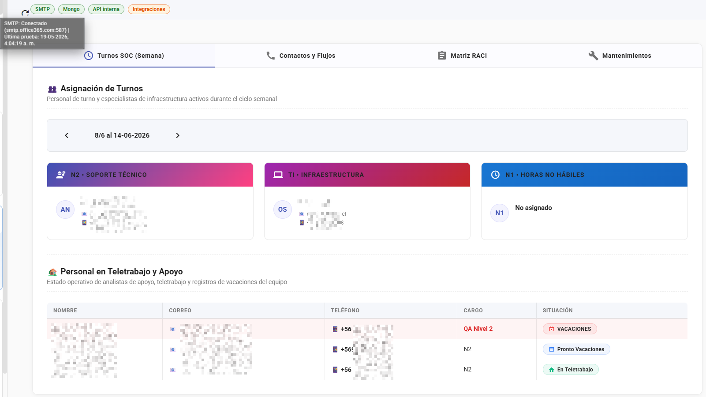

# 📸 Capturas de Pantalla - BitacoraSOC

Documentación visual de las principales funcionalidades del sistema.

> Nota: Las capturas son referenciales y pueden variar respecto a la versión actual. Para comportamiento exacto de cada módulo, priorizar `docs/OPERATIONS.md`, `docs/RUNBOOK.md` y `docs/CHANGELOG.md`.

## 📑 Índice de Capturas

1. [Pantalla Principal - Nueva Entrada](#-pantalla-principal---nueva-entrada)
2. [Temas Visuales](#-temas-visuales)
3. [Escalación y Turnos](#-escalación-y-turnos)
4. [Buscar Entradas](#-buscar-entradas)
5. [Generador de Reportes SOC](#-generador-de-reportes-soc)
6. [Configuración de Administrador](#-configuración-de-administrador)
7. [Menú Admin - Backup](#-menú-admin---backup)
8. [Sidebar - Menú de Navegación](#-sidebar---menú-de-navegación)
9. [Seguridad - Configuración de HTTPS y SSO](#-seguridad---configuración-de-https-y-sso)

---

## 🏠 Pantalla Principal - Nueva Entrada

**Funcionalidades visibles:**

- **Menú Lateral Izquierdo:**
  - ✍️ Escribir (página actual)
  - 📋 Historial Checklists
  - 📞 Escalaciones
  - 📊 Generar Reporte
  - ⏰ Mis Entradas
  - 🌐 Ver todas
  - 👤 Mi Perfil
  - ✅ Administracion Checklist
  - 📈 Reportes
  - ⚙️ Configuración (Admin)

- **Panel Central - Nueva Entrada:**
  - Fecha del Evento (dd-mm-aaaa)
  - Hora del Evento (HH:mm)
  - Clasificación:
    - 📋 **Operativa**: Eventos rutinarios
    - 🚨 **Incidente**: Eventos que requieren respuesta
  - Campo de texto para descripción con soporte de hashtags (#Trellix #hunting)
  - Autosave activado

- **Panel Derecho - Notas:**
  - 💡 Nota del Administrador (compartida)
  - 🗒️ Mi Nota Personal (privada)

- **Checklist de Turno:**
  - Estado del último check
  - Mensaje si no hay checklist activo asignado

---

## ✅ Temas Visuales

| Icono | Opción        |
| ----- | ------------- |
| 👥    | **Light**     |
| 📚    | **Dark**      |
| 📞    | **Sepia**     |
| 🏷️    | **Pastel**    |
| ☁️    | **Cyberpunk** |

## 📞 Escalación y Turnos

**Vista Semanal de Turnos (12/1 al 18-01-2026):**

- **Roles visibles:**
  - 👥 **N2 - Soporte Técnico** (púrpura) - No asignado
  - 💻 **TI - Infraestructura** (rosa) - No asignado
  - ⏰ **N1 - No Hábil** (cyan) - No asignado

- **Navegación:**
  - Flechas para cambiar semana
  - Fecha actual destacada

- **Contactos de Escalación:**
  - Lista de contactos por servicio
  - ⚠️ Mensaje: "No hay datos de escalación disponibles"
  - Requiere configuración por admin

**Funcionalidad:** Permite visualizar quién está de turno en cada rol durante la semana actual, facilitando la coordinación del equipo SOC.

---

## 🔍 Buscar Entradas

**Filtros de Búsqueda:**

- 🔍 **Buscar texto**: Búsqueda en el contenido
- 📑 **Tipo**: Dropdown (Todos/Operativa/Incidente)
- 📅 **Fecha desde**: dd-mm-aaaa
- 📅 **Fecha hasta**: dd-mm-aaaa
- 🏷️ **Tags**: Filtro por etiquetas
- 🔵 **Botón Buscar**
- ❌ **Limpiar**: Resetear filtros

**Tabla de Resultados (78 entradas):**

| Columna       | Descripción                                          |
| ------------- | ---------------------------------------------------- |
| **Fecha**     | dd/mm/aaaa                                           |
| **Hora**      | HH:mm                                                |
| **Tipo**      | 🟢 operativa / 🔴 incidente                          |
| **Contenido** | Texto truncado de la entrada                         |
| **Tags**      | Hashtags en chips (qradar, dpp, 0002296, 2214, etc.) |
| **Autor**     | Usuario que creó la entrada                          |

**Ejemplo visible:**

- 14/01/2026 18:28 - Operativa - "#Qradar #dpp [[QRADAR] #0002296] Nuevo incidente D..."
- Tags: qradar, dpp, 0002296, 2214
- Autor: mfuentes

**Funcionalidad:** Permite buscar y filtrar entradas históricas con múltiples criterios para análisis y auditoría.

---

## 📊 Generador de Reportes SOC

**Formulario para Reportes HTML:**

**Campos del formulario:**

1. **Tipo de operación** \*
   - Dropdown con autocomplete
   - Validación: "Escribe al menos 0 caracteres para buscar"

2. **Ofensa/Código interno**
   - Campo de texto libre
   - Ejemplo: Número de offense o ticket

3. **Nombre de Ofensa/Evento** \*
   - Dropdown con autocomplete
   - Validación: "Escribe al menos 0 caracteres para buscar"

4. **Motivo de la Ofensa/Evento** \*\*
   - Textarea multilínea
   - Descripción detallada del evento

**Funcionalidad:**

- Genera reportes en formato HTML estructurados
- Utiliza catálogos predefinidos (Tipos de operación, Eventos)
- Facilita la documentación estandarizada de incidentes
- Exportable para compartir con otras áreas o clientes

---

## ⚙️ Configuración de Administrador

**Menú de Configuración (Admin):**

Sección expandida con opciones administrativas:

| Icono | Opción                   | Descripción                                                                            |
| ----- | ------------------------ | -------------------------------------------------------------------------------------- |
| 👥    | **Usuarios**             | Gestión de usuarios, roles y permisos                                                  |
| 📋    | **Checklist**            | Configuración y asignación de checklists operativos de turno                           |
| ⏰    | **Turnos**               | Administración de turnos rotativos semanales (soporte para Teletrabajo y Vacaciones)   |
| 📚    | **Clientes y Catálogos** | Configuración de clientes, servicios, tipos de operación y catálogo de eventos         |
| 📞    | **Escalación**           | Configuración de contactos externos y turnos internos de escalación                    |
| 📧    | **EMAIL Config**         | Configuración del servidor SMTP y parámetros de correo                                 |
| 🔒    | **Seguridad**            | Administración de certificados SSL/TLS, directivas de seguridad y Single Sign-On (SSO) |
| 🔌    | **Integraciones**        | Administración de webhooks y conectores externos                                       |
| 🧩    | **Complementos**         | Gestión de complementos modulares adicionales                                          |

> La consola admin puede incluir más entradas según versión/rol (por ejemplo: Integraciones, Seguridad, Apariencia y Complementos).

**Acceso:** Solo usuarios con rol `admin` o `auditor` pueden ver y acceder a esta sección.

**Seguridad:**

- Requiere autenticación previa
- Operaciones sensibles registradas en audit logs
- Backups protegidos con control de acceso

---

## 💾 Menú Admin - Backup

**Detalle del menú administrativo:**

Opciones visibles en la sección de configuración:

- **Usuarios** - Gestión de cuentas y roles
- **Checklist** - Configuración de tareas de control
- **Turnos** - Planificación de rotaciones (Teletrabajo/Vacaciones)
- **Clientes y Catálogos** - Configuración del SOC
- **Escalación** - Matriz de contactos telefónicos
- **EMAIL Config** - Parámetros SMTP
- **Seguridad** - Certificados, directivas y Single Sign-On (SSO)
- **Integraciones** - Webhooks y APIs externas
- **Complementos** - Módulos adicionales y backups (seleccionado)

**Funcionalidad de Backup:**

- Crear backup completo de todas las colecciones (23 colecciones)
- Descargar backups en formato JSON
- Restaurar desde backup existente
- Modo incremental o completo (clearBeforeRestore)
- Historial de backups con timestamps
- Validación de integridad de datos

Ver documentación completa en [backend/scripts/README.md](../backend/scripts/README.md#5-restaurar-un-backup)

---

## 🔒 Seguridad - Configuración de HTTPS y SSO

**Funcionalidades visibles:**

- **Cifrado de Red (HTTPS):** Gestión e instalación interactiva de certificados TLS (`.crt`, `.key` y `.ca`) con inyección dinámica en caliente y reinicio controlado de escuchas.
- **Autenticación Single Sign-On (SSO):** Panel simétrico dedicado para parametrizar las variables de integración de Google SSO y Microsoft SSO/Entra ID.
- **⚠️ Nota / Disclaimer sobre estado Beta:** Dado que el proyecto completo de BitacoraSOC se encuentra en fase **beta**, la parametrización visual de los flujos de inicio de sesión SSO (Google y Microsoft) es de reciente incorporación y no está 100% probada en todos los escenarios de despliegue corporativos. No obstante, la inyección y el soporte de cifrado **HTTPS** dinámico está completamente probado, estable y funcional para su uso productivo.

---

## 📂 Sidebar - Menú de Navegación

**Menú lateral izquierdo completo:**

### Secciones Principales

| Icono | Opción                      | Rol   | Descripción                                          |
| ----- | --------------------------- | ----- | ---------------------------------------------------- |
| ✏️    | **Escribir**                | Todos | Crear nueva entrada y registrar checks               |
| 📋    | **Historial Checklists**    | Todos | Ver todos los checklists completados del equipo      |
| 📞    | **Escalación**              | Todos | Vista de turnos y contactos de escalación            |
| 📄    | **Reportes**                | Todos | Dashboard de reportes KPIs y exportación             |
| 👥    | **Directorio Centralizado** | Todos | Búsqueda centralizada de contactos                   |
| 🌐    | **Ver entradas**            | Todos | Búsqueda y filtrado de todas las entradas operativas |
| 👤    | **Mi Perfil**               | Todos | Editar información personal e interfaz               |
| 📈    | **Estadísticas**            | Todos | Estadísticas de uso y carga laboral                  |

### Configuración (Admin) ▼

| Icono | Opción                | Descripción                                                           |
| ----- | --------------------- | --------------------------------------------------------------------- |
| ⚙️    | **Consola Admin**     | Toda la configuración general (Integraciones, Turnos, SMTP, Usuarios) |
| 🖼️    | **Branding**          | Personalización visual                                                |
| 📜    | **Logs de Auditoría** | Información de uso y trazabilidad de eventos                          |
| ☁️    | **Backup**            | Respaldos automáticos y manuales                                      |

> La navegación de configuración es dinámica y puede variar por versión, rol y módulos habilitados.

**Interacción:**

- Sección colapsable con indicador de expansión (▼/►)
- Items activos resaltados
- Íconos intuitivos con Material Icons
- Responsive: Se convierte en drawer en móvil

---

## 📋 Resumen de Funcionalidades

### Usuario Operador

✅ Crear entradas operativas e incidentes  
✅ Usar hashtags para categorización  
✅ Ver todas las entradas del equipo  
✅ Buscar y filtrar entradas históricas  
✅ Ver turnos y escalaciones  
✅ Completar checklists de turno  
✅ Generar reportes HTML  
✅ Notas personales privadas

### Usuario Administrador

✅ Todas las funciones de operador  
✅ Gestionar usuarios y permisos  
✅ Configurar catálogos y taxonomías  
✅ Definir reglas de escalación  
✅ Configurar turnos y roles  
✅ Crear y restaurar backups  
✅ Configurar SMTP y notificaciones  
✅ Ver auditorías del sistema  
✅ Personalizar logo corporativo

---

## 🎨 Diseño y UX

**Características del diseño:**

- 🎨 Material Design con Angular Material
- 🌈 Sistema multi-tema: light, dark, sepia, pastel y cyberpunk
- 📱 Diseño responsive (desktop, tablet, mobile)
- 🌙 Tematización operativa para distintos contextos de uso
- ♿ Accesibilidad: ARIA labels, navegación por teclado
- ⚡ Autosave para prevenir pérdida de datos
- 🔔 Notificaciones en tiempo real
- 📊 Visualización clara de tipos (operativa/incidente)
- 🏷️ Tags visuales como chips de colores

---

## 📊 Estadísticas del Sistema

**Capturas documentadas:** 14  
**Última actualización:** 10 de junio de 2026  
**Cobertura visual:** módulos principales (vista referencial, no exhaustiva)

**Áreas documentadas:**

- ✅ Navegación y menús
- ✅ Formulario de entradas
- ✅ Sistema de búsqueda
- ✅ Escalación y turnos
- ✅ Generación de reportes
- ✅ Configuración administrativa
- ✅ Sistema de backup
- ✅ Seguridad (HTTPS y SSO)

---

## 📝 Notas Técnicas

**Stack tecnológico visible:**

- Frontend: Angular 20 + Angular Material
- Componentes standalone
- Diseño modular y escalable
- Sistema de rutas protegidas por roles
- Formularios reactivos con validación

**Patrones de diseño:**

- Sidebar navigation con secciones colapsables
- Floating action buttons para acciones principales
- Cards para agrupación de contenido
- Chips para tags y categorías
- Dropdowns con autocomplete para catálogos extensos
- Notificaciones inline (⚠️ advertencias, ℹ️ información)

---

_Última actualización: 2026-06-10_
