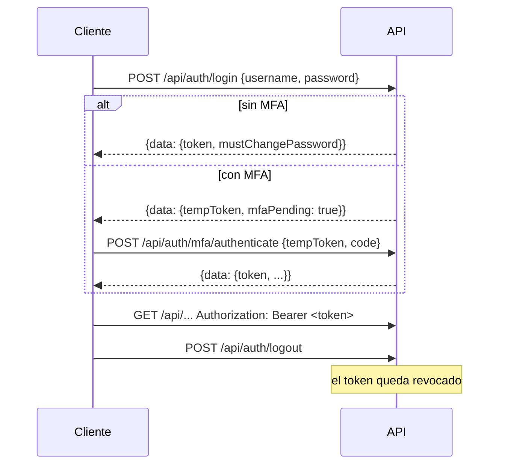

# API

Bitácora Ops expone una API HTTP JSON bajo `/api`. Es la misma que usa el frontend, así que todo lo que se hace en pantalla se puede hacer por API con los mismos permisos.

- [Conceptos](#conceptos)
- [Autenticación](#autenticación)
- [Formato de respuestas](#formato-de-respuestas)
- [Errores](#errores)
- [Límites de uso](#límites-de-uso)
- [Eventos en vivo](#eventos-en-vivo)
- [Referencia de rutas](#referencia-de-rutas)

---

## Conceptos

| Concepto | Valor |
| --- | --- |
| URL base | La de `PUBLIC_BASE_URL`, por ejemplo `http://127.0.0.1:8081/api` |
| Formato | JSON (UTF-8). Algunas rutas reciben o devuelven CSV, imágenes o archivos. |
| Fechas | ISO 8601 / RFC 3339 con zona (`2026-10-12T09:00:00-03:00`). Los días sueltos van como `AAAA-MM-DD`. |
| Identificadores | UUID |
| Auditoría | Toda ruta que **escribe** queda registrada en la Auditoría. Una prueba automática lo exige. |

---

## Autenticación



- El token es un **JWT** que dura **8 horas**. El `tempToken` del segundo factor dura 5 minutos.
- Se envía en cada petición como `Authorization: Bearer <token>`.
- `POST /api/auth/logout` agrega el token a una lista de revocación: deja de servir aunque no haya vencido.
- Con `mustChangePassword: true`, solo se puede cambiar la contraseña hasta hacerlo. El resto responde `403`.

**Ejemplo:**

```bash
curl -s -X POST http://127.0.0.1:8081/api/auth/login \
  -H 'Content-Type: application/json' \
  -d '{"username":"analista1","password":"********"}'
```

```json
{"data":{"token":"eyJhbGciOiJIUzI1NiIs...","mustChangePassword":false}}
```

### Niveles de acceso

En la tabla de rutas, la columna **Acceso** usa estos niveles:

| Acceso | Significa |
| --- | --- |
| Pública | Sin token. |
| Sesión | Cualquier usuario con sesión. |
| Admin | Rol administrador. |
| Admin o analista | Administrador o analista (no auditor ni invitado). |
| Admin o auditor | Administrador o auditor. |
| · módulo SOC / NOC | Además, la instalación tiene ese módulo encendido **y** el usuario lo tiene en su alcance. Si no, `403`. |
| · Ticketera encendida | Además, el módulo Ticketera está encendido. |
| · Complementos encendidos | Además, la funcionalidad Complementos está encendida. |
| Permiso `x:y` | El usuario tiene esa capacidad por un grupo de permisos. El administrador la tiene siempre. |
| Token de complemento | Solo para complementos, con un token propio y un permiso por ruta. No lo usa el frontend. |

---

## Formato de respuestas

Las respuestas exitosas vienen envueltas en `data`. Las listas paginadas agregan `meta`:

```json
{
  "data": [ { "id": "6f1c…", "name": "Phishing detectado" } ],
  "meta": { "page": 1, "pageSize": 50, "total": 1858 }
}
```

Las acciones sin contenido que devolver responden `204 No Content`.

---

## Errores

Los errores siguen **RFC 7807 (Problem Details)**:

```json
{
  "type": "https://bitacorasoc.local/errors/invalid-credentials",
  "title": "Unauthorized",
  "status": 401,
  "detail": "credenciales inválidas",
  "instance": "/api/auth/login"
}
```

- `detail` está en español y se puede mostrar al usuario.
- El final de `type` (`invalid-credentials`, `missing-token`, `invalid-payload`…) sirve para distinguir casos por código.

| Código | Cuándo |
| --- | --- |
| `400` | Datos inválidos (`invalid-payload`, `invalid-query`) |
| `401` | Sin token, token vencido o revocado, credenciales inválidas |
| `403` | Sin rol, módulo o permiso; o cambio de contraseña pendiente |
| `404` | No existe o no es visible para ti |
| `409` | Conflicto (por ejemplo, un nombre duplicado) |
| `429` | Demasiados intentos (ver límites) |
| `500` | Error interno: el detalle queda en el log del servidor |

---

## Límites de uso

| Qué | Límite | Ventana |
| --- | --- | --- |
| Login fallido por IP | 5 intentos | 15 min (guardado en PostgreSQL) |
| API sin sesión, por IP | 300 peticiones | 15 min |
| API con sesión, por usuario | 1.200 peticiones | 15 min |
| PIN del enlace público de un ticket | 30 intentos por enlace | 15 min |

Para desbloquear en una emergencia: [operacion.md](operacion.md#desbloquear-el-login).

---

## Eventos en vivo

`GET /api/stream/events` es un flujo **Server-Sent Events** autenticado con la misma cabecera `Authorization`. El frontend lo abre con `fetch` (no con `EventSource`) para poder mandar esa cabecera.

- Cada mensaje trae `id`, `event: <tipo>` y `data: <json>`.
- Al reconectar se envía `Last-Event-ID` y el servidor repite lo que se perdió.
- Detrás de un proxy hay que desactivar el búfer (en Caddy, `flush_interval -1`).

---

## Referencia de rutas

Generada desde `backend-go/cmd/server/main.go`, donde se registran las rutas. Las rutas con `{id}` llevan el identificador en esa posición. Los cuerpos de cada ruta están en los `struct` de petición de `backend-go/internal/handler/`.
<!-- generado desde cmd/server/main.go: 277 rutas -->

### Salud

| Método | Ruta | Acceso |
| --- | --- | --- |
| `GET` | `/api/health/live` | Pública |
| `GET` | `/api/health/ready` | Pública |

### Eventos en vivo (SSE)

| Método | Ruta | Acceso |
| --- | --- | --- |
| `GET` | `/api/stream/events` | Sesión |

### Asistente inicial

| Método | Ruta | Acceso |
| --- | --- | --- |
| `GET` | `/api/setup/status` | Pública |
| `POST` | `/api/setup/bootstrap` | Pública |

### Autenticación

| Método | Ruta | Acceso |
| --- | --- | --- |
| `POST` | `/api/auth/login` | Pública |
| `POST` | `/api/auth/mfa/authenticate` | Pública |
| `POST` | `/api/auth/mfa/setup` | Sesión |
| `POST` | `/api/auth/mfa/verify` | Sesión |
| `POST` | `/api/auth/mfa/disable` | Sesión |
| `GET` | `/api/auth/password-policy` | Pública |
| `POST` | `/api/auth/logout` | Sesión (también con cambio de clave pendiente) |
| `POST` | `/api/auth/forgot-password` | Pública |
| `POST` | `/api/auth/reset-password` | Pública |

### Usuarios

| Método | Ruta | Acceso |
| --- | --- | --- |
| `GET` | `/api/users/me` | Sesión (también con cambio de clave pendiente) |
| `PATCH` | `/api/users/me` | Sesión (también con cambio de clave pendiente) |
| `PUT` | `/api/users/me/password` | Sesión (también con cambio de clave pendiente) |
| `GET` | `/api/users/me/capabilities` | Sesión |
| `GET` | `/api/users` | Admin |
| `GET` | `/api/users/cargos` | Admin |
| `POST` | `/api/users` | Admin |
| `PATCH` | `/api/users/{id}` | Admin |
| `DELETE` | `/api/users/{id}` | Admin |
| `POST` | `/api/users/force-reset-all` | Admin |
| `GET` | `/api/users/{id}/permission-groups` | Admin |
| `PUT` | `/api/users/{id}/permission-groups` | Admin |
| `GET` | `/api/users/{id}/channels` | Sesión |
| `POST` | `/api/users/{id}/channels` | Admin |
| `DELETE` | `/api/users/{id}/channels/{channelId}` | Admin |

### Grupos de permisos

| Método | Ruta | Acceso |
| --- | --- | --- |
| `GET` | `/api/permission-groups` | Sesión |
| `POST` | `/api/permission-groups` | Admin |
| `PATCH` | `/api/permission-groups/{id}` | Admin |

### Configuración

| Método | Ruta | Acceso |
| --- | --- | --- |
| `PUT` | `/api/config/password-policy` | Admin |
| `PATCH` | `/api/config/modules` | Admin |
| `GET` | `/api/config/territorial-labels` | Sesión |
| `PATCH` | `/api/config/territorial-labels` | Admin |
| `GET` | `/api/config/smtp` | Admin |
| `PUT` | `/api/config/smtp` | Admin |
| `POST` | `/api/config/smtp/test-send` | Admin |
| `GET` | `/api/config/checklist` | Admin |
| `PUT` | `/api/config/checklist` | Admin |
| `GET` | `/api/config/birthday-emails` | Admin |
| `PUT` | `/api/config/birthday-emails` | Admin |
| `POST` | `/api/config/birthday-emails/test` | Admin |
| `GET` | `/api/config/birthday-emails/image` | Pública |

### Funcionalidades

| Método | Ruta | Acceso |
| --- | --- | --- |
| `GET` | `/api/system-features` | Sesión |
| `PATCH` | `/api/system-features/{code}` | Admin |

### Sistema

| Método | Ruta | Acceso |
| --- | --- | --- |
| `POST` | `/api/system/rate-limit-reset` | Pública |
| `POST` | `/api/deployments/notify` | Admin |

### Marca

| Método | Ruta | Acceso |
| --- | --- | --- |
| `GET` | `/api/branding` | Pública |
| `GET` | `/api/branding/logo` | Pública |
| `GET` | `/api/branding/favicon` | Pública |
| `GET` | `/api/branding/font` | Pública |
| `PATCH` | `/api/branding` | Admin |
| `PUT` | `/api/branding/logo` | Admin |
| `DELETE` | `/api/branding/logo` | Admin |
| `PUT` | `/api/branding/favicon` | Admin |
| `DELETE` | `/api/branding/favicon` | Admin |
| `PUT` | `/api/branding/font` | Admin |
| `DELETE` | `/api/branding/font` | Admin |

### Bitácora

| Método | Ruta | Acceso |
| --- | --- | --- |
| `GET` | `/api/entries` | Sesión |
| `POST` | `/api/entries` | Sesión |
| `GET` | `/api/entries/export` | Sesión |
| `POST` | `/api/entries/upload-image` | Sesión |
| `PATCH` | `/api/entries/bulk` | Admin |
| `GET` | `/api/entries/{id}` | Sesión |
| `PATCH` | `/api/entries/{id}` | Sesión |
| `DELETE` | `/api/entries/{id}` | Sesión |
| `POST` | `/api/entries/{id}/comments` | Sesión |
| `POST` | `/api/entries/{id}/ticket-link` | Sesión · Ticketera encendida |
| `POST` | `/api/entries/{id}/convert-to-ticket` | Sesión · Ticketera encendida |
| `POST` | `/api/entries/{id}/resolve` | Sesión · Ticketera encendida |

### Borradores

| Método | Ruta | Acceso |
| --- | --- | --- |
| `POST` | `/api/drafts/sync` | Sesión |
| `GET` | `/api/drafts` | Sesión |
| `DELETE` | `/api/drafts/{id}` | Sesión |

### Notas

| Método | Ruta | Acceso |
| --- | --- | --- |
| `GET` | `/api/notes/admin` | Sesión |
| `PUT` | `/api/notes/admin` | Admin |
| `GET` | `/api/notes/personal` | Sesión |
| `PUT` | `/api/notes/personal` | Sesión |

### Adjuntos

| Método | Ruta | Acceso |
| --- | --- | --- |
| `GET` | `/api/attachments/{id}` | Sesión |

### Checklist de turno

| Método | Ruta | Acceso |
| --- | --- | --- |
| `GET` | `/api/shift-checks` | Sesión |
| `POST` | `/api/shift-checks` | Sesión |
| `POST` | `/api/shift-checks/abandoned` | Sesión |
| `POST` | `/api/shift-checks/close` | Sesión |
| `GET` | `/api/shift-checks/handover` | Sesión |
| `GET` | `/api/shift-checks/stats` | Sesión |
| `POST` | `/api/shift-checks/closures/{id}/acknowledge` | Sesión |

### Plantillas de checklist

| Método | Ruta | Acceso |
| --- | --- | --- |
| `GET` | `/api/checklist-templates/active` | Sesión |
| `GET` | `/api/checklist-templates` | Admin |
| `POST` | `/api/checklist-templates` | Admin |
| `PUT` | `/api/checklist-templates/{id}` | Admin |
| `DELETE` | `/api/checklist-templates/{id}` | Admin |

### Turnos de trabajo y Dotación

| Método | Ruta | Acceso |
| --- | --- | --- |
| `GET` | `/api/work-shifts` | Sesión |
| `GET` | `/api/work-shifts/{id}/members` | Admin |
| `PUT` | `/api/work-shifts/{id}/members/{userId}` | Admin |
| `DELETE` | `/api/work-shifts/{id}/members/{userId}` | Admin |
| `POST` | `/api/work-shifts` | Admin |
| `PATCH` | `/api/work-shifts/{id}` | Admin |
| `GET` | `/api/work-shifts/matrix` | Sesión |
| `POST` | `/api/work-shifts/assignments` | Admin |
| `GET` | `/api/work-shifts/notification-schedules` | Admin |
| `POST` | `/api/work-shifts/notification-schedules` | Admin |
| `PATCH` | `/api/work-shifts/notification-schedules/{id}` | Admin |
| `POST` | `/api/work-shifts/notification-schedules/{id}/test` | Admin |

### Recordatorios de turno

| Método | Ruta | Acceso |
| --- | --- | --- |
| `GET` | `/api/shift-reminders` | Admin |
| `POST` | `/api/shift-reminders` | Admin |
| `PATCH` | `/api/shift-reminders/{id}` | Admin |
| `DELETE` | `/api/shift-reminders/{id}` | Admin |
| `POST` | `/api/shift-reminders/{id}/test` | Admin |

### Guardias (línea de tiempo)

| Método | Ruta | Acceso |
| --- | --- | --- |
| `GET` | `/api/guards` | Sesión |
| `PATCH` | `/api/guards/{cycleId}` | Admin |
| `POST` | `/api/guards/slots` | Admin |
| `PUT` | `/api/guards/slots/{id}` | Admin |
| `DELETE` | `/api/guards/slots/{id}` | Admin |
| `POST` | `/api/guards/rotation` | Admin |
| `GET` | `/api/guards/import/template` | Admin |
| `POST` | `/api/guards/import` | Admin |

### Rotación (avanzado)

| Método | Ruta | Acceso |
| --- | --- | --- |
| `GET` | `/api/rotation-cycles` | Sesión |
| `POST` | `/api/rotation-cycles` | Admin |
| `GET` | `/api/rotation-slots/current` | Sesión |
| `GET` | `/api/rotation-slots` | Sesión |
| `POST` | `/api/rotation-slots` | Admin |
| `PATCH` | `/api/rotation-slots/{id}` | Admin |
| `POST` | `/api/rotation-overrides` | Admin |

### Escalamiento

| Método | Ruta | Acceso |
| --- | --- | --- |
| `GET` | `/api/escalation/resolve` | Sesión |
| `POST` | `/api/escalation/actions` | Sesión |
| `GET` | `/api/escalation/actions` | Sesión |
| `POST` | `/api/escalation/notify` | Sesión |
| `GET` | `/api/escalation/policies` | Sesión |
| `POST` | `/api/escalation/policies` | Admin |
| `DELETE` | `/api/escalation/policies/{id}` | Admin |
| `PATCH` | `/api/escalation/policies/{id}` | Admin |
| `GET` | `/api/escalation/incidents` | Sesión |
| `POST` | `/api/escalation/incidents` | Sesión |
| `PATCH` | `/api/escalation/incidents/{id}` | Sesión |
| `GET` | `/api/escalation/incidents/{id}/notes` | Sesión |
| `POST` | `/api/escalation/incidents/{id}/notes` | Sesión |
| `GET` | `/api/escalation/pools` | Sesión |
| `POST` | `/api/escalation/pools` | Admin |
| `PATCH` | `/api/escalation/pools/{id}` | Admin |
| `DELETE` | `/api/escalation/pools/{id}` | Admin |
| `GET` | `/api/escalation/pools/{id}/members` | Sesión |
| `PUT` | `/api/escalation/pools/{id}/members` | Admin |
| `POST` | `/api/escalation/policies/{id}/steps` | Admin |
| `DELETE` | `/api/escalation/policies/{id}/steps/{stepOrder}` | Admin |

### Directorio

| Método | Ruta | Acceso |
| --- | --- | --- |
| `GET` | `/api/directory` | Sesión |
| `GET` | `/api/directory/search` | Sesión |
| `GET` | `/api/directory/{id}` | Sesión |
| `POST` | `/api/directory` | Permiso `directory:write` (admin siempre) |
| `PUT` | `/api/directory/{id}` | Permiso `directory:write` (admin siempre) |
| `DELETE` | `/api/directory/{id}` | Permiso `directory:delete` (admin siempre) |
| `POST` | `/api/directory/import-csv` | Permiso `directory:write` (admin siempre) |
| `POST` | `/api/directory/merge-duplicates` | Admin |
| `GET` | `/api/contacts/{id}/channels` | Sesión |
| `POST` | `/api/contacts/{id}/channels` | Permiso `directory:write` (admin siempre) |
| `DELETE` | `/api/contacts/{id}/channels/{channelId}` | Permiso `directory:write` (admin siempre) |

### Organizaciones y servicios

| Método | Ruta | Acceso |
| --- | --- | --- |
| `GET` | `/api/organizations` | Sesión |
| `POST` | `/api/organizations` | Admin |
| `PATCH` | `/api/organizations/{id}` | Admin |
| `DELETE` | `/api/organizations/{id}` | Admin |
| `GET` | `/api/organizations/{id}/dependents` | Admin |
| `GET` | `/api/organization-types` | Sesión |
| `POST` | `/api/organization-types` | Admin |
| `PATCH` | `/api/organization-types/{code}` | Admin |
| `DELETE` | `/api/organization-types/{code}` | Admin |
| `GET` | `/api/log-sources` | Sesión |
| `POST` | `/api/log-sources` | Admin |
| `PATCH` | `/api/log-sources/{id}` | Admin |
| `GET` | `/api/services` | Sesión · módulo SOC |
| `POST` | `/api/services` | Admin · módulo SOC |

### Equipos

| Método | Ruta | Acceso |
| --- | --- | --- |
| `GET` | `/api/team-groups` | Sesión |
| `POST` | `/api/team-groups` | Admin |
| `GET` | `/api/teams` | Sesión |
| `GET` | `/api/teams/{id}` | Sesión |
| `POST` | `/api/teams` | Admin |
| `PATCH` | `/api/teams/{id}` | Admin |
| `POST` | `/api/teams/{id}/members` | Admin |
| `DELETE` | `/api/teams/{id}/members/{memberId}` | Admin |
| `GET` | `/api/teams/{id}/coverage` | Sesión · módulo NOC |
| `POST` | `/api/teams/{id}/coverage` | Admin · módulo NOC |
| `DELETE` | `/api/teams/{id}/coverage/{territorialUnitId}` | Admin · módulo NOC |
| `GET` | `/api/raci-assignments` | Sesión |
| `POST` | `/api/raci-assignments` | Admin |

### Territorio (NOC)

| Método | Ruta | Acceso |
| --- | --- | --- |
| `GET` | `/api/territorial-units` | Sesión · módulo NOC |
| `POST` | `/api/territorial-units` | Admin · módulo NOC |
| `PATCH` | `/api/territorial-units/{id}` | Admin · módulo NOC |
| `POST` | `/api/territorial-units/import` | Admin · módulo NOC |
| `POST` | `/api/territorial-units/bulk-active` | Admin · módulo NOC |
| `GET` | `/api/territorial-units/import/template` | Sesión · módulo NOC |
| `GET` | `/api/assets` | Sesión · módulo NOC |
| `POST` | `/api/assets` | Admin · módulo NOC |
| `PATCH` | `/api/assets/{id}` | Admin · módulo NOC |
| `GET` | `/api/maintenance-windows` | Sesión |
| `POST` | `/api/maintenance-windows` | Admin o analista |
| `DELETE` | `/api/maintenance-windows/{id}` | Admin o analista |

### Ticketera

| Método | Ruta | Acceso |
| --- | --- | --- |
| `GET` | `/api/tickets` | Sesión · Ticketera encendida |
| `POST` | `/api/tickets` | Sesión · Ticketera encendida |
| `GET` | `/api/tickets/assignees` | Sesión · Ticketera encendida |
| `GET` | `/api/tickets/{id}` | Sesión · Ticketera encendida |
| `PATCH` | `/api/tickets/{id}` | Sesión · Ticketera encendida |
| `DELETE` | `/api/tickets/{id}` | Admin · Ticketera encendida |
| `POST` | `/api/tickets/merge` | Sesión · Ticketera encendida |
| `PUT` | `/api/tickets/{id}/parent` | Sesión · Ticketera encendida |
| `PUT` | `/api/tickets/{id}/client` | Permiso `tickets:change_client` (admin siempre) · Ticketera encendida |
| `POST` | `/api/tickets/{id}/resolvers` | Sesión · Ticketera encendida |
| `POST` | `/api/tickets/{id}/images` | Sesión · Ticketera encendida |
| `GET` | `/api/tickets/{id}/images/{imageId}` | Sesión · Ticketera encendida |
| `DELETE` | `/api/tickets/{id}/images/{imageId}` | Sesión · Ticketera encendida |
| `DELETE` | `/api/tickets/{id}/resolvers/{userId}` | Sesión · Ticketera encendida |
| `POST` | `/api/tickets/{id}/comments` | Sesión · Ticketera encendida |
| `GET` | `/api/tickets/{id}/tasks` | Sesión · Ticketera encendida |
| `POST` | `/api/tickets/{id}/tasks` | Sesión · Ticketera encendida |
| `PATCH` | `/api/tickets/{id}/tasks/{taskId}` | Sesión · Ticketera encendida |
| `POST` | `/api/tickets/{id}/public-pin` | Sesión · Ticketera encendida |

### Enlaces públicos

| Método | Ruta | Acceso |
| --- | --- | --- |
| `POST` | `/api/public-shares/telework` | Admin |
| `GET` | `/p/telework/{token}` | Pública |
| `GET` | `/api/public/tickets/{token}` | Pública |
| `GET` | `/api/public/tickets/{token}/images/{imageId}` | Pública |

### Reportes

| Método | Ruta | Acceso |
| --- | --- | --- |
| `GET` | `/api/reports/shift/recent` | Admin |
| `POST` | `/api/reports/{kind}/preview` | Sesión |
| `POST` | `/api/reports/{kind}/send` | Admin o analista |
| `GET` | `/api/reports/recipients` | Sesión |
| `GET` | `/api/reports/history` | Sesión |
| `GET` | `/api/reports/history/{id}` | Sesión |
| `DELETE` | `/api/reports/history/{id}` | Admin |
| `GET` | `/api/report-operation-types` | Sesión |
| `POST` | `/api/report-operation-types` | Admin |
| `PUT` | `/api/report-operation-types/{id}` | Admin |
| `DELETE` | `/api/report-operation-types/{id}` | Admin |
| `GET` | `/api/report-events` | Sesión |
| `GET` | `/api/report-events/all` | Admin |
| `POST` | `/api/report-events` | Admin |
| `PUT` | `/api/report-events/{id}` | Admin |
| `DELETE` | `/api/report-events/{id}` | Admin |
| `POST` | `/api/reports/shift/dispatch` | Admin |

### Avisos por cliente

| Método | Ruta | Acceso |
| --- | --- | --- |
| `GET` | `/api/client-alerts` | Admin |
| `GET` | `/api/client-alerts/active` | Sesión |
| `POST` | `/api/client-alerts/{id}/ack` | Sesión |
| `POST` | `/api/client-alerts` | Admin |
| `PUT` | `/api/client-alerts/{id}` | Admin |
| `DELETE` | `/api/client-alerts/{id}` | Admin |

### Respaldos

| Método | Ruta | Acceso |
| --- | --- | --- |
| `GET` | `/api/backups/history` | Admin |
| `POST` | `/api/backups/create` | Admin |
| `POST` | `/api/backups/export-delta` | Sesión |
| `POST` | `/api/backups/import-delta` | Admin |
| `GET` | `/api/backups/{id}/download` | Admin |
| `POST` | `/api/backups/{id}/validate` | Admin |
| `DELETE` | `/api/backups/{id}` | Admin |
| `POST` | `/api/backups/{id}/restore` | Admin |
| `POST` | `/api/backups/upload` | Admin |
| `GET` | `/api/backups/config` | Admin |
| `PUT` | `/api/backups/config` | Admin |
| `POST` | `/api/backups/config/run` | Admin |
| `GET` | `/api/backups/export` | Admin |
| `POST` | `/api/backups/purge` | Admin |

### Auditoría

| Método | Ruta | Acceso |
| --- | --- | --- |
| `GET` | `/api/audit-logs` | Admin o auditor |
| `GET` | `/api/audit-logs/export` | Admin o auditor |

### Complementos

| Método | Ruta | Acceso |
| --- | --- | --- |
| `GET` | `/api/complements` | Admin · Complementos encendidos |
| `POST` | `/api/complements` | Admin · Complementos encendidos |
| `GET` | `/api/complements/active` | Sesión · Complementos encendidos |
| `POST` | `/api/complements/uploads` | Admin · Complementos encendidos |
| `GET` | `/api/complements/uploads/{id}/preview` | Admin · Complementos encendidos |
| `POST` | `/api/complements/uploads/{id}/publish` | Admin · Complementos encendidos |
| `GET` | `/api/complements/{slug}` | Admin · Complementos encendidos |
| `PATCH` | `/api/complements/{slug}` | Admin · Complementos encendidos |
| `DELETE` | `/api/complements/{slug}` | Admin · Complementos encendidos |
| `POST` | `/api/complements/{slug}/token` | Admin · Complementos encendidos |
| `POST` | `/api/complements/{slug}/test` | Admin · Complementos encendidos |
| `POST` | `/api/complements/{slug}/embed` | Sesión · Complementos encendidos |
| `POST` | `/api/complements/{slug}/entries` | Sesión · Complementos encendidos |

### API interna de complementos

| Método | Ruta | Acceso |
| --- | --- | --- |
| `GET` | `/api/internal/versions` | Pública |
| `GET` | `/api/internal/v1/context` | Token de complemento (`READ_CONTEXT`) |
| `POST` | `/api/internal/v1/log-entry` | Token de complemento (`WRITE_ENTRIES`) |
| `GET` | `/api/internal/v1/query-general` | Token de complemento (`READ_LOGS`) |
| `GET` | `/api/internal/v1/storage` | Token de complemento (`READ_STORAGE`) |
| `POST` | `/api/internal/v1/storage` | Token de complemento (`WRITE_STORAGE`) |
| `POST` | `/api/internal/v1/log` | Token de complemento (`WRITE_LOGS`) |
