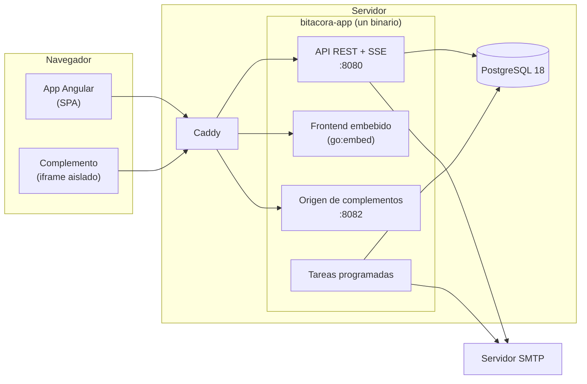
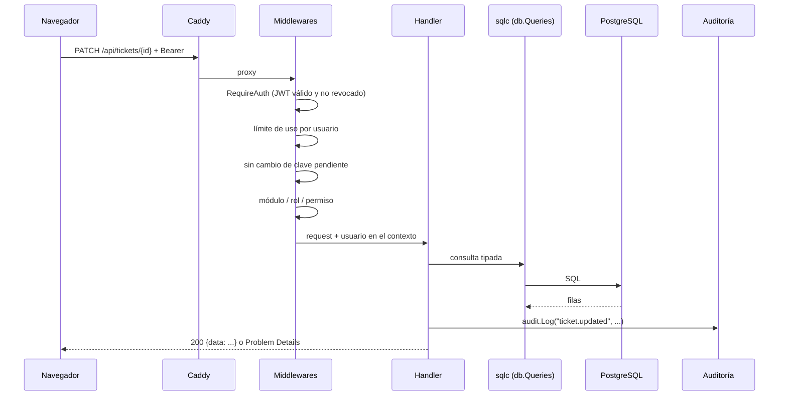
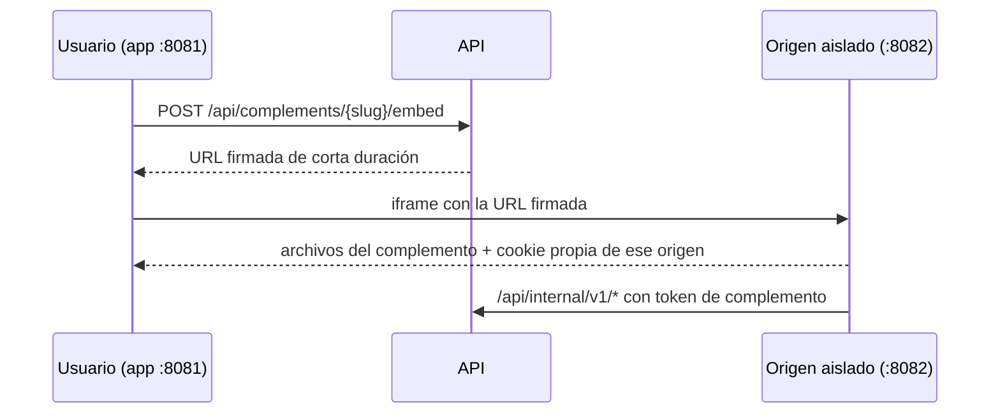

# Arquitectura

Cómo está construido Bitácora Ops y por qué. Las razones de cada decisión están en los [ADR](adr/).

- [1. Vista general](#1-vista-general)
- [2. Recorrido de una petición](#2-recorrido-de-una-petición)
- [3. Backend (Go)](#3-backend-go)
- [4. Frontend (Angular)](#4-frontend-angular)
- [5. Base de datos](#5-base-de-datos)
- [6. Seguridad](#6-seguridad)
- [7. Tareas programadas](#7-tareas-programadas)
- [8. Correo](#8-correo)
- [9. Complementos](#9-complementos)

---

## 1. Vista general



Ideas centrales:

- **Un solo binario.** Sirve la API, el frontend compilado (embebido con `//go:embed`), el origen de complementos y las tareas programadas. No hay servidor web aparte ni procesos de fondo separados ([ADR 0005](adr/0005-docker-compose-2-contenedores-sin-kubernetes.md)).
- **PostgreSQL para todo.** Datos, auditoría, límite de intentos y eventos en vivo. No hay Redis ni colas ([ADR 0001](adr/0001-postgresql-reemplaza-mongodb.md), [ADR 0008](adr/0008-rate-limiting-login-postgres-sin-redis.md)).
- **Biblioteca estándar.** `net/http` con el enrutador de Go 1.22+, sin frameworks; SQL escrito a mano y tipado con `sqlc` ([ADR 0002](adr/0002-backend-stdlib-sqlc-sin-chi-ni-ent.md)).
- **Módulos que se encienden y apagan.** SOC, NOC y Ticketera conviven en el mismo código; el servidor bloquea lo apagado y el frontend lo esconde ([ADR 0009](adr/0009-system-features-y-module-flags-conviven.md)).

---

## 2. Recorrido de una petición



Cada ruta se registra en `cmd/server/main.go` envuelta en el nivel de acceso que le corresponde:

- `public`, `authed`, `admin`, `operator`,
- `nocAdmin`, `ticketAuthed`, `withCapability(...)`, etc.

Así, con leer una línea se sabe quién puede usar una ruta. Detalle en [api.md](api.md#niveles-de-acceso).

---

## 3. Backend (Go)

```text
backend-go/
├── cmd/
│   ├── server/                 # el servidor: lee el entorno, arma dependencias y registra las rutas
│   ├── legacy-etl/             # migración de datos del legacy
│   ├── escalation-shadow-diff/ # compara el escalamiento del legacy con el nuevo
│   └── territorial-seed/       # genera la semilla territorial de un país
├── internal/                   # el código de la aplicación (ver tabla)
├── sql/
│   ├── migrations/             # 000001 … 000029 (golang-migrate, up/down)
│   ├── queries/                # SQL con anotaciones sqlc, un archivo por área
│   └── schema/                 # esquema completo, lo usa sqlc para tipar
└── sqlc.yaml
```

| Paquete | Responsabilidad |
| --- | --- |
| `handler` | Controladores HTTP de cada área: validan, llaman a la base o a las reglas, auditan y responden. Es el paquete más grande. |
| `middleware` | Autenticación, rol, módulo, capacidad, límite de uso y cambio de clave obligatorio. |
| `repository` | Conexión `pgx` y el código generado por `sqlc` (`repository/db`). |
| `auth` | JWT, bcrypt y TOTP (MFA). |
| `crypto` | Cifrado AES-256-GCM de secretos en reposo. |
| `audit` | `audit.Log()`: el registro único de quién hizo qué. |
| `ratelimit` | Límite de login (en PostgreSQL) y de API (en memoria). |
| `eventbus` | Hub de eventos en vivo (SSE) con repetición por `Last-Event-ID`. |
| `escalation` | Reglas puras del motor de escalamiento: qué política aplica y en qué orden. |
| `rotation` | Reglas puras de guardias y reemplazos: quién está de guardia en un momento dado. |
| `tickets` | Reglas puras de la ticketera: prioridad, SLA y transiciones. |
| `checklist`, `clientalerts`, `directory`, `territory`, `reminders` | Reglas puras de cada área. |
| `modules` | Qué módulos tiene la instalación y el usuario. |
| `mailtpl` | Plantillas de correo con el formato del legacy. |
| `reporting` | Envío de reportes de cierre de turno y de dotación programada. |
| `backup` | Copias completas y delta cifradas, restauración y purga. |
| `complements` | Firma de accesos, estado y aislamiento de los complementos. |
| `branding` | Marca de la instalación. |
| `scheduler` | Ejecuta una tarea cada cierto intervalo. |
| `legacyetl`, `shadowdiff` | Migración desde el legacy y comparador de escalamiento. |
| `web` | Sirve el frontend embebido y redirige las rutas de la SPA a `index.html`. |
| `problemdetails` | Errores en formato RFC 7807. |

**Reglas puras.** La lógica que decide (escalamiento, guardias, SLA) vive en paquetes sin HTTP ni base de datos, con sus propias pruebas. Los handlers solo cargan datos, llaman a esas reglas y guardan el resultado.

---

## 4. Frontend (Angular)

```text
frontend-v2/src/app/
├── app.routes.ts      # rutas y guards (setup, login, módulos)
├── core/              # servicios por área (HTTP), auth, i18n, preferencias, SSE
├── features/          # pantallas: entries, shifts, escalation, directory, reports,
│                      # tickets, complements, admin, setup, login, territory
├── shared/            # componentes reutilizables (modal, botones, tabla, markdown)
└── shell/             # marco de la app: menú lateral, perfil, idioma y tema
```

| Rasgo | Cómo |
| --- | --- |
| Componentes | Standalone, `ChangeDetectionStrategy.OnPush`, **signals** y sin `zone.js` (zoneless). |
| Estado | Signals en cada componente y servicio. No hay store global. |
| HTTP | Un servicio por área en `core/` que devuelve promesas (`firstValueFrom`). |
| Rutas | Carga diferida por pantalla. Los guards llevan a `/setup` si falta configurar, a `/login` si no hay sesión, y esconden lo que el módulo apagado no permite. |
| Textos | Español e inglés (ver abajo). |
| Estilos | CSS por componente con variables de tema (`--bg-app`, `--accent`…); 3 temas completos. Un lint impide colores sueltos. |
| Diálogos | Angular CDK Dialog con el componente `app-modal` propio. |

**Idiomas.** Los textos comunes van en `core/i18n/messages.ts` (ES) y `messages-en.ts` (EN). Los de cada área van en un **pack** (`core/i18n/packs/<área>.ts`) que se carga junto con su pantalla, así el bundle inicial queda chico. Cómo agregar textos: [desarrollo.md](desarrollo.md#textos-es--en).

**Build.** `pnpm run build` deja el resultado en `dist/frontend-v2/browser`. El `Dockerfile` lo copia a `backend-go/internal/web/dist/browser` antes de compilar Go, y queda dentro del binario.

---

## 5. Base de datos

PostgreSQL 18 con 73 tablas. Las principales por área:

| Área | Tablas |
| --- | --- |
| Usuarios y acceso | `users`, `permission_groups`, `user_permission_groups`, `token_denylist`, `login_rate_limits` |
| Catálogos | `organizations`, `organization_types`, `services`, `catalog_log_sources`, `territorial_units`, `assets` |
| Equipos y contactos | `teams`, `team_members`, `team_coverage`, `contacts`, `contact_channels` |
| Bitácora | `entries`, `entry_comments`, `entry_attachments`, `entry_drafts`, `admin_notes`, `personal_notes` |
| Turnos | `work_shifts`, `work_shift_members`, `work_shift_assignments` (dotación), `shift_checks`, `shift_closures`, `checklist_templates`, `checklist_items` |
| Guardias | `rotation_cycles`, `rotation_slots` (con hora exacta), `rotation_overrides` |
| Escalamiento | `escalation_policies`, `escalation_steps`, `escalation_pools`, `escalation_incidents`, `escalation_action_logs` (inmutable), `maintenance_windows` |
| Ticketera | `tickets`, `ticket_comments`, `ticket_tasks`, `ticket_resolvers`, `ticket_images` |
| Reportes | `report_history`, `report_events`, `report_operation_types`, `client_alert_rules` |
| Sistema | `audit_log`, `system_events`, `system_features`, `app_config`, `smtp_config`, `app_branding`, `backup_runs`, `backup_config`, `complements` |

- **Migraciones:** `backend-go/sql/migrations/NNNNNN_nombre.{up,down}.sql`. Se aplican con `golang-migrate` y la aplicación nunca las ejecuta sola.
- **Esquema espejo:** `sql/schema/0001_init_schema.sql` tiene el esquema completo para que `sqlc` tipe las consultas. Cada migración nueva se agrega también ahí.
- **Inmutables:** `escalation_action_logs` no admite `UPDATE` ni `DELETE` (lo impide un trigger), porque es la evidencia de cada intento de contacto.

---

## 6. Seguridad

| Tema | Cómo se resuelve |
| --- | --- |
| Contraseñas | bcrypt costo 12. Los hashes antiguos de menor costo se recalculan al iniciar sesión ([ADR 0007](adr/0007-hashing-contrasenas-bcrypt-costo-12.md)). Largo mínimo configurable (6 por defecto, 12 para el primer admin). |
| Sesiones | JWT HS256 de 8 horas. El logout revoca el token (`token_denylist`). |
| Segundo factor | TOTP opcional por usuario. El secreto se guarda cifrado. |
| Secretos en reposo | AES-256-GCM con `APP_ENCRYPTION_KEY`: contraseña SMTP, secretos MFA y frase de respaldos. |
| Fuerza bruta | 5 intentos de login por IP cada 15 minutos (en PostgreSQL, sobrevive reinicios). Límites de API por IP y por usuario. 30 intentos de PIN por enlace público. |
| Permisos | Rol, módulo y capacidades **en el servidor**. El frontend solo esconde: nunca es la barrera. |
| Auditoría | Toda escritura queda en `audit_log` con actor, evento y resultado. También las lecturas sensibles (a quién llamar, Directorio). Una prueba automática falla si una ruta que escribe no audita. |
| Complementos | Se sirven desde otro origen (otro puerto o subdominio) y no pueden leer la sesión de la app. Usan tokens propios de corta duración y permisos por ruta. |
| Contenedor | Imagen *distroless* sin shell, usuario sin privilegios; la base y la app solo escuchan en `127.0.0.1` o en la red interna. |
| Enlaces públicos | Token aleatorio + PIN. Cambiar el cliente de un ticket renueva ambos. |

---

## 7. Tareas programadas

Corren dentro del mismo binario (`internal/scheduler`), cada una en su intervalo:

| Cada | Tarea |
| --- | --- |
| 1 min | Enviar los reportes de cierre de turno pendientes y los correos de dotación programada. |
| 1 min | Recordatorios de turno por correo. |
| 1 min | Correos de cumpleaños (una vez al día, desde la hora configurada). |
| 1 min | Respaldo automático, si toca según la configuración. |
| 30 s | Salud de los complementos y limpieza de subidas vencidas. |

Si un envío falla, queda marcado con su causa (visible en Administración) y no bloquea los demás.

---

## 8. Correo

- El SMTP se configura en *Administración → Correo*. La contraseña se guarda cifrada.
- Todos los correos (reportes, avisos, escalamiento, cumpleaños, restablecer contraseña) usan **las plantillas del legacy** (`internal/mailtpl`). Así el cliente sigue recibiendo el mismo formato de siempre.
- La app **no hace llamadas telefónicas**. El escalamiento avisa por correo y registra el resultado de las llamadas manuales.

---

## 9. Complementos



Un complemento es un ZIP estático (HTML, JS y CSS) que se sube y se publica desde Administración. Puede usar una API interna limitada (`/api/internal/v1/*`): contexto del usuario, almacenamiento propio, registro en la bitácora y consultas. Cada ruta exige su propio permiso.
