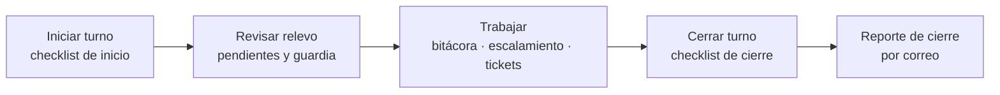
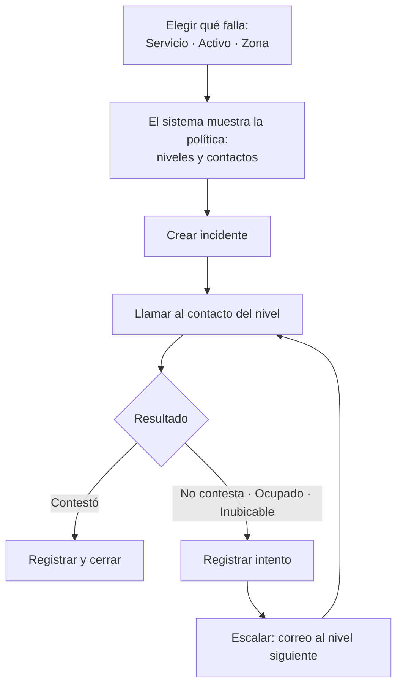

# Guía de uso

Qué hace cada pantalla de Bitácora Ops y cómo se usa en el día a día. Las pantallas que ves dependen de los módulos encendidos (SOC, NOC, Ticketera) y de tu rol. Lo que no te corresponde no aparece en el menú.

- [Roles](#roles)
- [Ingreso y perfil](#ingreso-y-perfil)
- [Un turno típico](#un-turno-típico)
- [Bitácora](#bitácora)
- [Turnos y Checklist](#turnos-y-checklist)
- [Escalamiento](#escalamiento)
- [Directorio](#directorio)
- [Reportes](#reportes)
- [Ticketera](#ticketera)
- [Complementos](#complementos)
- [Administración](#administración)
- [Atajos y accesibilidad](#atajos-y-accesibilidad)

---

## Roles

| Rol | Qué puede hacer |
| --- | --- |
| **Administrador** | Todo, incluida la sección Administración. |
| **Analista** (`user`) | Operar: registrar en la bitácora, hacer el checklist, escalar, enviar reportes, registrar mantenciones y trabajar tickets. |
| **Auditor** | Lo mismo que un analista en las pantallas de trabajo, más consultar y exportar la **Auditoría**. No puede enviar reportes ni registrar mantenciones, y no aparece en la Dotación. |
| **Invitado** | Cuentas temporales con fecha de vencimiento que vienen del legacy. En la 2.0 no se crean invitados nuevos: los usuarios nuevos son administrador, analista o auditor. |

Además del rol, cada usuario pertenece a **grupos de permisos**. Los grupos definen su alcance (SOC, NOC o ambos) y le dan capacidades puntuales, por ejemplo:

- editar o borrar en el Directorio,
- cambiar el cliente de un ticket.

---

## Ingreso y perfil

- **Login** con usuario y contraseña. Si la cuenta tiene **MFA**, se pide además el código de 6 dígitos de la app autenticadora.
- **¿Olvidaste tu contraseña?** envía un enlace por correo para crear una nueva.
- Si un administrador te obliga a cambiar la contraseña, la app solo te deja hacer eso hasta que la cambies.
- La sesión dura **8 horas**.
- Tras **5 intentos fallidos** desde la misma red, el login se bloquea 15 minutos.

**Mi perfil** (menú de tu nombre, abajo a la izquierda) tiene tres pestañas:

| Pestaña | Qué hay |
| --- | --- |
| **Datos** | Nombre, correo, cargo y último ingreso. |
| **Seguridad** | Cambiar contraseña (con medidor de fortaleza) y activar o desactivar MFA con un código QR. |
| **Preferencias** | Idioma (ES/EN), tema (claro, oscuro, rosa) y fuente para dislexia. |

---

## Un turno típico

1. En **Turnos y Checklist → Mi turno** haces el **checklist de inicio**.
2. Revisas el **relevo**: pendientes del turno anterior, quién está de guardia y las mantenciones en curso.
3. Durante el turno registras todo en la **Bitácora**. Si algo falla, usas **Escalamiento**; si hay que darle seguimiento, creas un **ticket**.
4. Al terminar haces el **checklist de cierre**. El sistema arma y envía el **reporte de cierre** a los destinatarios del turno.

---

## Bitácora

Es el registro del turno. Cada **entrada** tiene un tipo, un texto en Markdown y, si corresponde:

- un **cliente** o servicio (SOC) o un **activo** o **zona** (NOC),
- etiquetas,
- imágenes de evidencia.

| Tipo | Para qué |
| --- | --- |
| Operativa | Lo normal del turno. |
| Incidente | Algo que afecta un servicio. Las aperturas de escalamiento crean una entrada de este tipo sola. |
| Ofensa | Alertas de seguridad (SOC). |
| Checklist | Las genera el checklist de turno. |

**Qué se puede hacer con las entradas:**

- **Buscar y filtrar** por texto, tipo, alcance, cliente, autor, fechas y si tiene imagen.
- **Seguimiento**: comentarios sobre la entrada.
- **Crear ticket** o **vincular a un ticket** existente.
- **Neutralizar** (*defang*) URLs e IPs: `https` pasa a `hxxps` y `1.2.3.4` a `1[.]2[.]3[.]4`, para que nadie las abra por error.
- **Exportar a CSV** (cualquier usuario) y acciones en lote (solo administrador).
- **Borradores**: lo que escribes se guarda solo y se sincroniza entre pestañas.

Al costado hay dos libretas:

- **Pizarrón de la sala**: lo ve toda la sala y solo lo editan los administradores.
- **Mi libreta**: notas que solo ves tú.

Si un cliente tiene **avisos** configurados (por ejemplo "no llamar después de las 22:00"), aparecen al elegir ese cliente y hay que darlos por leídos.

---

## Turnos y Checklist

Tiene tres pestañas.

### Mi turno

- **Checklist de inicio y de cierre.** Cada servicio se marca en verde o en rojo; un rojo pide una observación. Los ítems en rojo avisan por correo a los cargos configurados.
- **Relevo.** Pendientes del turno anterior, quién está de **guardia** ahora, mantenciones en curso y si alguna suprime avisos.
- **Cierre de turno.** Muestra el balance del turno (entradas, incidentes, checklist) y envía el **reporte de cierre** a los destinatarios del turno de trabajo. Si el turno no tiene destinatarios, lo avisa.

### Historial

Checklists anteriores con fecha, turno, analista y resultado. Se pueden filtrar los que tuvieron servicios en rojo y descargar en PDF.

### Dotación (TV)

Matriz del personal por día: quién trabaja, teletrabajo, vacaciones, licencias y trámites médicos. Está pensada para mostrarse en una pantalla de la sala. Se puede compartir con un **enlace público** sin login.

---

## Escalamiento

Responde **"¿a quién llamo?"** y deja constancia de cada intento.

> **La aplicación no hace llamadas.** Las llamadas se hacen a mano desde el teléfono de guardia. Aquí se registra el resultado y, al escalar, el sistema avisa **por correo** al nivel siguiente.

1. **Elige qué falla.** *Servicio* viene seleccionado por defecto porque es lo más usado. Al escribir, el buscador va proponiendo; en zonas busca sin importar tildes.
2. El sistema busca la **política de escalamiento**. Si el servicio no tiene una, sube por su zona y las zonas superiores, o usa el equipo que cubre la zona. Muestra los **niveles**, sus contactos con sus canales, quién está **de guardia**, si hay **mantención** y el tiempo antes de pasar al siguiente nivel.
3. **Crea el incidente.** Queda enlazado a una **entrada de la bitácora** ("Ver en la bitácora") donde se anota cada intento, nota, cierre y reapertura.
4. **Registra cada intento**: contestó, no contesta, ocupado o inubicable, con una nota opcional.
5. **Escalar** marca el nivel como escalado y envía un correo al nivel siguiente con tu nota.

Ver a quién llamar queda registrado en la Auditoría.

---

## Directorio

Contactos **internos** (sincronizados desde los usuarios de la app) y **externos** (contratas, clientes, proveedores). Cada contacto tiene sus canales: llamada, WhatsApp, SMS, correo u otro.

- Buscar, filtrar por organización y marcar **favoritos**.
- Clic en un teléfono o correo para **copiarlo**.
- **Agregar, editar e importar CSV**: requiere el permiso de escritura del Directorio. **Borrar** requiere el permiso de borrado. **Consolidar duplicados** es solo del administrador.
- Los contactos sincronizados desde un usuario se editan desde la cuenta de ese usuario.

Consultar el Directorio queda registrado en la Auditoría. No se guarda lo buscado, porque puede ser un teléfono o un correo.

---

## Reportes

Informes por correo para clientes, con dos modos:

| Modo | Para qué |
| --- | --- |
| **Incidente** | Informe de un evento: nombre del evento, motivo, origen y destino, evidencia, impacto, mitigación y recomendación. Al escribir el nombre, **sugiere eventos del catálogo** y rellena el motivo con su texto por defecto. |
| **Boletín** | Comunicado general: título, nivel de alerta, productos afectados y referencias. |

- La **vista previa** se actualiza mientras escribes y usa el mismo formato de correo de siempre.
- **Destinatarios**: se escriben a mano o se toman del Directorio, con CC.
- **Neutralizar**: cambia `http` por `hxxp` y los puntos de IPs y dominios por `[.]`.
- Imágenes de evidencia, copiar como HTML o Markdown, y **borrador** automático.
- **Historial**: los envíos anteriores con su estado; se pueden reenviar.

---

## Ticketera

Tickets ITIL de **incidente** o **requerimiento**. Solo aparece si el módulo Ticketera está encendido.

| Concepto | Cómo funciona |
| --- | --- |
| **Prioridad** | Sale de impacto × urgencia (P1 crítica a P4 baja). |
| **SLA** | Plazos de respuesta y resolución. Se **pausa** mientras se espera al proveedor y muestra si está en riesgo o vencido. |
| **Estados** | Nuevo → Asignado → En curso → Esperando proveedor → Resuelto → Cerrado (o Cancelado). |
| **Asignación** | Equipo y resolutores. Cualquier analista puede tomar o asignar. |
| **Tareas** | Lista de pasos dentro del ticket, con tiempo. |
| **Comentarios** | Internos o públicos, en Markdown, con imágenes. |

**Relaciones entre tickets:**

- **Unir duplicados** ("Unir con…"): pueden hacerlo el administrador o quien creó cualquiera de los dos. Todo el historial pasa al ticket que queda; el otro se cierra como "Unido a…". No se deshace.
- **Padre e hijos** (un solo nivel):
  - Un comentario en el padre puede enviarse también a los hijos abiertos.
  - Esperar al proveedor en el padre pausa a los hijos.
  - Resolver el padre ofrece resolver los hijos.
  - Los cambios de los hijos se ven en el padre, con "X de N resueltos".
- **Cambiar cliente**, si se registró mal: requiere el permiso "Cambiar el cliente de un ticket" y un motivo. Renueva el enlace público y su PIN.

**Enlace público:** cada ticket tiene un enlace con **PIN** para que el cliente vea el avance en 3 pasos y los comunicados públicos, sin cuenta. Tras 30 PIN incorrectos en 15 minutos, el enlace se bloquea un rato.

---

## Complementos

Mini-aplicaciones propias (herramientas, diccionarios, utilidades) que se abren dentro de Bitácora Ops. Corren en un **origen aislado**, así que no pueden leer tu sesión. Solo aparecen si la funcionalidad *Complementos* está encendida.

---

## Administración

Solo para administradores. El menú se agrupa así:

| Grupo | Sección | Lo esencial |
| --- | --- | --- |
| Personas | **Usuarios y grupos** | Usuarios, roles, grupos de permisos, cargos, largo mínimo de contraseña (6 por defecto) y correos de cumpleaños. |
| Operación | **Turnos** | Guardias, turnos de trabajo, dotación programada y recordatorios (detalle abajo). |
| | **Checklist** | Plantillas de inicio y cierre, servicios y alertas de ítems en rojo. |
| | **Escalamiento** | Políticas por servicio, activo o zona; niveles, tiempos y grupos de contacto. |
| | **Avisos por cliente** | Avisos que aparecen al trabajar con un cliente y el catálogo de eventos de los informes. |
| | **Correo** | SMTP y remitente, con plantillas para los proveedores comunes y correo de prueba. |
| | **Reportes de turno** | Formato y estado de los reportes de cierre. |
| Catálogos | **Organizaciones y servicios** | Clientes, tipos, servicios y fuentes de log. |
| | **Territorio** (NOC) | Regiones, zonas y sitios, con importación CSV y activar o desactivar en lote. |
| | **Equipos** | Equipos, contratas, guardias, integrantes y cobertura territorial. |
| Sistema | **Marca** | Nombre, logo, favicon y fuente. |
| | **Módulos** y **Funcionalidades** | Qué partes del sistema están encendidas. |
| | **Respaldos** | Copias, restauración y exportación (ver [operacion.md](operacion.md)). |
| | **Auditoría** | Quién hizo qué y cuándo, con filtros y exportación. |
| | **Complementos** | Subir y publicar mini-aplicaciones. |

### Turnos → Guardias

La pantalla para organizar las guardias (N2, TI, N1 No hábil, OL…).

- **Ahora de guardia:** quién está en cada guardia, hasta cuándo y quién sigue.
- **Línea de tiempo** de 2 o 4 semanas, con una línea roja en "ahora".
  - Las barras se ven en curso, próximas, pasadas o como reemplazo.
  - Si hay dos personas a la vez, sus barras se apilan.
  - Clic en una barra para editarla.
- **Siempre cubierta:** N1 y N2 no pueden quedar sin nadie. Un tramo vacío se marca en rojo y se cubre con un clic.
- **Nueva guardia:** eliges la guardia y la persona; cada integrante muestra si está libre, en otra guardia o de vacaciones. Hay duraciones rápidas (1 semana, 2 semanas, 2 días).
- **Antes de guardar** el panel avisa si:
  - la persona ya está en otra guardia,
  - tiene una ausencia en Dotación,
  - quedan dos personas a la vez,
  - queda un hueco antes o después.
- **Reemplazo por unos días:** pone a otra persona en un tramo sin cambiar la guardia.
- **Generar rotación:** marcas a las personas, las ordenas y eliges desde cuándo, cuánto dura cada una y cuántas crear. La vista previa avisa de ausencias y cruces.
- **Configurar** (ícono junto a cada guardia):
  - si debe estar siempre cubierta,
  - el día de cambio,
  - la hora de cambio, que sale del turno de trabajo enlazado (sin turno enlazado, 09:00).
- **Cargar CSV:** la carga masiva con la misma plantilla del legacy (`condicion,usuario,fechaInicio,horaInicio,fechaFin,horaFin`).
  - Las guardias van a la línea de tiempo.
  - Teletrabajo, vacaciones, trámite médico y licencia van a Dotación.
  - Informa los errores fila por fila.
- **Próximos relevos** y **Revisión** de las próximas 4 semanas: cada problema viene con un botón para resolverlo.

---

## Atajos y accesibilidad

- **Atajos de navegación:** `Alt+1` Bitácora · `Alt+2` Turnos · `Alt+3` Escalamiento · `Alt+4` Directorio · `Alt+5` Administración · `Alt+8` Reportes. Están indicados junto a cada ítem del menú.
- **Buscador de Administración:** `Ctrl+K`.
- **Idioma:** botones ES / EN abajo a la izquierda.
- **Tema y fuente para dislexia (OpenDyslexic):** íconos abajo a la izquierda o en *Mi perfil → Preferencias*.
- **Ayuda de Markdown:** el ícono junto a los editores muestra cómo dar formato al texto.
