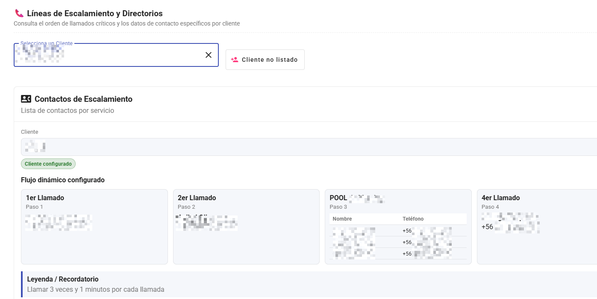
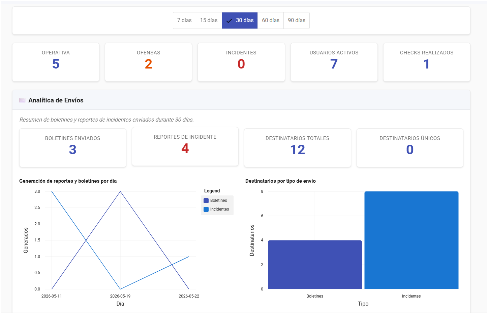
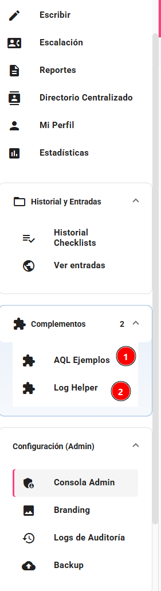

# Imágenes de screenshots

Esta carpeta contiene las capturas de pantalla del sistema BitacoraSOC.

## Estructura

- `01-main-nueva-entrada.png` - Pantalla principal con formulario de nueva entrada.
  

- `02-escalacion-turnos.png` - Vista de turnos semanales y escalación.
  

- `02.1-escalacion-turnos.png` - Eescalación Telefonica.
  

- `11-Turnos.png` - Configuracion de turnos semanales y escalación.
  
- `03-buscar-entradas.png` - Búsqueda y filtrado de entradas.
  

- `04-generador-reportes.png` - Formulario de generación de reportes.
  

- `12-Estadisticas.png` - Estadisticas de incidentes.
  

- `06-menu-admin-backup.png` - Menú admin con backup seleccionado.
  

- `07-sidebar-menu.png` - Menú lateral completo de navegación.
  

- `08-Historial de entradas.png` - Historial de entradas.
  
