# Modelo de datos

> Generado por `backend-go/cmd/er-docs` desde `backend-go/sql/schema/0001_init_schema.sql`, el esquema que usa sqlc, con todas las migraciones aplicadas. **No se edita a mano**: si cambia el esquema, se regenera con `go run ./cmd/er-docs` desde `backend-go/`.

73 tablas en PostgreSQL, agrupadas en 13 dominios. Notación pata de gallo: `||` uno, `|o` / `o|` cero o uno, `o{` cero o muchos. La etiqueta de cada línea es la columna que hace la referencia.

- Cada entidad muestra todas sus columnas salvo `created_at` y `updated_at`. `PK` clave primaria, `FK` referencia a otra tabla, `UK` valor único.
- Las tablas de otros dominios aparecen como cajas sin columnas: son la misma tabla, dibujada donde se une.
- Las columnas de autoría que apuntan a `users` (`created_by`, `closed_by`…) se listan pero no se dibujan, para que los diagramas se puedan leer.
- Los tipos, restricciones e índices exactos están en el esquema.

Correspondencia con el legacy (MongoDB): [modelo-er-legacy-2.0.md](modelo-er-legacy-2.0.md).

## Índice

1. [Usuarios, acceso y permisos](#1-usuarios-acceso-y-permisos) — 6 tablas
2. [Territorio, organizaciones y activos](#2-territorio-organizaciones-y-activos) — 6 tablas
3. [Directorio de contactos](#3-directorio-de-contactos) — 2 tablas
4. [Ticketera](#4-ticketera) — 5 tablas
5. [Equipos y escalamiento](#5-equipos-y-escalamiento) — 13 tablas
6. [Turnos, guardias y dotación](#6-turnos-guardias-y-dotación) — 11 tablas
7. [Checklists](#7-checklists) — 4 tablas
8. [Bitácora](#8-bitácora) — 5 tablas
9. [Reportes y avisos por cliente](#9-reportes-y-avisos-por-cliente) — 5 tablas
10. [Auditoría, notas y alertas de sala](#10-auditoría-notas-y-alertas-de-sala) — 4 tablas
11. [Configuración y respaldos](#11-configuración-y-respaldos) — 6 tablas
12. [Complementos](#12-complementos) — 4 tablas
13. [Ingesta de alertas (después del corte)](#13-ingesta-de-alertas-después-del-corte) — 2 tablas

---

## 1. Usuarios, acceso y permisos

Cuentas, sesiones revocadas, llaves de API y los grupos de permisos que acotan qué módulos y capacidades tiene cada usuario.

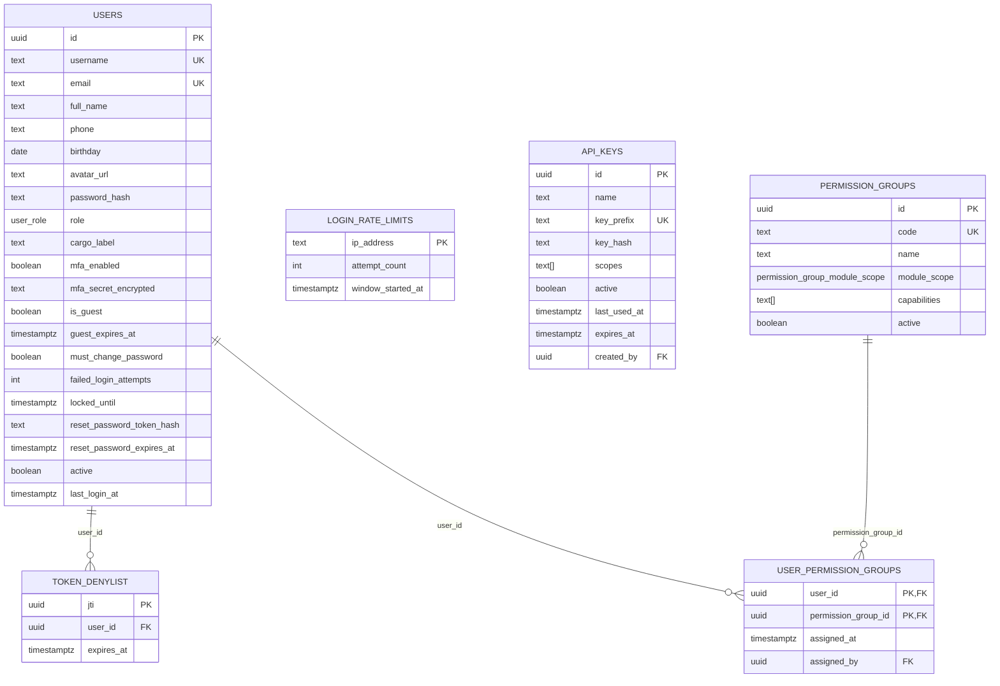

---

## 2. Territorio, organizaciones y activos

Árbol territorial genérico (país → región → zona → sitio), organizaciones con tipos configurables, sus servicios y los activos.

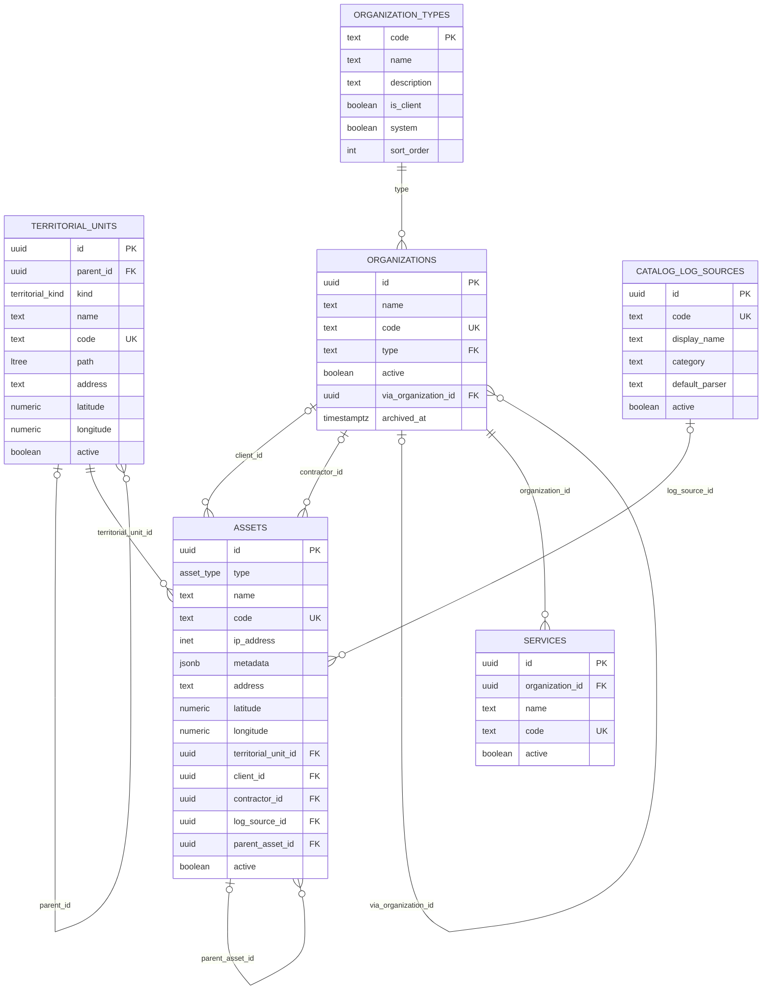

---

## 3. Directorio de contactos

Personas externas e internas a las que se avisa, con sus canales.

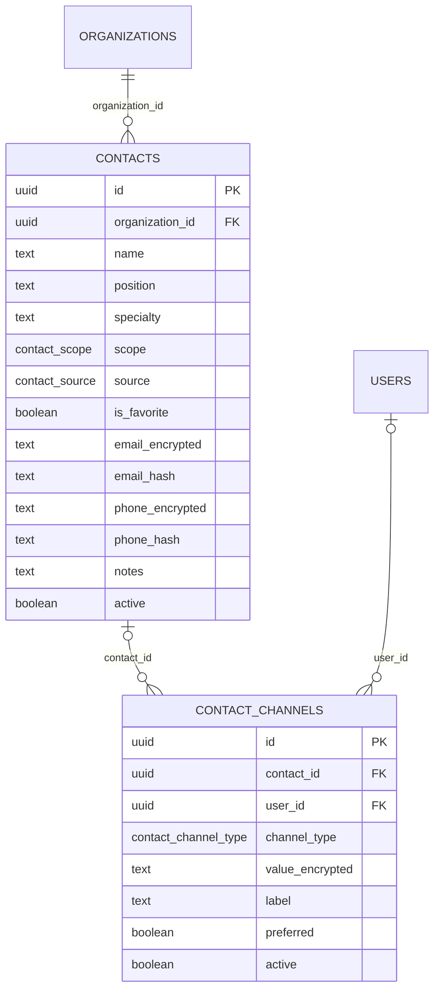

---

## 4. Ticketera

Tickets con SLA, comentarios, tareas con tiempo, resolutores, imágenes, padre/hijo y unidos.

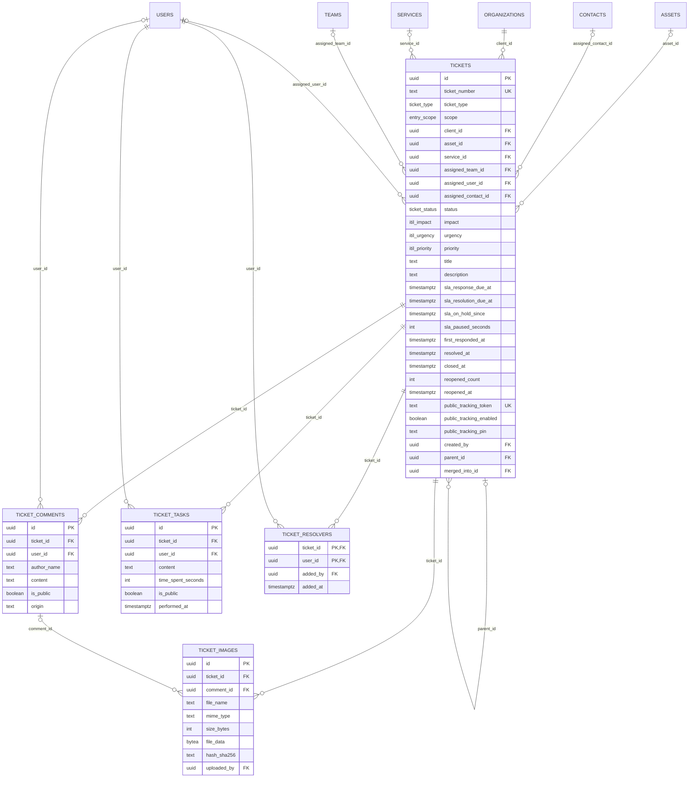

---

## 5. Equipos y escalamiento

Equipos, políticas con sus llamados, pools con nombre, incidentes con sus intentos y notas, ventanas de mantenimiento y RACI. Un equipo con `kind = 'step'` es el grupo de personas de un solo llamado: no tiene organización, no aparece en Equipos y se borra con su paso.

```mermaid
erDiagram
    TEAM_GROUPS {
        uuid id PK
        text name
        text slug UK
        uuid client_id FK
        boolean active
    }
    TEAMS {
        uuid id PK
        uuid organization_id FK
        uuid team_group_id FK
        text name
        text slug UK
        text kind
        team_audience audience
        boolean active
        boolean deactivated_by_org
    }
    TEAM_MEMBERS {
        uuid id PK
        uuid team_id FK
        uuid user_id FK
        uuid contact_id FK
        recipient_type recipient_type
        team_role role_in_team
        int priority
        boolean active
        uuid pool_id FK
    }
    TEAM_COVERAGE {
        uuid team_id PK, FK
        uuid territorial_unit_id PK, FK
        int priority
    }
    ESCALATION_POLICIES {
        uuid id PK
        uuid service_id FK
        uuid asset_id FK
        uuid territorial_unit_id FK
        boolean active
        text reminder
    }
    ESCALATION_STEPS {
        uuid id PK
        uuid policy_id FK
        int step_order
        uuid team_id FK
        escalation_mode mode
        int wait_before_escalate_minutes
        text title
    }
    ESCALATION_POOLS {
        uuid id PK
        uuid organization_id FK
        text name
        boolean active
    }
    ESCALATION_POOL_MEMBERS {
        uuid id PK
        uuid pool_id FK
        uuid contact_id FK
        uuid user_id FK
        int position
    }
    ESCALATION_INCIDENTS {
        uuid id PK
        uuid service_id FK
        uuid asset_id FK
        uuid territorial_unit_id FK
        text title
        text glpi_ticket
        uuid ticket_id FK
        uuid opened_by FK
        timestamptz opened_at
        uuid closed_by FK
        timestamptz closed_at
        uuid entry_id FK
    }
    ESCALATION_INCIDENT_NOTES {
        uuid id PK
        uuid incident_id FK
        uuid user_id FK
        text note
    }
    ESCALATION_ACTION_LOGS {
        uuid id PK
        uuid entry_id FK
        uuid policy_id FK
        int step_order
        uuid contact_id FK
        contact_channel_type channel_type
        contact_attempt_result result
        text notes
        uuid operator_id FK
        uuid incident_id FK
    }
    MAINTENANCE_WINDOWS {
        uuid id PK
        uuid service_id FK
        uuid asset_id FK
        uuid territorial_unit_id FK
        text title
        text notes
        timestamptz starts_at
        timestamptz ends_at
        boolean suppress_notifications
        int priority
        uuid created_by FK
        boolean active
    }
    RACI_ASSIGNMENTS {
        uuid id PK
        uuid client_id FK
        uuid service_id FK
        uuid asset_id FK
        text topic
        raci_role role
        uuid team_id FK
        boolean active
    }

    ASSETS |o--o{ ESCALATION_INCIDENTS : "asset_id"
    ASSETS |o--o{ ESCALATION_POLICIES : "asset_id"
    ASSETS |o--o{ MAINTENANCE_WINDOWS : "asset_id"
    ASSETS |o--o{ RACI_ASSIGNMENTS : "asset_id"
    CONTACTS |o--o{ ESCALATION_ACTION_LOGS : "contact_id"
    CONTACTS |o--o{ ESCALATION_POOL_MEMBERS : "contact_id"
    CONTACTS |o--o{ TEAM_MEMBERS : "contact_id"
    ENTRIES |o--o{ ESCALATION_ACTION_LOGS : "entry_id"
    ENTRIES |o--o{ ESCALATION_INCIDENTS : "entry_id"
    ESCALATION_INCIDENTS |o--o{ ESCALATION_ACTION_LOGS : "incident_id"
    ESCALATION_INCIDENTS ||--o{ ESCALATION_INCIDENT_NOTES : "incident_id"
    ESCALATION_POLICIES |o--o{ ESCALATION_ACTION_LOGS : "policy_id"
    ESCALATION_POLICIES ||--o{ ESCALATION_STEPS : "policy_id"
    ESCALATION_POOLS |o--o{ TEAM_MEMBERS : "pool_id"
    ESCALATION_POOLS ||--o{ ESCALATION_POOL_MEMBERS : "pool_id"
    ORGANIZATIONS |o--o{ ESCALATION_POOLS : "organization_id"
    ORGANIZATIONS |o--o{ RACI_ASSIGNMENTS : "client_id"
    ORGANIZATIONS |o--o{ TEAMS : "organization_id"
    ORGANIZATIONS |o--o{ TEAM_GROUPS : "client_id"
    SERVICES |o--o{ ESCALATION_INCIDENTS : "service_id"
    SERVICES |o--o{ ESCALATION_POLICIES : "service_id"
    SERVICES |o--o{ MAINTENANCE_WINDOWS : "service_id"
    SERVICES |o--o{ RACI_ASSIGNMENTS : "service_id"
    TEAMS ||--o{ ESCALATION_STEPS : "team_id"
    TEAMS ||--o{ RACI_ASSIGNMENTS : "team_id"
    TEAMS ||--o{ TEAM_COVERAGE : "team_id"
    TEAMS ||--o{ TEAM_MEMBERS : "team_id"
    TEAM_GROUPS |o--o{ TEAMS : "team_group_id"
    TERRITORIAL_UNITS |o--o{ ESCALATION_INCIDENTS : "territorial_unit_id"
    TERRITORIAL_UNITS |o--o{ ESCALATION_POLICIES : "territorial_unit_id"
    TERRITORIAL_UNITS |o--o{ MAINTENANCE_WINDOWS : "territorial_unit_id"
    TERRITORIAL_UNITS ||--o{ TEAM_COVERAGE : "territorial_unit_id"
    TICKETS |o--o{ ESCALATION_INCIDENTS : "ticket_id"
    USERS |o--o{ ESCALATION_POOL_MEMBERS : "user_id"
    USERS |o--o{ TEAM_MEMBERS : "user_id"
    USERS ||--o{ ESCALATION_ACTION_LOGS : "operator_id"
    USERS ||--o{ ESCALATION_INCIDENT_NOTES : "user_id"
```

---

## 6. Turnos, guardias y dotación

Turnos de trabajo y sus integrantes, guardias con hora exacta (ciclos, tramos y reemplazos), dotación, recordatorios y cierre de turno.

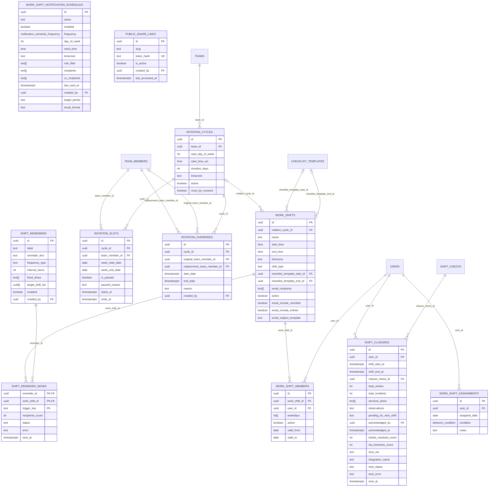

---

## 7. Checklists

Plantillas de checklist de inicio y cierre de turno y sus ejecuciones.

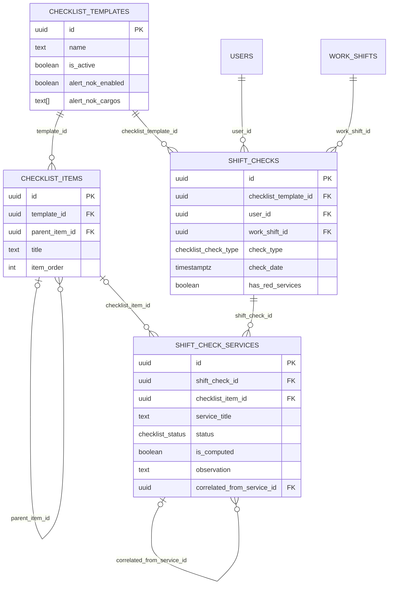

---

## 8. Bitácora

Entradas, comentarios, adjuntos, borradores y eventos del sistema.

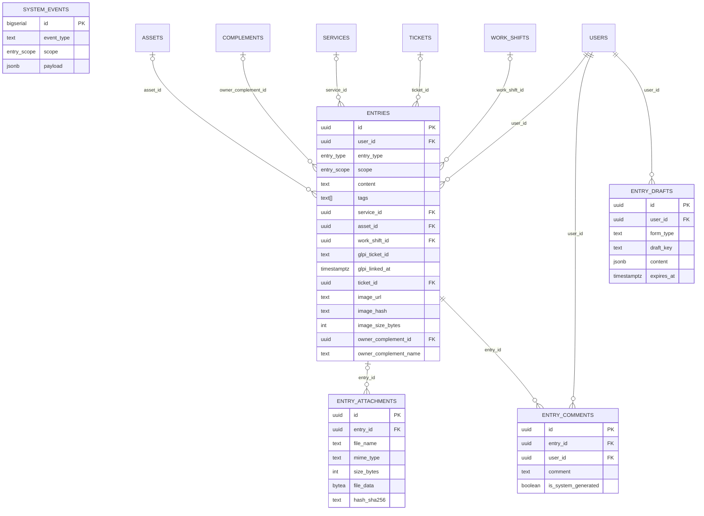

---

## 9. Reportes y avisos por cliente

Historial de reportes enviados, tipos de operación, eventos del informe y las reglas de aviso por cliente con su acuse.

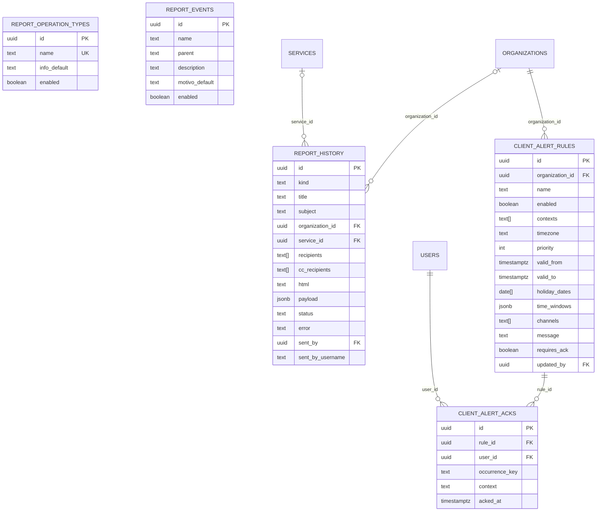

---

## 10. Auditoría, notas y alertas de sala

Registro de auditoría (solo se agrega), notas del admin y personales, y alertas programadas en pantalla.

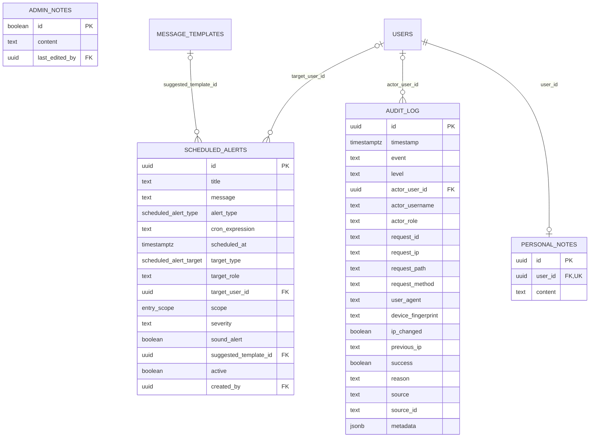

---

## 11. Configuración y respaldos

Configuración única de la instalación, correo, marca, funcionalidades activables y respaldos.

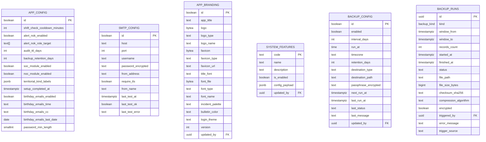

---

## 12. Complementos

Complementos instalados, sus archivos y su almacenamiento.

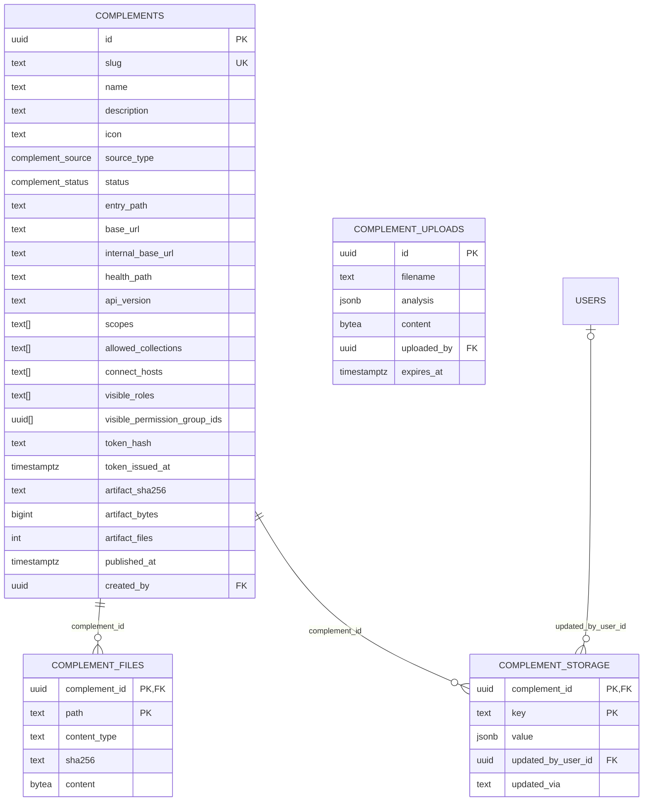

---

## 13. Ingesta de alertas (después del corte)

Tablas creadas para la ingesta de alertas del backlog posterior al corte; todavía sin uso.

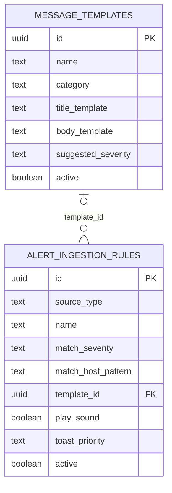
