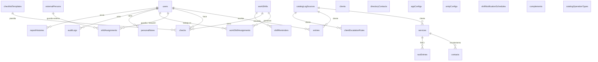
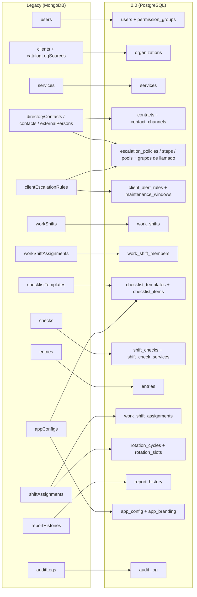

# Modelo entidad-relación: legacy ↔ 2.0

Comentario del dueño #18. Cómo se corresponden los datos del legacy (MongoDB, 43 modelos) con los de la 2.0 (PostgreSQL): qué colección va a qué tablas, qué se transforma y qué no se migra.

- **Fuente**: el código del ETL (`backend-go/internal/legacyetl`) y el respaldo real del 2026-09-25 (39 colecciones). Las cantidades son de ese respaldo.
- **Modelo 2.0 completo**: [modelo-de-datos.md](modelo-de-datos.md) (por dominio, generado desde el esquema real). Acá solo se muestra lo que tiene contraparte en el legacy.
- **Al día con**: migración 000030 (llamados dentro de la política) y 000029 (guardias con hora exacta), 2026-10-09.
- **Reglas del ETL**: `spec/13-etl.md`. Cada documento migrado conserva un id estable (`ID(colección, _id)`), así el ETL se puede repetir desde cero con el mismo resultado.
- **Mantener**: si cambia el ETL o aparece una colección nueva en el legacy, actualizar este archivo. El informe del ETL avisa si el respaldo trae una colección con datos que ningún paso lee.

---

## 1. Legacy (MongoDB): colecciones y referencias

Solo las colecciones con datos en producción o con referencias relevantes. En MongoDB las referencias son `ObjectId` sin integridad: un documento puede apuntar a otro que ya no existe (el ETL lo cuenta como descarte o lo resuelve, ver §3).

Notas del legacy que explican varias decisiones:

- El **cliente real** estaba repartido entre `clients` y `catalogLogSources` (la fuente de logs hacía de cliente): en la 2.0 ambos son `organizations`.
- `checklistTemplates` guarda los ítems **anidados** dentro del documento; `checks` guarda una copia del título de cada servicio.
- `shiftAssignments` mezcla dos cosas: **guardias semanales** (N2, N1 inhábil, TI, OL) y **condiciones del día** (teletrabajo, vacaciones, licencia…).
- `appConfigs` es un documento único con todo: marca, alerta NOK, cumpleaños, cooldown de checklist.

## 2. 2.0 (PostgreSQL): tablas que reciben datos del legacy

```mermaid
erDiagram
    users ||--o{ user_permission_groups : "pertenece"
    permission_groups ||--o{ user_permission_groups : ""
    organizations ||--o{ services : "tiene"
    organizations ||--o{ contacts : "de"
    contacts ||--o{ contact_channels : "cifrados"
    services ||--o{ escalation_policies : "escala"
    escalation_policies ||--o{ escalation_steps : "llamados"
    teams ||--o{ escalation_steps : "personas del llamado"
    teams ||--o{ team_members : "integrantes"
    escalation_pools |o--o{ team_members : "pool en un llamado"
    escalation_pools ||--o{ escalation_pool_members : "integrantes"
    services ||--o{ raci_assignments : "RACI"
    services ||--o{ maintenance_windows : "mantención"
    organizations ||--o{ client_alert_rules : "avisos"
    work_shifts ||--o{ work_shift_members : "personas"
    users ||--o{ work_shift_members : ""
    work_shifts ||--o{ shift_checks : "turno"
    checklist_templates ||--o{ checklist_items : "ítems"
    checklist_templates ||--o{ shift_checks : "plantilla"
    shift_checks ||--o{ shift_check_services : "servicios"
    checklist_items ||--o{ shift_check_services : "ítem"
    users ||--o{ entries : "escribe"
    services ||--o{ entries : "cliente"
    users ||--o{ work_shift_assignments : "dotación del día"
    teams ||--o{ rotation_cycles : "guardia"
    rotation_cycles ||--o{ rotation_slots : "tramos con hora"
    team_members ||--o{ rotation_slots : "de guardia"
    users ||--o{ admin_notes : ""
    users ||--o{ personal_notes : ""
    users ||--o{ report_history : "envía"
    complements ||--o{ complement_files : "archivos"
    users ||--o{ audit_log : "actor"
```

Tablas de configuración (fila única): `app_config`, `app_branding`, `smtp_config`. Más `shift_reminders`, `work_shift_notification_schedules`, `report_operation_types` y `report_events`.

## 3. Correspondencia colección → tablas

| Colección legacy | Docs | Tablas 2.0 | Transformación |
|---|---:|---|---|
| `users` | 12 | `users`, `permission_groups`, `user_permission_groups` | Contraseñas bcrypt tal cual (el login sigue igual). Cumpleaños, cargo y rol se conservan. |
| `clients` + `catalogLogSources` | 6 + 9 | `organizations` (tipo cliente) | Se unen por nombre: un mismo cliente que estaba en las dos colecciones queda una sola vez. |
| `services` | 12 | `services` | Enlazados a su cliente (`organizations`). |
| `directoryContacts` | 54 | `contacts`, `contact_channels` | Correos y teléfonos se cifran con la llave 2.0; se crean índices de búsqueda. |
| `contacts` | 58 | `contacts`, `contact_channels`, `teams`, `team_members`, `escalation_policies`, `escalation_steps` | Cada servicio con contactos PARA/CC pasa a una política cuyo primer llamado es **"Aviso por correo (PARA y CC)"**, en modo pool. Las personas de ese llamado forman un grupo propio del paso (`teams.kind = 'step'`, sin organización): no aparece en Equipos y se borra con el paso. Los avisos preventivos sí quedan como equipos de la organización. |
| `externalPersons` | 1 | `contacts` (ámbito interno) | Personal externo de guardia. |
| `clientEscalationRules` | 6 | `escalation_pools`, `escalation_pool_members`, `escalation_steps`, `client_alert_rules`, `maintenance_windows` | Según el tipo de regla: flujos de llamada → llamados de la política, cada uno con su título del legacy ("1er llamado"…) y sus personas en un grupo del paso (`kind = 'step'`); los pasos `pool` del legacy pasan a pools con nombre; `special_alert` → avisos por cliente; mantenciones → ventanas por servicio. Las personas del flujo que no estaban en el directorio se crean como contactos. |
| `raciEntries` | 12 | `raci_assignments` | Una fila por persona y letra R/A/C/I. |
| `workShifts` | 2 | `work_shifts` | Horario, zona y reporte de cierre (destinatarios, asunto, qué incluye). |
| `workShiftAssignments` | 2 | `work_shift_members` | Personas del turno y sus días: reciben los recordatorios de turno, como en el legacy. |
| `checklistTemplates` | 2 | `checklist_templates`, `checklist_items`, `work_shifts.checklist_template_*_id` | Ítems anidados → filas con `parent_item_id`. La asignación a turno (inicio/cierre) va en el turno. |
| `checks` | 339 | `shift_checks`, `shift_check_services` | 4.976 servicios. Cada servicio se enlaza con su ítem de plantilla cuando existe. El turno faltante (215 checks viejos) se deduce por la hora; las plantillas ya borradas se recrean inactivas con su nombre. |
| `entries` | 966 | `entries` | Tipo, ámbito (SOC/NOC), etiquetas y cliente (por servicio). |
| `adminNotes`, `personalNotes` | 1, 10 | `admin_notes`, `personal_notes` | Se descarta la nota de un usuario que ya no existe. |
| `shiftAssignments` | 330 | `work_shift_assignments`, `teams`, `team_members`, `rotation_cycles`, `rotation_slots` | Condiciones del día (teletrabajo, vacaciones, licencia…) → un registro por día. Guardias (N2, N1 inhábil, TI, OL) → un equipo "Guardia X" con su ciclo semanal; cada guardia es un tramo con la **fecha y hora exactas** del legacy (`starts_at`/`ends_at`). N2 y N1 inhábil quedan como guardias que siempre deben estar cubiertas (`must_be_covered`). |
| `shiftReminders` | 1 | `shift_reminders` | |
| `shiftNotificationSchedules` | 2 | `work_shift_notification_schedules` | Formato (lista/calendario) y condiciones a notificar con los códigos del legacy. |
| `smtpConfigs` | 1 | `smtp_config` | La contraseña se re-cifra con la llave 2.0. |
| `complements` | 2 | `complements`, `complement_files` | Con sus archivos publicados (de `uploads/` del respaldo). |
| `reportHistories` | 500 | `report_history` | Estado "importado": se ven pero no se pueden usar como base (el legacy no guardaba el formulario). |
| `catalogOperationTypes` | 2 | `report_operation_types` | Con su texto de "Información adicional". |
| `catalogEvents` | 1863 | `report_events` | Con su texto de "Motivo"; 5 repetidos se cargan una vez (desde 2026-10-07). |
| `appConfigs` | 1 | `app_config`, `app_branding`, `checklist_templates` | Marca (nombre, logo de `uploads/logos`, favicon, paleta, tema del login); alerta NOK por cargo → copiada a cada plantilla; correos de cumpleaños; cooldown de checklist. Enciende SOC y marca el setup como hecho. |
| `auditLogs` | 21.786 | `audit_log` | Carga masiva; la tabla es solo de inserción. |

### Diagrama de la correspondencia

## 4. Lo que no se migra

| Colección | Docs | Por qué |
|---|---:|---|
| `tokenDenylist` | — | Sesiones del legacy: después del corte todos vuelven a entrar. |
| `avisoLogs` | 187 | Historial de envíos de recordatorios; la 2.0 lleva el suyo (`shift_reminder_sends`). |
| `apiLogs`, `apiKeys` | 0 | API externa: no se usa en producción. |
| `customFonts` | 0 | La fuente del título se vuelve a subir en Administración → Marca. |
| `glpiConfigs`, `logForwardingConfigs` | 1, 0 | Integraciones post-corte. |
| `complementSharedRecords` | 0 | Sin datos. |

Vacías en producción y sin paso de ETL: `checklistNotificationLogs`, `escalationRules`, `serviceCatalogs`, `shiftClosures`, `shiftOverrides`, `shiftRoles`, `shiftRotationCycles`. Si alguna llegara a tener datos, el informe del ETL lo avisa ("colecciones con datos que el ETL no lee").

## 5. Lo nuevo en la 2.0 (sin origen en el legacy)

Ticketera (`tickets`, `ticket_comments`, `ticket_tasks`, `ticket_images`, `ticket_resolvers`), territorio y activos NOC (`territorial_units`, `assets`, `team_coverage`), incidentes de escalamiento (`escalation_incidents`, `escalation_incident_notes`, `escalation_action_logs`), acuses de avisos (`client_alert_acks`), borradores (`entry_drafts`), adjuntos y comentarios de la bitácora, respaldos (`backup_runs`, `backup_config`), funcionalidades (`system_features`), límite de intentos de login y enlaces públicos.

## 6. Huecos que encontró este análisis (2026-10-06, corregidos)

- **Historial de checklists** (`checks`, 339): no se migraba. Ahora va completo a `shift_checks` + `shift_check_services`.
- **Personas del turno** (`workShiftAssignments`, 2): no se migraban, y la 2.0 mandaba los recordatorios a los correos del reporte de cierre. En producción esos correos están vacíos, así que **los recordatorios habrían dejado de llegar** después del corte. Ahora existe `work_shift_members` (migración 000024), los recordatorios van a esas personas los días marcados, y se editan en Administración → Turnos.
- El informe del ETL ahora avisa de cualquier colección con datos que no se lea.
