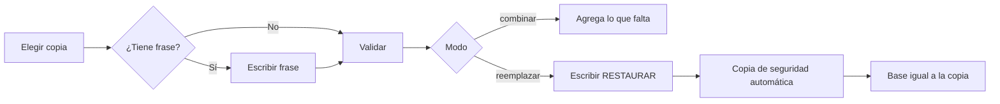
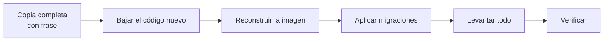

# Operación

Tareas de mantenimiento de un servidor con Bitácora Ops: respaldos, actualizaciones, monitoreo y solución de problemas.

- [1. Respaldos](#1-respaldos)
- [2. Restaurar](#2-restaurar)
- [3. Actualizar a una versión nueva](#3-actualizar-a-una-versión-nueva)
- [4. Monitoreo y logs](#4-monitoreo-y-logs)
- [5. Tareas de emergencia](#5-tareas-de-emergencia)
- [6. Problemas comunes](#6-problemas-comunes)

---

## 1. Respaldos

Todo se maneja en **Administración → Respaldos** y queda en la Auditoría.

### Tipos de copia

| Tipo | Qué contiene | Para qué |
| --- | --- | --- |
| **Completa** | Toda la base: datos y configuración. | Recuperarse de un desastre o mover la instalación entera. |
| **Delta operativo** | Solo lo del período elegido: bitácora, tickets, checklists, cierres y escalaciones. Sin configuración. | Llevar la operación de un servidor a otro (por ejemplo, de un nodo de contingencia al principal). |
| **Exportación** | ZIP de bitácora, checklists, tickets o todo, en formato legible. | Entregar datos a alguien o archivarlos. No sirve para restaurar. |

Las copias completas y delta se guardan **comprimidas (zstd) y cifradas**:

- **con frase:** la escribes tú, mínimo 8 caracteres, y sin ella no se abre;
- **sin frase:** se cifra con la clave del servidor (`APP_ENCRYPTION_KEY`), y solo ese servidor (o uno con la misma clave) puede abrirla.

> **Para un desastre real usa frase.** Si pierdes el servidor y con él la `APP_ENCRYPTION_KEY`, una copia sin frase no se puede abrir en otro lado.

### Copias automáticas

En *Respaldos → Respaldos automáticos* se configura:

| Opción | Qué hace |
| --- | --- |
| Activados | Enciende o apaga las copias automáticas. |
| Cada (días) / A las | Frecuencia y hora. |
| Conservar (días) | Las copias automáticas más viejas se borran solas. |
| Frase de cifrado | Opcional. Se guarda cifrada. |
| Destino | Disco del servidor, carpeta de red SMB o montaje NFS. |
| Ejecutar prueba ahora | Hace una copia en el momento para comprobar la configuración. |

**Destinos y Docker.** La copia se escribe en una carpeta **dentro del contenedor** `bitacora-app`:

- **Disco del servidor:** `BACKUP_DIR` (por defecto `backups`). En producción tiene que ser un volumen montado, o se pierde al recrear el contenedor ([instalacion.md](instalacion.md#paso-4-publicar-los-puertos-y-guardar-los-respaldos-fuera-del-contenedor)).
- **SMB o NFS:** monta el recurso de red en el servidor, móntalo también en el contenedor (`volumes:`) y escribe esa ruta. La aplicación **no crea** carpetas de red: si la ruta no existe, falla a propósito, para no guardar en el disco local creyendo que va al NAS.

### Copia de la base con PostgreSQL (opcional, complementaria)

Una copia a nivel de base, independiente de la aplicación:

```bash
docker compose exec -T bitacora-db pg_dump -U bitacora -Fc bitacora > respaldo-$(date +%F).dump
```

Se restaura con `pg_restore` sobre una base vacía. Úsala además de las copias de la aplicación, no en vez de ellas.

---

## 2. Restaurar

Desde *Respaldos → Historial*, en la copia elegida:

| Acción | Qué hace |
| --- | --- |
| **Validar** | Abre la copia (pide la frase si la tiene) y comprueba que esté sana, sin tocar nada. |
| **Descargar** | Baja el archivo `.enc`. |
| **Restaurar · combinar** (`merge`) | Agrega lo que falta y no borra nada. |
| **Restaurar · reemplazar** (`replace`) | Deja la base **igual que la copia**. Hay que escribir `RESTAURAR` para confirmar. **Antes, el sistema saca solo una copia de seguridad del estado actual.** |
| **Subir** | Sube un `.enc` de otro servidor. Se descifra con la frase para comprobarlo y queda en el historial como "Subido", listo para restaurar. |



### Purgar (solo ambientes de prueba)

Borra todo y deja el sistema como recién instalado. Requiere dos cosas:

1. Encender **"Permitir purga"** en *Administración → Funcionalidades*.
2. Escribir la frase exacta **`PURGAR TODO`**.

Después vuelve el asistente `/setup`. Si `BOOTSTRAP_ADMIN_*` está definido, el admin se crea solo.

---

## 3. Actualizar a una versión nueva



```bash
# 1. Copia completa con frase (desde Administración → Respaldos) y, opcional, pg_dump.

# 2. Código nuevo
git pull

# 3. Construir la imagen nueva (la app sigue funcionando mientras tanto)
docker compose build bitacora-app

# 4. Migraciones pendientes
migrate -path backend-go/sql/migrations \
  -database "postgres://bitacora:<POSTGRES_PASSWORD>@127.0.0.1:25432/bitacora?sslmode=disable" up

# 5. Reemplazar el contenedor y asegurar que Caddy esté arriba
docker compose up -d bitacora-app
docker compose up -d

# 6. Verificar
curl -s http://127.0.0.1:8081/api/health/ready
```

- **Qué migraciones faltan:** `migrate … version` muestra la versión actual. La última de este repositorio es `000030_step_teams`.
- **Volver atrás una migración:** `migrate … down 1` ejecuta el `down.sql` de la última. Algunas migraciones reordenan datos: prueba primero sobre una copia.
- **Volver atrás la versión completa:** vuelve al código anterior (`git checkout <tag>`), baja las migraciones que agregó la versión nueva y reconstruye. Si algo sale mal, restaura la copia del paso 1.

---

## 4. Monitoreo y logs

### Salud

| Ruta | Responde | Uso |
| --- | --- | --- |
| `GET /api/health/live` | `200` si el proceso está vivo. | Reiniciar el contenedor si no responde. |
| `GET /api/health/ready` | `200 {"status":"ready"}` si además llega a la base. | Monitoreo externo y balanceadores. |

```bash
curl -s -o /dev/null -w "%{http_code}\n" https://bitacora.ejemplo.cl/api/health/ready
```

### Logs

La aplicación escribe **un JSON por línea** en la salida estándar:

```bash
docker compose logs -f --since 30m bitacora-app
```

```json
{"time":"2026-10-07T20:54:11.25Z","level":"INFO","msg":"bitacora-app escuchando","addr":":8080"}
{"time":"2026-10-07T20:54:11.20Z","level":"WARN","msg":"rate limit DESACTIVADO por RATE_LIMIT_DISABLED (solo desarrollo)"}
```

Filtra por nivel con `jq`:

```bash
docker compose logs --no-log-prefix bitacora-app | jq -c 'select(.level=="ERROR")'
```

### Auditoría

Lo que hicieron los usuarios no está en el log sino en *Administración → Auditoría*, con filtros por evento, usuario, resultado y fecha, y exportación. Algunos eventos útiles:

| Evento | Qué registra |
| --- | --- |
| `auth.login.success` / `auth.login.fail` | Ingresos y fallos. |
| `backup.restore` | Restauraciones, con el modo y la copia de seguridad previa. |
| `escalation.view.contacts.read` | Quién consultó a quién llamar. |
| `guard.slot.created`, `guard.import` | Cambios en las guardias. |
| `report.shift.dispatch` | Envío de reportes de cierre. |

### Envíos fallidos

Los correos que no salen quedan con su causa:

- **reportes de cierre** en *Administración → Reportes de turno*,
- **correo de prueba** en *Administración → Correo*.

Las causas típicas son SMTP mal configurado o un turno sin destinatarios.

---

## 5. Tareas de emergencia

### Desbloquear el login

Tras 5 intentos fallidos, una IP queda bloqueada 15 minutos. Para levantar el bloqueo antes:

1. Define `RATE_LIMIT_RESET_SECRET` en `.env` y ejecuta `docker compose up -d bitacora-app`.
2. Llama a la ruta con el secreto:

```bash
curl -s -X POST http://127.0.0.1:8081/api/system/rate-limit-reset \
  -H "X-Rate-Limit-Reset-Secret: <secreto>" \
  -H 'Content-Type: application/json' \
  -d '{"scope":"login","key":"203.0.113.7"}'
```

| `scope` | Efecto |
| --- | --- |
| `login` | Con `key` (una IP) libera esa IP. Sin `key`, libera todas. |
| `api` | Reinicia los límites de la API. |
| `all` | Ambos. |

Con el secreto vacío la ruta no existe (404). Déjalo vacío cuando no lo necesites.

### Un administrador olvidó su contraseña

- **Si el SMTP funciona:** "¿Olvidaste tu contraseña?" en el login.
- **Si no:** otro administrador la restablece desde *Usuarios y grupos*.
- **Si no queda ningún administrador con acceso:** restaura una copia, o pide ayuda a quien mantiene el servidor para hacerlo a nivel de base.

### Forzar el cambio de contraseña a todos

*Usuarios y grupos → Forzar cambio a todos*. En el siguiente ingreso, cada usuario debe elegir una contraseña nueva antes de seguir.

---

## 6. Problemas comunes

| Síntoma | Qué revisar |
| --- | --- |
| La app no abre | `docker compose ps`: los tres contenedores deben estar `Up` y la base `healthy`. Si falta Caddy, `docker compose up -d`. |
| Errores 500 tras actualizar | ¿Se aplicaron las migraciones? `migrate … version` debe dar la última. |
| `ready` falla pero `live` responde | La app no llega a la base: revisa `bitacora-db` y la contraseña. |
| Las pantallas no se actualizan solas | El proxy retiene los eventos SSE: `flush_interval -1` en Caddy. |
| No llegan correos | *Administración → Correo → Enviar prueba* muestra el error del servidor SMTP. |
| Un reporte de cierre no salió | *Reportes de turno*: suele ser un turno sin destinatarios. Agrégalos en *Turnos → Turnos de trabajo*. |
| "De guardia ahora" vacío | No hay guardia que cubra este momento. Revisa *Turnos → Guardias*: los huecos aparecen en rojo. |
| Un módulo desapareció del menú | Está apagado en *Módulos* o el usuario no lo tiene en su alcance (grupos de permisos). |
| Un complemento no carga | `COMPLEMENTS_PUBLIC_URL` debe ser alcanzable desde el navegador y distinto del origen de la app. |
| Respaldo automático "Última copia falló" | El detalle está en el historial. Si el destino es SMB/NFS, confirma que la ruta existe dentro del contenedor. |
| Tras cambiar `APP_ENCRYPTION_KEY`, el correo y el MFA fallan | Esos secretos se cifraron con la clave anterior. Vuelve a la clave anterior, o configura de nuevo el SMTP y que cada usuario reactive su MFA. |
